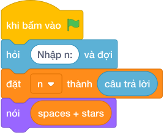

# Hướng Dẫn Giảng Dạy: Tam giác sao cân
Chuyên đề: **Lập Trình Thuật Toán & Khối Lệnh Scratch 3.0**

---

## 1. Ý tưởng & Phân tích thuật toán

- Bản chất của bài này là vẽ tháp sao cân cao `N` dòng: dòng thứ `i` có `(N - i)` dấu cách đứng trước rồi tới `(2*i - 1)` dấu sao.
- Quy trình từng bước với đúng tên biến trong lời giải:
  - Bước 1: `n = int(câu trả lời.strip())` đọc chiều cao. Với mẫu, `n = 3`.
  - Bước 2: vòng lặp `for i in range(1, n + 1)` cho `i` là 1, 2, 3.
  - Bước 3: mỗi dòng tính `spaces = " " * (n - i)` và `stars = "*" * (2 * i - 1)`, rồi in `spaces + stars`.
- Giá trị biên cụ thể: khi `n = 1` tháp chỉ có một dòng là `*`; đề bài giới hạn `1 <= N <= 20` nên dòng cuối dài nhất 39 dấu sao.

---

## 2. Bảng chạy tay trên số liệu mẫu (Dry Run Table - Sample 1: 3)

| Dòng (`i`) | `n - i` (số cách) | `2*i - 1` (số sao) | `spaces` | `stars` | In ra màn hình |
|---|---|---|---|---|---|
| 1 | 2 | 1 | `__` | `*` | `__*` |
| 2 | 1 | 3 | `_` | `***` | `_***` |
| 3 | 0 | 5 | (rỗng) | `*****` | `*****` |

- Ba dòng in ra là `__*`, `_***`, `*****` (ký hiệu `_` là dấu cách), trùng kết quả mẫu.

---

## 3. Lưu ý & Bẫy lỗi thường gặp

- Bẫy 1: tính sai số sao thành `2 * i` (thiếu trừ 1). Với mẫu `n = 3` dòng 1 sẽ có 2 sao thay vì 1, là kết quả sai. Cách sửa: dùng `2 * i - 1`.
```text
n = int(câu trả lời.strip())
for i in range(1, n + 1):
    spaces = " " * (n - i)
    stars = "*" * (2 * i)
    print(spaces + stars)
```
- Bẫy 2: quên in dấu cách phía trước, chỉ in sao. Với mẫu `n = 3` ba dòng sẽ lệch trái (`*`, `***`, `*****`), là kết quả sai vì tháp không cân. Cách sửa: in `spaces + stars`.
```text
n = int(câu trả lời.strip())
for i in range(1, n + 1):
    stars = "*" * (2 * i - 1)
    print(stars)
```
- Bẫy 3: vòng lặp chạy `range(n)` nên `i` đi từ 0 tới 2, dòng đầu có 0 sao sai hẳn. Với mẫu dòng đầu in ra 2 dấu cách và sao bị lệch. Cách sửa: dùng `range(1, n + 1)` để `i` đi từ 1.
```text
n = int(câu trả lời.strip())
for i in range(n):
    spaces = " " * (n - i)
    stars = "*" * (2 * i - 1)
    print(spaces + stars)
```

---

## 4. Lời giải tham khảo & Kịch bản Khối lệnh Scratch 3.0

### 4.1. Khối lệnh đồ họa trực quan (Visual Scratch Blocks)



> 💡 **Kịch bản thực hiện từng bước:**
> - khi bấm vào cờ xanh
> - hỏi [Nhập n:] và đợi
> - đặt [n] thành (câu trả lời)
> - nói (spaces + stars)
