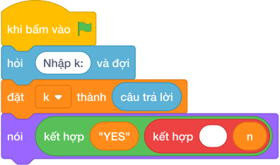

# Hướng Dẫn Giảng Dạy: Dãy số tam giác (triangular numbers)
Chuyên đề: **Lập Trình Thuật Toán & Khối Lệnh Scratch 3.0**

---

## 1. Ý tưởng & Phân tích thuật toán

- Bản chất của bài này là kiểm tra số sỏi `K` có xếp được thành hình tam giác không, tức có tồn tại `N` sao cho `N*(N+1)//2 = K` hay không.
- Quy trình từng bước với đúng tên biến trong lời giải:
  - Bước 1: `k = int(câu trả lời)` đọc số sỏi. Với mẫu, `k = 10`.
  - Bước 2: đặt `n = 1` rồi lặp `while n * (n + 1) // 2 < k`, mỗi lần tăng `n` thêm 1 cho tới khi số tam giác đạt hoặc vượt `k`.
  - Bước 3: nếu `n * (n + 1) // 2 == k` thì in `YES` kèm `n`, ngược lại in `NO`.
- Giá trị biên cụ thể: với `k = 10` thì dừng ở `n = 4` vì `4*5//2 = 10`; đề bài cho `K` tới 1000000000 nên `n` lớn nhất khoảng 44720.

---

## 2. Bảng chạy tay trên số liệu mẫu (Dry Run Table - Sample 1: 10)

| Lần kiểm tra | `n` | `n * (n + 1) // 2` | So với `k = 10` | Việc làm |
|---|---|---|---|---|
| Khởi đầu | 1 | `1` | `1 < 10` | tăng `n` lên 2 |
| 2 | 2 | `3` | `3 < 10` | tăng `n` lên 3 |
| 3 | 3 | `6` | `6 < 10` | tăng `n` lên 4 |
| 4 | 4 | `10` | `10 < 10` sai, dừng lặp | kiểm tra bằng nhau |

- Vì `10 == 10` nên in ra `YES 4`, trùng kết quả mẫu (xếp được tam giác 4 tầng).

---

## 3. Lưu ý & Bẫy lỗi thường gặp

- Bẫy 1: dùng điều kiện lặp `<=` thay vì `<`, vòng lặp chạy lố một bước. Với mẫu `k = 10` thì `n` thành 5 rồi kiểm tra `15 == 10` sai nên in `NO`, là kết quả sai. Cách sửa: lặp khi `< k`.
```text
k = int(câu trả lời)
n = 1
while n * (n + 1) // 2 <= k:
    n += 1
if n * (n + 1) // 2 == k:
    print("YES", n)
else:
    print("NO")
```
- Bẫy 2: quên in kèm `n` khi đúng, chỉ in `YES`. Với mẫu sẽ in `YES` thiếu số `4`, là kết quả sai. Cách sửa: in `nói ("YES", n)`.
```text
k = int(câu trả lời)
n = 1
while n * (n + 1) // 2 < k:
    n += 1
if n * (n + 1) // 2 == k:
    print("YES")
else:
    print("NO")
```
- Bẫy 3: khởi đầu `n = 0` rồi kiểm tra bằng nhau ngay mà không xét đúng, với `k = 10` vẫn ra đúng nhưng với số tam giác nhỏ như `k = 1` vòng lặp không chạy và so `0 == 1` sai. Cách sửa: đặt `n = 1` như lời giải.
```text
k = int(câu trả lời)
n = 0
while n * (n + 1) // 2 < k:
    n += 1
if n * (n + 1) // 2 == k:
    print("YES", n)
else:
    print("NO")
```

---

## 4. Lời giải tham khảo & Kịch bản Khối lệnh Scratch 3.0

### 4.1. Khối lệnh đồ họa trực quan (Visual Scratch Blocks)



> 💡 **Kịch bản thực hiện từng bước:**
> - khi bấm vào cờ xanh
> - hỏi [Nhập k:] và đợi
> - đặt [k] thành (câu trả lời)
> - nói (kết hợp "YES" và " " và n)
