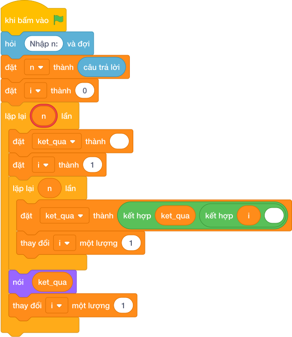

# Hướng Dẫn Giảng Dạy

## 1. Ý tưởng & Phân tích thuật toán

- Bản chất của bài này là in bảng vuông `N x N` kiểu bàn cờ: ô góc trên trái là 1, các ô kề nhau luôn khác nhau, tức giá trị ô hàng `i` cột `j` phụ thuộc vào tính chẵn lẻ của `i + j`.
- Quy trình từng bước với đúng tên biến trong lời giải:
  - Bước 1: `n = câu trả lời` đọc kích thước. Với mẫu, `n = 4`.
  - Bước 2: vòng ngoài `for i in range(n)` cho `i` là 0, 1, 2, 3, mỗi `i` là một hàng.
  - Bước 3: với mỗi hàng, `" ".join(str((i + j + 1) % 2) for j in range(n))` tính từng ô: `(i + j + 1) % 2` cho ra 1 khi tổng chẵn theo cách đánh số từ 0, rồi in cả hàng.
- Giá trị biên cụ thể: khi `n = 1` bảng chỉ có một ô duy nhất là `1`; đề bài giới hạn `1 <= N <= 50` nên bảng lớn nhất là 50 dòng.

---

## 2. Bảng chạy tay trên số liệu mẫu (Dry Run Table - Sample 1: 4)

| Hàng (`i`) | `(i + j + 1) % 2` với `j = 0, 1, 2, 3` | In ra màn hình |
|---|---|---|
| 0 | 1, 0, 1, 0 | `1 0 1 0` |
| 1 | 0, 1, 0, 1 | `0 1 0 1` |
| 2 | 1, 0, 1, 0 | `1 0 1 0` |
| 3 | 0, 1, 0, 1 | `0 1 0 1` |

- Bốn hàng in ra đúng như kết quả mẫu, ô đầu tiên luôn là `1`.

---

## 3. Lưu ý & Bẫy lỗi thường gặp

- Bẫy 1: quên `+ 1` trong công thức, viết `(i + j) % 2`. Với mẫu `n = 4` hàng đầu sẽ thành `0 1 0 1`, là kết quả sai vì ô góc phải là 1. Cách sửa: dùng `(i + j + 1) % 2`.
```text
n = câu trả lời
for i in range(n):
    nói (" ".join(str((i + j) % 2) for j in range(n)))

```
- Bẫy 2: in mỗi ô trên một dòng riêng bằng `nói (...)` trong vòng trong, cả bảng 16 số dồn thành 16 dòng, là kết quả sai. Cách sửa: ghép cả hàng bằng `" ".join(...)` rồi in một lần.
```text
n = câu trả lời
for i in range(n):
    for j in range(n):
        nói ((i + j + 1) % 2)

```
- Bẫy 3: vòng ngoài chạy `range(1, n)` nên thiếu hàng cuối. Với mẫu `n = 4` chỉ in 3 hàng, là kết quả sai. Cách sửa: dùng `range(n)` cho đủ 4 hàng.
```text
n = câu trả lời
for i in range(1, n):
    nói (" ".join(str((i + j + 1) % 2) for j in range(n)))

```

---

## 4. Lời giải tham khảo & Kịch bản Khối lệnh Scratch 3.0

### 4.1. Khối lệnh đồ họa trực quan (Visual Scratch Blocks)



> 💡 **Kịch bản thực hiện từng bước:**
> - khi bấm vào cờ xanh
> - hỏi [Nhập n:] và đợi
> - đặt [n] thành (câu trả lời)
> - đặt [i] thành (0)
> - lặp lại (n) lần:
> -   đặt [ket_qua] thành rỗng
> -   đặt [i] thành 1
> -   lặp lại (n) lần:
> -     đặt [ket_qua] thành kết hợp ket_qua và i và dấu cách
> -     thay đổi [i] một lượng 1
> -   nói (ket_qua)
> -   thay đổi [i] một lượng 1
