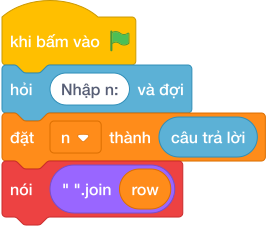

# Hướng Dẫn Giảng Dạy: Tam giác Floyd
Chuyên đề: **Lập Trình Thuật Toán & Khối Lệnh Scratch 3.0**

---

## 1. Ý tưởng & Phân tích thuật toán

- Bản chất của bài này là tháp số có `N` dòng, dòng thứ `i` chứa đúng `i` số, các số tăng dần liên tiếp từ 1.
- Quy trình từng bước với đúng tên biến trong lời giải:
  - Bước 1: `n = int(câu trả lời.strip())` đọc số dòng. Với mẫu, `n = 4`.
  - Bước 2: đặt `cur = 1` là số sắp điền vào tháp.
  - Bước 3: vòng ngoài `for i in range(1, n + 1)` cho `i` là 1, 2, 3, 4; mỗi dòng tạo giỏ `row = []` rồi lặp `i` lần, mỗi lần bỏ `str(cur)` vào `row` và tăng `cur` thêm 1.
  - Bước 4: in `" ".join(row)` cho từng dòng.
- Giá trị biên cụ thể: khi `n = 1` tháp chỉ có một dòng là `1`; đề bài giới hạn `1 <= N <= 20` nên số cuối lớn nhất là `20*21//2 = 210`.

---

## 2. Bảng chạy tay trên số liệu mẫu (Dry Run Table - Sample 1: 4)

| Dòng (`i`) | Các số được bỏ vào `row` | `cur` sau khi xong dòng | In ra màn hình |
|---|---|---|---|
| 1 | 1 | 2 | `1` |
| 2 | 2, 3 | 4 | `2 3` |
| 3 | 4, 5, 6 | 7 | `4 5 6` |
| 4 | 7, 8, 9, 10 | 11 | `7 8 9 10` |

- Bốn dòng in ra đúng như kết quả mẫu.

---

## 3. Lưu ý & Bẫy lỗi thường gặp

- Bẫy 1: đặt lại `cur = 1` ở đầu mỗi dòng, các dòng in trùng nhau. Với mẫu `n = 4` dòng 2 sẽ thành `1 2` thay vì `2 3`, là kết quả sai. Cách sửa: đặt `cur = 1` một lần trước vòng ngoài.
```text
n = int(câu trả lời.strip())
for i in range(1, n + 1):
    cur = 1
    row = []
    for _ in range(i):
        row.append(str(cur))
        cur += 1
    print(" ".join(row))
```
- Bẫy 2: quên tăng `cur`, mọi ô đều là 1. Với mẫu dòng 3 sẽ thành `1 1 1`, là kết quả sai. Cách sửa: sau mỗi lần thêm phải `cur += 1`.
```text
n = int(câu trả lời.strip())
cur = 1
for i in range(1, n + 1):
    row = []
    for _ in range(i):
        row.append(str(cur))
    print(" ".join(row))
```
- Bẫy 3: in số mà quên đổi thành chuỗi khi ghép, `row.append(cur)` rồi `" ".join(row)` sẽ báo lỗi vì `join` cần chuỗi. Cách sửa: thêm `str(cur)` như lời giải.
```text
n = int(câu trả lời.strip())
cur = 1
for i in range(1, n + 1):
    row = []
    for _ in range(i):
        row.append(cur)
        cur += 1
    print(" ".join(row))
```

---

## 4. Lời giải tham khảo & Kịch bản Khối lệnh Scratch 3.0

### 4.1. Khối lệnh đồ họa trực quan (Visual Scratch Blocks)



> 💡 **Kịch bản thực hiện từng bước:**
> - khi bấm vào cờ xanh
> - hỏi [Nhập n:] và đợi
> - đặt [n] thành (câu trả lời)
> - nói (" ".join(row)
