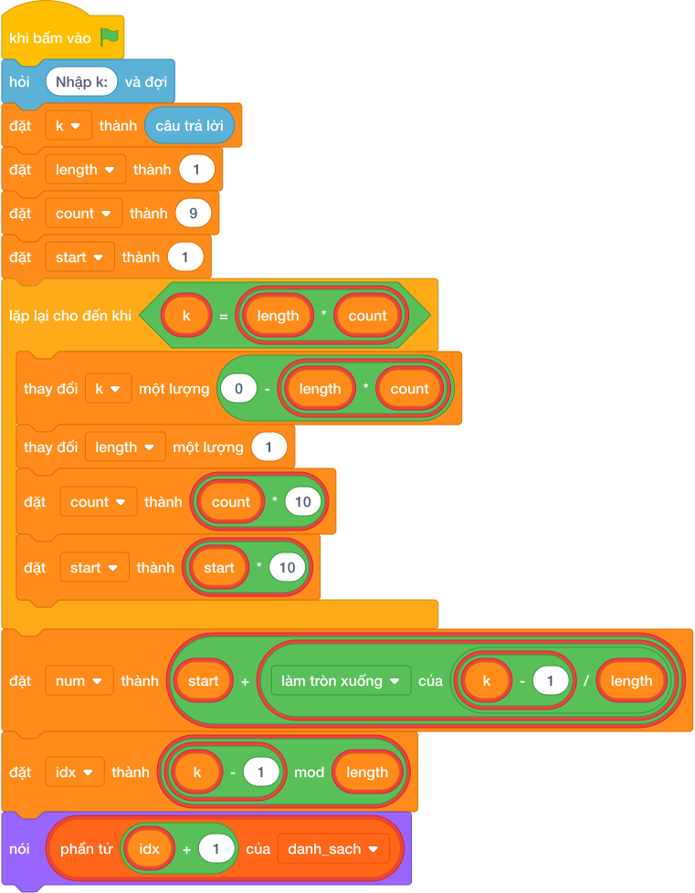

# Hướng Dẫn Giảng Dạy

## 1. Ý tưởng & Phân tích thuật toán

- Bản chất của bài này là dải số `123456789101112...` được chia thành từng khối: khối số có 1 chữ số (từ 1 tới 9) dài 9 chữ số, khối số có 2 chữ số dài 180 chữ số, và cứ thế tiếp tục.
- Quy trình từng bước với đúng tên biến trong lời giải:
  - Bước 1: đọc `k = 7` (vị trí cần tìm), đặt `length = 1` (số chữ số của khối hiện tại), `count = 9` (có bao nhiêu số trong khối), `start = 1` (số đầu khối).
  - Bước 2: lặp `while k > length * count` để trừ dần cả khối: khi `k` còn nằm trong khối hiện tại thì dừng.
  - Bước 3: số chứa vị trí cần tìm là `num = start + (k - 1) // length`, vị trí chữ số trong số đó là `idx = (k - 1) % length`, rồi in `str(num)[idx]`.
- Giá trị biên cụ thể: với mẫu `k = 7` thì `7 > 1*9` sai nên dừng ngay ở khối 1 chữ số; đề bài cho `K` tới 100000 nên `k` có thể rơi vào khối số có 5 chữ số.

---

## 2. Bảng chạy tay trên số liệu mẫu (Dry Run Table - Sample 1: 7)

| Bước | Việc làm | `k` | `length` | `count` | `start` | Ghi chú |
|---|---|---|---|---|---|---|
| 1 | Đọc `k`, đặt khởi đầu | 7 | 1 | 9 | 1 | khối số 1 chữ số dài `1*9 = 9` chữ số |
| 2 | Kiểm tra `k > 9` | 7 | 1 | 9 | 1 | `7 > 9` sai, dừng lặp |
| 3 | Tính `num = 1 + (7-1)//1` | 7 | 1 | 9 | 1 | `num = 7` |
| 4 | Tính `idx = (7-1)%1` | 7 | 1 | 9 | 1 | `idx = 0` |
| 5 | In `str(7)[0]` | 7 | 1 | 9 | 1 | in ra `7` |

- Chữ số thứ 7 trong dải `1234567...` đúng là `7`, trùng kết quả mẫu.

---

## 3. Lưu ý & Bẫy lỗi thường gặp

- Bẫy 1: quên trừ 1 khi tính `num`, viết `num = start + làm tròn xuống của (k / length)`. Với mẫu `k = 7` sẽ ra `num = 8`, in ra `8`, là kết quả sai. Cách sửa: dùng `(k - 1) // length`.
```text
k = câu trả lời
length = 1
count = 9
start = 1
while k > length * count:
    k -= length * count
    length += 1
    count *= 10
    start *= 10
num = start + làm tròn xuống của (k / length)
idx = (k - 1) % length
nói (str(num)[idx])

```
- Bẫy 2: nhầm điều kiện lặp thành `>=`, khối bị trừ lố. Với `k = 9` (đúng chữ số cuối khối 1 chữ số) vòng lặp trừ mất cả khối và nhảy sang khối 2 chữ số, cho kết quả sai. Cách sửa: lặp khi `k > length * count`.
```text
k = câu trả lời
length = 1
count = 9
start = 1
while k >= length * count:
    k -= length * count
    length += 1
    count *= 10
    start *= 10
num = start + (k - 1) // length
idx = (k - 1) % length
nói (str(num)[idx])

```
- Bẫy 3: nối cả dải số thành chuỗi rồi lấy vị trí thứ `k`. Với `K = 100000` chuỗi dài hàng trăm nghìn ký tự, vừa tốn trí nhớ vừa chậm. Cách sửa: trừ dần từng khối như lời giải để tìm thẳng khối chứa `k`.
```text
k = câu trả lời
s = ""
i = 1
while len(s) < k:
    s = s + str(i)
    i += 1
nói (s[k - 1])

```

---

## 4. Lời giải tham khảo & Kịch bản Khối lệnh Scratch 3.0

### 4.1. Khối lệnh đồ họa trực quan (Visual Scratch Blocks)



> 💡 **Kịch bản thực hiện từng bước:**
> - khi bấm vào cờ xanh
> - hỏi [Nhập k:] và đợi
> - đặt [k] thành (câu trả lời)
> - đặt [length] thành (1)
> - đặt [count] thành (9)
> - đặt [start] thành (1)
> - lặp lại cho đến khi <k = length * count>:
> -   thay đổi [k] một lượng (-length * count)
> -   thay đổi [length] một lượng (1)
> -   đặt [count] thành (count * 10)
> -   đặt [start] thành (start * 10)
> - đặt [num] thành (start + k - 1 chia nguyên length)
> - đặt [idx] thành (k - 1 mod length)
> - nói (giá trị)
