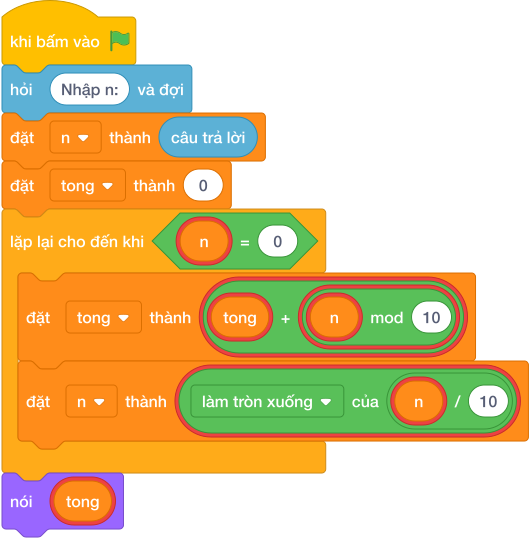

# Hướng Dẫn Giảng Dạy

## 1. Ý tưởng & Phân tích thuật toán

- Bản chất của bài này giống bài tổng 3 chữ số nhưng số `N` dài tùy ý (tới 19 chữ số), vẫn gọt từng chữ số từ phải sang trái rồi cộng dồn.
- Quy trình từng bước với đúng tên biến trong lời giải:
  - Bước 1: `n = câu trả lời` đọc số. Với mẫu, `n = 2024`.
  - Bước 2: đặt `tong = 0`.
  - Bước 3: lặp `while n > 0`, mỗi lần cộng `(n mod 10)` vào `tong` rồi gọt `n = làm tròn xuống của (n / 10)`.
  - Bước 4: in `tong`.
- Giá trị biên cụ thể: trường hợp đặc biệt `n = 0` thì vòng lặp không chạy lần nào và in `0`, đúng đáp án mẫu thứ 2; `N` lớn nhất tới 1000000000000000000.

---

## 2. Bảng chạy tay trên số liệu mẫu (Dry Run Table - Sample 1: 2024)

| Lần lặp | `n` trước | Chữ số `(n mod 10)` | `tong` trước | `tong` sau | `n` sau (`làm tròn xuống của (n / 10)`) |
|---|---|---|---|---|---|
| Khởi đầu | 2024 | — | 0 | 0 | 2024 |
| 1 | 2024 | 4 | 0 | 4 | 202 |
| 2 | 202 | 2 | 4 | 6 | 20 |
| 3 | 20 | 0 | 6 | 6 | 2 |
| 4 | 2 | 2 | 6 | 8 | 0 |

- Vòng lặp dừng vì `n = 0`, in ra `8`, trùng kết quả mẫu (`2 + 0 + 2 + 4 = 8`).

---

## 3. Lưu ý & Bẫy lỗi thường gặp

- Bẫy 1: quên gọt `n` trong vòng lặp, `n` mãi bằng 2024 nên lặp vô tận. Cách sửa: cuối mỗi lần lặp phải `n = làm tròn xuống của (n / 10)`.
```text
n = câu trả lời
tong = 0
while n > 0:
    tong = tong + (n mod 10)
nói (tong)

```
- Bẫy 2: viết điều kiện lặp `while n >= 0` thay vì `while n > 0`. Với mẫu `n = 2024`, khi `n` đã gọt về 0 thì điều kiện `0 >= 0` vẫn đúng nên lặp mãi không dừng. Cách sửa: dùng `while n > 0`.
```text
n = câu trả lời
tong = 0
while n >= 0:
    tong = tong + (n mod 10)
    n = làm tròn xuống của (n / 10)
nói (tong)

```
- Bẫy 3: dùng `for` với số lần lặp cố định 3 lần (học theo bài số 3 chữ số). Với mẫu `n = 2024` có 4 chữ số nên thiếu mất chữ số 2 đầu tiên, ra `0 + 2 + 4 = 6`, là kết quả sai. Cách sửa: lặp `while n > 0` cho tới khi gọt hết.
```text
n = câu trả lời
tong = 0
for _ in range(3):
    tong = tong + (n mod 10)
    n = làm tròn xuống của (n / 10)
nói (tong)

```

---

## 4. Lời giải tham khảo & Kịch bản Khối lệnh Scratch 3.0

### 4.1. Khối lệnh đồ họa trực quan (Visual Scratch Blocks)



> 💡 **Kịch bản thực hiện từng bước:**
> - khi bấm vào cờ xanh
> - hỏi [Nhập n:] và đợi
> - đặt [n] thành (câu trả lời)
> - đặt [tong] thành (0)
> - lặp lại cho đến khi <n = 0>:
> -   đặt [tong] thành (tong + n mod 10)
> -   đặt [n] thành (n chia nguyên 10)
> - nói (tong)
