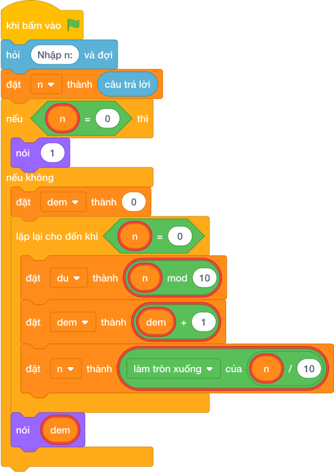

# Hướng Dẫn Giảng Dạy

## 1. Ý tưởng & Phân tích thuật toán

- Bản chất của bài này là gọt dần từng chữ số ở cuối bằng phép chia nguyên cho 10, gọt được bao nhiêu lần thì số có bấy nhiêu chữ số.
- Quy trình từng bước với đúng tên biến trong lời giải:
  - Bước 1: `n = câu trả lời` đọc số. Với mẫu, `n = 123456`.
  - Bước 2: trường hợp đặc biệt `if n == 0` thì in `1` ngay vì số 0 có một chữ số.
  - Bước 3: ngược lại đặt `dem = 0` rồi lặp `while n > 0`, mỗi lần lấy `du = (n mod 10)`, tăng `dem` thêm 1, gọt `n = làm tròn xuống của (n / 10)`.
  - Bước 4: in `dem`.
- Giá trị biên cụ thể: với mẫu `123456` đếm được 6; số 0 là trường hợp đặc biệt phải xử lý riêng, in ra 1.

---

## 2. Bảng chạy tay trên số liệu mẫu (Dry Run Table - Sample 1: 123456)

| Lần lặp | `n` trước | `du = (n mod 10)` | `dem` trước | `dem` sau | `n` sau |
|---|---|---|---|---|---|
| Khởi đầu | 123456 | — | 0 | 0 | 123456 |
| 1 | 123456 | 6 | 0 | 1 | 12345 |
| 2 | 12345 | 5 | 1 | 2 | 1234 |
| 3 | 1234 | 4 | 2 | 3 | 123 |
| 4 | 123 | 3 | 3 | 4 | 12 |
| 5 | 12 | 2 | 4 | 5 | 1 |
| 6 | 1 | 1 | 5 | 6 | 0 |

- Vòng lặp dừng vì `n = 0`, in ra `6`, trùng kết quả mẫu.

---

## 3. Lưu ý & Bẫy lỗi thường gặp

- Bẫy 1: quên xử lý riêng số 0. Với `n = 0` vòng lặp không chạy lần nào nên in `dem = 0`, là kết quả sai (đáp án đúng là 1). Cách sửa: thêm nhánh `if n == 0: nói (1)` như lời giải.
```text
n = câu trả lời
dem = 0
while n > 0:
    du = (n mod 10)
    dem = dem + 1
    n = làm tròn xuống của (n / 10)
nói (dem)

```
- Bẫy 2: quên tăng `dem` trong vòng lặp. Với mẫu `123456` vòng lặp gọt 6 lần nhưng `dem` mãi là 0, in ra `0`, là kết quả sai. Cách sửa: mỗi lần lặp phải `dem = dem + 1`.
```text
n = câu trả lời
if n == 0:
    nói (1)
else:
    dem = 0
    while n > 0:
        du = (n mod 10)
        n = làm tròn xuống của (n / 10)
    nói (dem)

```
- Bẫy 3: quên gọt `n` trong vòng lặp, `n` mãi bằng 123456 nên lặp vô tận. Cách sửa: cuối mỗi lần lặp phải `n = làm tròn xuống của (n / 10)`.
```text
n = câu trả lời
if n == 0:
    nói (1)
else:
    dem = 0
    while n > 0:
        du = (n mod 10)
        dem = dem + 1
    nói (dem)

```

---

## 4. Lời giải tham khảo & Kịch bản Khối lệnh Scratch 3.0

### 4.1. Khối lệnh đồ họa trực quan (Visual Scratch Blocks)



> 💡 **Kịch bản thực hiện từng bước:**
> - khi bấm vào cờ xanh
> - hỏi [Nhập n:] và đợi
> - đặt [n] thành (câu trả lời)
> - nếu <n = 0> thì:
> -   nói (1)
> - nếu không thì:
> -   đặt [dem] thành (0)
> -   lặp lại cho đến khi <n = 0>:
> -     đặt [du] thành (n mod 10)
> -     đặt [dem] thành (dem + 1)
> -     đặt [n] thành (n chia nguyên 10)
> -   nói (dem)
