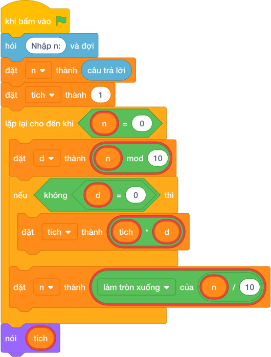

# Hướng Dẫn Giảng Dạy

## 1. Ý tưởng & Phân tích thuật toán

- Bản chất của bài này là nhân dồn các chữ số của `N`, gặp chữ số 0 thì bỏ qua không nhân (vì nhân với 0 sẽ làm cả tích thành 0).
- Quy trình từng bước với đúng tên biến trong lời giải:
  - Bước 1: `n = câu trả lời` đọc số. Với mẫu, `n = 205`.
  - Bước 2: đặt `tich = 1` (phải là 1 chứ không phải 0 vì đây là phép nhân).
  - Bước 3: lặp `while n > 0`, mỗi lần lấy `d = (n mod 10)`; nếu `d != 0` thì `tich = tich * d`; rồi gọt `n = làm tròn xuống của (n / 10)`.
  - Bước 4: in `tich`.
- Giá trị biên cụ thể: với mẫu `205` thì bỏ qua chữ số 0, tích là `2 * 5 = 10`; đề bài cho `N` tới 1000000000.

---

## 2. Bảng chạy tay trên số liệu mẫu (Dry Run Table - Sample 1: 205)

| Lần lặp | `n` trước | `d = (n mod 10)` | `d != 0`? | `tich` trước | `tich` sau | `n` sau |
|---|---|---|---|---|---|---|
| Khởi đầu | 205 | — | — | 1 | 1 | 205 |
| 1 | 205 | 5 | đúng | 1 | `1 * 5 = 5` | 20 |
| 2 | 20 | 0 | sai, bỏ qua | 5 | 5 | 2 |
| 3 | 2 | 2 | đúng | 5 | `5 * 2 = 10` | 0 |

- Vòng lặp dừng vì `n = 0`, in ra `10`, trùng kết quả mẫu.

---

## 3. Lưu ý & Bẫy lỗi thường gặp

- Bẫy 1: nhân cả chữ số 0, bỏ mất điều kiện `if d != 0`. Với mẫu `205` tích thành `1 * 5 * 0 * 2 = 0`, là kết quả sai. Cách sửa: chỉ nhân khi `d != 0`.
```text
n = câu trả lời
tich = 1
while n > 0:
    d = (n mod 10)
    tich = tich * d
    n = làm tròn xuống của (n / 10)
nói (tich)

```
- Bẫy 2: khởi đầu `tich = 0` thay vì `tich = 1`. Với mẫu mọi phép nhân đều `0 * ... = 0`, in ra `0`, là kết quả sai. Cách sửa: đặt `tich = 1`.
```text
n = câu trả lời
tich = 0
while n > 0:
    d = (n mod 10)
    if d != 0:
        tich = tich * d
    n = làm tròn xuống của (n / 10)
nói (tich)

```
- Bẫy 3: quên gọt `n` trong vòng lặp, `n` mãi bằng 205 nên lặp vô tận. Cách sửa: cuối mỗi lần lặp phải `n = làm tròn xuống của (n / 10)`.
```text
n = câu trả lời
tich = 1
while n > 0:
    d = (n mod 10)
    if d != 0:
        tich = tich * d
nói (tich)

```

---

## 4. Lời giải tham khảo & Kịch bản Khối lệnh Scratch 3.0

### 4.1. Khối lệnh đồ họa trực quan (Visual Scratch Blocks)



> 💡 **Kịch bản thực hiện từng bước:**
> - khi bấm vào cờ xanh
> - hỏi [Nhập n:] và đợi
> - đặt [n] thành (câu trả lời)
> - đặt [tich] thành (1)
> - lặp lại cho đến khi <n = 0>:
> -   đặt [d] thành (n mod 10)
> -   nếu <d != 0> thì:
> -     đặt [tich] thành (tich * d)
> -   đặt [n] thành (n chia nguyên 10)
> - nói (tich)
