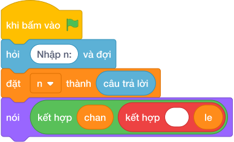

# Hướng Dẫn Giảng Dạy: Đếm chữ số chẵn và lẻ
Chuyên đề: **Lập Trình Thuật Toán & Khối Lệnh Scratch 3.0**

---

## 1. Ý tưởng & Phân tích thuật toán

- Bản chất của bài này là lướt từng chữ số của `N`, chữ số nào chia hết cho 2 thì bỏ vào giỏ chẵn, còn lại bỏ vào giỏ lẻ.
- Quy trình từng bước với đúng tên biến trong lời giải:
  - Bước 1: `n = int(câu trả lời)` đọc số. Với mẫu, `n = 2035`.
  - Bước 2: đặt hai giỏ `chan = 0` và `le = 0`.
  - Bước 3: lặp `while n > 0`, mỗi lần lấy `d = n % 10`; nếu `d % 2 == 0` thì `chan` tăng 1, ngược lại `le` tăng 1; rồi gọt `n = n // 10`.
  - Bước 4: in `nói (chan, le)` (giỏ chẵn trước, giỏ lẻ sau).
- Giá trị biên cụ thể: với mẫu `2035` có chữ số chẵn là 2, 0 và chữ số lẻ là 3, 5 nên in `2 2`.

---

## 2. Bảng chạy tay trên số liệu mẫu (Dry Run Table - Sample 1: 2035)

| Lần lặp | `n` trước | `d = n % 10` | `d % 2 == 0`? | `chan` sau | `le` sau | `n` sau |
|---|---|---|---|---|---|---|
| Khởi đầu | 2035 | — | — | 0 | 0 | 2035 |
| 1 | 2035 | 5 | không | 0 | 1 | 203 |
| 2 | 203 | 3 | không | 0 | 2 | 20 |
| 3 | 20 | 0 | có | 1 | 2 | 2 |
| 4 | 2 | 2 | có | 2 | 2 | 0 |

- Vòng lặp dừng, in ra `2 2`, trùng kết quả mẫu.

---

## 3. Lưu ý & Bẫy lỗi thường gặp

- Bẫy 1: quên nhánh đếm số lẻ, chỉ tăng giỏ `chan` mà không có `else`. Với mẫu `2035` giỏ lẻ mãi là 0 nên in ra `2 0`, là kết quả sai. Cách sửa: thêm nhánh `else` tăng `le` như lời giải.
```text
n = int(câu trả lời)
chan = 0
le = 0
while n > 0:
    d = n % 10
    if d % 2 == 0:
        chan = chan + 1
    n = n // 10
print(chan, le)
```
- Bẫy 2: in ngược thứ tự `nói (le, chan)`. Với mẫu tuy hai giỏ bằng nhau đều là 2 nên trùng, nhưng với số như 246 (chẵn 2, lẻ 1) sẽ in `1 2`, là kết quả sai. Cách sửa: in `nói (chan, le)`.
```text
n = int(câu trả lời)
chan = 0
le = 0
while n > 0:
    d = n % 10
    if d % 2 == 0:
        chan = chan + 1
    else:
        le = le + 1
    n = n // 10
print(le, chan)
```
- Bẫy 3: quên gọt `n` trong vòng lặp, `n` mãi bằng 2035 nên lặp vô tận. Cách sửa: cuối mỗi lần lặp phải `n = n // 10`.
```text
n = int(câu trả lời)
chan = 0
le = 0
while n > 0:
    d = n % 10
    if d % 2 == 0:
        chan = chan + 1
    else:
        le = le + 1
print(chan, le)
```

---

## 4. Lời giải tham khảo & Kịch bản Khối lệnh Scratch 3.0

### 4.1. Khối lệnh đồ họa trực quan (Visual Scratch Blocks)



> 💡 **Kịch bản thực hiện từng bước:**
> - khi bấm vào cờ xanh
> - hỏi [Nhập n:] và đợi
> - đặt [n] thành (câu trả lời)
> - nói (kết hợp chan và " " và le)
