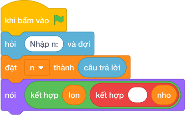

# Hướng Dẫn Giảng Dạy: Chữ số lớn nhất & nhỏ nhất
Chuyên đề: **Lập Trình Thuật Toán & Khối Lệnh Scratch 3.0**

---

## 1. Ý tưởng & Phân tích thuật toán

- Bản chất của bài này là lướt qua từng chữ số của `N` từ phải sang trái, tay cầm hai tấm bảng ghi chữ số lớn nhất và nhỏ nhất thấy được cho tới lúc này.
- Quy trình từng bước với đúng tên biến trong lời giải:
  - Bước 1: `n = int(câu trả lời)` đọc số. Với mẫu, `n = 9418`.
  - Bước 2: đặt `lon = -1` (nhỏ hơn mọi chữ số) và `nho = 10` (lớn hơn mọi chữ số).
  - Bước 3: lặp `while n > 0`, mỗi lần lấy `d = n % 10`; nếu `d > lon` thì đổi bảng `lon`, nếu `d < nho` thì đổi bảng `nho`; rồi gọt `n = n // 10`.
  - Bước 4: in `nói (lon, nho)`.
- Giá trị biên cụ thể: với mẫu `9418` thì lớn nhất là 9, nhỏ nhất là 1; số có 1 chữ số như 5 thì cả hai bảng đều là 5.

---

## 2. Bảng chạy tay trên số liệu mẫu (Dry Run Table - Sample 1: 9418)

| Lần lặp | `n` trước | `d = n % 10` | `lon` trước | `lon` sau | `nho` trước | `nho` sau | `n` sau |
|---|---|---|---|---|---|---|---|
| Khởi đầu | 9418 | — | -1 | -1 | 10 | 10 | 9418 |
| 1 | 9418 | 8 | -1 | 8 | 10 | 8 | 941 |
| 2 | 941 | 1 | 8 | 8 | 8 | 1 | 94 |
| 3 | 94 | 4 | 8 | 8 | 1 | 1 | 9 |
| 4 | 9 | 9 | 8 | 9 | 1 | 1 | 0 |

- Vòng lặp dừng, in ra `9 1`, trùng kết quả mẫu.

---

## 3. Lưu ý & Bẫy lỗi thường gặp

- Bẫy 1: khởi đầu `lon = 0` thay vì `lon = -1`. Với số như 5 thì vẫn đúng, nhưng cách đặt `-1` an toàn cho mọi chữ số; lỗi thật sự là khởi đầu `nho = 0`: với mẫu `9418` không chữ số nào nhỏ hơn 0 nên `nho` mãi là 0, in ra `9 0`, là kết quả sai. Cách sửa: đặt `lon = -1`, `nho = 10`.
```text
n = int(câu trả lời)
lon = 9
nho = 0
while n > 0:
    d = n % 10
    if d > lon:
        lon = d
    if d < nho:
        nho = d
    n = n // 10
print(lon, nho)
```
- Bẫy 2: quên gọt `n` trong vòng lặp, `n` mãi bằng 9418 nên lặp vô tận. Cách sửa: cuối mỗi lần lặp phải `n = n // 10`.
```text
n = int(câu trả lời)
lon = -1
nho = 10
while n > 0:
    d = n % 10
    if d > lon:
        lon = d
    if d < nho:
        nho = d
print(lon, nho)
```
- Bẫy 3: in ngược thứ tự `nói (nho, lon)`. Với mẫu sẽ ra `1 9`, là kết quả sai vì đề bài yêu cầu lớn nhất trước, nhỏ nhất sau. Cách sửa: in `nói (lon, nho)`.
```text
n = int(câu trả lời)
lon = -1
nho = 10
while n > 0:
    d = n % 10
    if d > lon:
        lon = d
    if d < nho:
        nho = d
    n = n // 10
print(nho, lon)
```

---

## 4. Lời giải tham khảo & Kịch bản Khối lệnh Scratch 3.0

### 4.1. Khối lệnh đồ họa trực quan (Visual Scratch Blocks)



> 💡 **Kịch bản thực hiện từng bước:**
> - khi bấm vào cờ xanh
> - hỏi [Nhập n:] và đợi
> - đặt [n] thành (câu trả lời)
> - nói (kết hợp lon và " " và nho)
