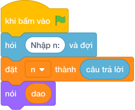

# Hướng Dẫn Giảng Dạy: Số đảo ngược
Chuyên đề: **Lập Trình Thuật Toán & Khối Lệnh Scratch 3.0**

---

## 1. Ý tưởng & Phân tích thuật toán

- Bản chất của bài này là xây số mới bằng cách lấy từng chữ số từ phải sang trái của số cũ rồi đắp dần từ trái sang phải: `dao = dao * 10 + chữ số cuối`.
- Quy trình từng bước với đúng tên biến trong lời giải:
  - Bước 1: `n = int(câu trả lời)` đọc số. Với mẫu, `n = 1234`.
  - Bước 2: đặt `dao = 0` làm số đảo đang xây.
  - Bước 3: lặp `while n > 0`, mỗi lần lấy `n % 10` đắp vào `dao`, rồi gọt `n = n // 10`.
  - Bước 4: in `dao`. Các số 0 ở cuối số cũ tự rơi rụng vì `dao` là số nguyên (ví dụ 2500 đảo thành 52).
- Giá trị biên cụ thể: số có 1 chữ số như 5 thì đảo vẫn là 5; đề bài cho `N` tới 1000000000000.

---

## 2. Bảng chạy tay trên số liệu mẫu (Dry Run Table - Sample 1: 1234)

| Lần lặp | `n` trước | Chữ số `n % 10` | `dao` trước | `dao` sau (`dao * 10 + chữ số`) | `n` sau |
|---|---|---|---|---|---|
| Khởi đầu | 1234 | — | 0 | 0 | 1234 |
| 1 | 1234 | 4 | 0 | `0*10 + 4 = 4` | 123 |
| 2 | 123 | 3 | 4 | `4*10 + 3 = 43` | 12 |
| 3 | 12 | 2 | 43 | `43*10 + 2 = 432` | 1 |
| 4 | 1 | 1 | 432 | `432*10 + 1 = 4321` | 0 |

- Vòng lặp dừng vì `n = 0`, in ra `4321`, trùng kết quả mẫu.

---

## 3. Lưu ý & Bẫy lỗi thường gặp

- Bẫy 1: quên nhân `dao` với 10, viết `dao = dao + n % 10`. Với mẫu sẽ cộng `4 + 3 + 2 + 1 = 10`, là kết quả sai. Cách sửa: viết đủ `dao = dao * 10 + n % 10`.
```text
n = int(câu trả lời)
dao = 0
while n > 0:
    dao = dao + n % 10
    n = n // 10
print(dao)
```
- Bẫy 2: quên gọt `n` trong vòng lặp, `n` mãi bằng 1234 nên lặp vô tận. Cách sửa: cuối mỗi lần lặp phải `n = n // 10`.
```text
n = int(câu trả lời)
dao = 0
while n > 0:
    dao = dao * 10 + n % 10
print(dao)
```
- Bẫy 3: đảo bằng cách cắt chuỗi ký tự rồi in chuỗi, ví dụ `str(n)[::-1]`. Với mẫu `1234` vẫn ra `4321` đúng, nhưng với `2500` sẽ in `0052` thay vì `52`, là kết quả sai. Cách sửa: xây số bằng phép nhân cộng như lời giải để số 0 đầu tự rơi.
```text
n = int(câu trả lời)
print(str(n)[::-1])
```

---

## 4. Lời giải tham khảo & Kịch bản Khối lệnh Scratch 3.0

### 4.1. Khối lệnh đồ họa trực quan (Visual Scratch Blocks)



> 💡 **Kịch bản thực hiện từng bước:**
> - khi bấm vào cờ xanh
> - hỏi [Nhập n:] và đợi
> - đặt [n] thành (câu trả lời)
> - nói (dao)
