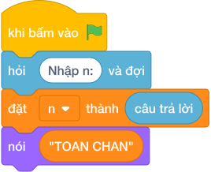

# Hướng Dẫn Giảng Dạy: Số toàn chẵn hoặc toàn lẻ
Chuyên đề: **Lập Trình Thuật Toán & Khối Lệnh Scratch 3.0**

---

## 1. Ý tưởng & Phân tích thuật toán

- Bản chất của bài này là lướt từng chữ số của `N`: thấy một chữ số lẻ thì đội Chẵn thua, thấy một chữ số chẵn thì đội Lẻ thua; đội nào còn đứng vững tới cuối thì thắng.
- Quy trình từng bước với đúng tên biến trong lời giải:
  - Bước 1: `n = int(câu trả lời)` đọc số. Với mẫu, `n = 2468`.
  - Bước 2: cắm hai cờ `toan_chan = True` và `toan_le = True`.
  - Bước 3: lặp `while n > 0`, mỗi lần lấy `d = n % 10`; nếu `d` chẵn thì hạ cờ `toan_le = False`, ngược lại hạ cờ `toan_chan = False`; rồi gọt `n = n // 10`.
  - Bước 4: nếu `toan_chan` còn đúng thì in `TOAN CHAN`, ngược lại nếu `toan_le` còn đúng thì in `TOAN LE`, còn lại in `BINH THUONG`.
- Giá trị biên cụ thể: với mẫu `2468` cả bốn chữ số 2, 4, 6, 8 đều chẵn nên in `TOAN CHAN`; số như 1395 toàn lẻ nên in `TOAN LE`.

---

## 2. Bảng chạy tay trên số liệu mẫu (Dry Run Table - Sample 1: 2468)

| Lần lặp | `n` trước | `d = n % 10` | Chẵn hay lẻ | `toan_chan` sau | `toan_le` sau | `n` sau |
|---|---|---|---|---|---|---|
| Khởi đầu | 2468 | — | — | True | True | 2468 |
| 1 | 2468 | 8 | chẵn | True | False | 246 |
| 2 | 246 | 6 | chẵn | True | False | 24 |
| 3 | 24 | 4 | chẵn | True | False | 2 |
| 4 | 2 | 2 | chẵn | True | False | 0 |

- Vòng lặp dừng, `toan_chan` còn True nên in `TOAN CHAN`, trùng kết quả mẫu.

---

## 3. Lưu ý & Bẫy lỗi thường gặp

- Bẫy 1: hạ nhầm cờ, viết chữ số chẵn thì hạ `toan_chan`. Với mẫu `2468` toàn chữ số chẵn mà cờ `toan_chan` bị hạ hết, cuối cùng in `BINH THUONG`, là kết quả sai. Cách sửa: chữ số chẵn hạ `toan_le`, chữ số lẻ hạ `toan_chan`.
```text
n = int(câu trả lời)
toan_chan = True
toan_le = True
while n > 0:
    d = n % 10
    if d % 2 == 0:
        toan_chan = False
    else:
        toan_le = False
    n = n // 10
if toan_chan:
    print("TOAN CHAN")
elif toan_le:
    print("TOAN LE")
else:
    print("BINH THUONG")
```
- Bẫy 2: quên gọt `n` trong vòng lặp, `n` mãi bằng 2468 nên lặp vô tận. Cách sửa: cuối mỗi lần lặp phải `n = n // 10`.
```text
n = int(câu trả lời)
toan_chan = True
toan_le = True
while n > 0:
    d = n % 10
    if d % 2 == 0:
        toan_le = False
    else:
        toan_chan = False
if toan_chan:
    print("TOAN CHAN")
elif toan_le:
    print("TOAN LE")
else:
    print("BINH THUONG")
```
- Bẫy 3: kiểm tra cờ `toan_le` trước `toan_chan`. Với số toàn chẵn hoặc toàn lẻ thì chỉ một cờ còn đúng nên không sao, nhưng số như 2418 cả hai cờ đều bị hạ và phải in `BINH THUONG`; thứ tự sai không gây lỗi ở đây, lỗi thật sự hay gặp là in thiếu chữ, ví dụ `TOANCHAN` không có dấu cách. Với mẫu sẽ in `TOANCHAN`, là kết quả sai. Cách sửa: in đúng `TOAN CHAN` có dấu cách ở giữa.
```text
n = int(câu trả lời)
toan_chan = True
toan_le = True
while n > 0:
    d = n % 10
    if d % 2 == 0:
        toan_le = False
    else:
        toan_chan = False
    n = n // 10
if toan_chan:
    print("TOANCHAN")
elif toan_le:
    print("TOANLE")
else:
    print("BINHTHUONG")
```

---

## 4. Lời giải tham khảo & Kịch bản Khối lệnh Scratch 3.0

### 4.1. Khối lệnh đồ họa trực quan (Visual Scratch Blocks)



> 💡 **Kịch bản thực hiện từng bước:**
> - khi bấm vào cờ xanh
> - hỏi [Nhập n:] và đợi
> - đặt [n] thành (câu trả lời)
> - nói ("TOAN CHAN")
