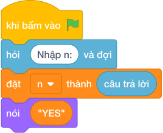

# Hướng Dẫn Giảng Dạy: Số may mắn chứa số 7
Chuyên đề: **Lập Trình Thuật Toán & Khối Lệnh Scratch 3.0**

---

## 1. Ý tưởng & Phân tích thuật toán

- Bản chất của bài này là lướt từng chữ số của `N` từ phải sang trái, chỉ cần thấy một chữ số 7 thì kết luận may mắn.
- Quy trình từng bước với đúng tên biến trong lời giải:
  - Bước 1: `n = int(câu trả lời)` đọc số. Với mẫu, `n = 372`.
  - Bước 2: cắm cờ `tim_thay = False` (chưa thấy số 7).
  - Bước 3: lặp `while n > 0`, mỗi lần kiểm tra `if n % 10 == 7` thì dựng cờ `tim_thay = True`; rồi gọt `n = n // 10`.
  - Bước 4: nếu `tim_thay` thì in `YES`, ngược lại in `NO`.
- Giá trị biên cụ thể: với mẫu `372` có chữ số 7 ở giữa nên in `YES`; số như 2024 không có chữ số 7 nên in `NO`.

---

## 2. Bảng chạy tay trên số liệu mẫu (Dry Run Table - Sample 1: 372)

| Lần lặp | `n` trước | `n % 10` | Có bằng 7 không | `tim_thay` sau | `n` sau |
|---|---|---|---|---|---|
| Khởi đầu | 372 | — | — | False | 372 |
| 1 | 372 | 2 | không | False | 37 |
| 2 | 37 | 7 | có | True | 3 |
| 3 | 3 | 3 | không | True | 0 |

- Vòng lặp dừng, `tim_thay` là True nên in `YES`, trùng kết quả mẫu.

---

## 3. Lưu ý & Bẫy lỗi thường gặp

- Bẫy 1: so sánh cả số `n == 7` thay vì từng chữ số. Với mẫu `372 != 7` nên in `NO`, là kết quả sai. Cách sửa: kiểm tra `n % 10 == 7` trong vòng lặp.
```text
n = int(câu trả lời)
if n == 7:
    print("YES")
else:
    print("NO")
```
- Bẫy 2: quên gọt `n` trong vòng lặp, `n` mãi bằng 372 nên lặp vô tận. Cách sửa: cuối mỗi lần lặp phải `n = n // 10`.
```text
n = int(câu trả lời)
tim_thay = False
while n > 0:
    if n % 10 == 7:
        tim_thay = True
if tim_thay:
    print("YES")
else:
    print("NO")
```
- Bẫy 3: in chữ thường `yes`/`no`. Với mẫu sẽ in `yes`, là kết quả sai vì đề bài yêu cầu in hoa `YES`. Cách sửa: in đúng `YES` và `NO`.
```text
n = int(câu trả lời)
tim_thay = False
while n > 0:
    if n % 10 == 7:
        tim_thay = True
    n = n // 10
if tim_thay:
    print("yes")
else:
    print("no")
```

---

## 4. Lời giải tham khảo & Kịch bản Khối lệnh Scratch 3.0

### 4.1. Khối lệnh đồ họa trực quan (Visual Scratch Blocks)



> 💡 **Kịch bản thực hiện từng bước:**
> - khi bấm vào cờ xanh
> - hỏi [Nhập n:] và đợi
> - đặt [n] thành (câu trả lời)
> - nói ("YES")
