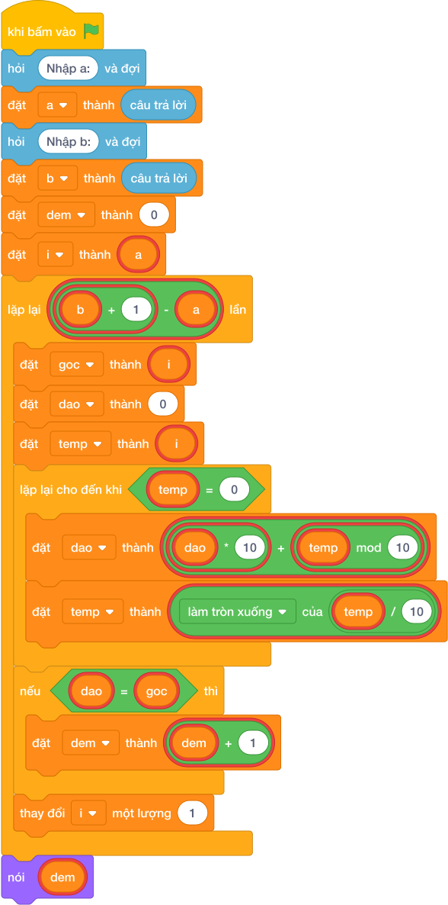

# Hướng Dẫn Giảng Dạy

## 1. Ý tưởng & Phân tích thuật toán

- Bản chất của bài này là đi bộ từ `A` tới `B`, với mỗi số thì đảo ngược rồi so với chính nó; giống nhau thì đếm thêm 1.
- Quy trình từng bước với đúng tên biến trong lời giải:
  - Bước 1: `a, b = các khối hỏi và đợi cho từng biến` đọc hai đầu đoạn. Với mẫu, `a = 1`, `b = 20`.
  - Bước 2: đặt `dem = 0` làm giỏ đếm.
  - Bước 3: vòng lặp `for i in range(a, b + 1)` cho `i` chạy từ 1 tới 20; với mỗi `i` giữ `goc = i`, xây `dao` bằng cách gọt biến `temp = i`, nếu `dao == goc` thì `dem` tăng 1.
  - Bước 4: in `dem`.
- Giá trị biên cụ thể: với mẫu đoạn 1 tới 20 có 10 số đối xứng là 1, 2, 3, 4, 5, 6, 7, 8, 9, 11 nên đáp án là 10; đề bài cho `B` tới 100000 nên vòng lặp nhiều nhất 100000 số.

---

## 2. Bảng chạy tay trên số liệu mẫu (Dry Run Table - Sample 1: 1 20)

| `i` | `goc` | Cách đảo | `dao` | `dao == goc`? | `dem` sau |
|---|---|---|---|---|---|
| 1 | 1 | đảo 1 | 1 | có | 1 |
| 2 | 2 | đảo 2 | 2 | có | 2 |
| 3 | 3 | đảo 3 | 3 | có | 3 |
| 4 | 4 | đảo 4 | 4 | có | 4 |
| 5 | 5 | đảo 5 | 5 | có | 5 |
| 6 | 6 | đảo 6 | 6 | có | 6 |
| 7 | 7 | đảo 7 | 7 | có | 7 |
| 8 | 8 | đảo 8 | 8 | có | 8 |
| 9 | 9 | đảo 9 | 9 | có | 9 |
| 10 | 10 | đảo 10 thành 1 | 1 | không | 9 |
| 11 | 11 | đảo 11 thành 11 | 11 | có | 10 |
| 12 | 12 | đảo 12 thành 21 | 21 | không | 10 |
| 13–20 | (tương tự) | đảo đều khác gốc | — | không | 10 |

- Hết đoạn thì in `dem = 10`, trùng kết quả mẫu.

---

## 3. Lưu ý & Bẫy lỗi thường gặp

- Bẫy 1: vòng lặp `range(a, b)` thiếu `+ 1` nên bỏ mất số `B`. Với mẫu `1 20` thì số 20 không đối xứng nên vẫn ra 10 đúng, nhưng với đoạn `9 11` sẽ bỏ mất 11 và đếm ra 1 thay vì 2, là kết quả sai. Cách sửa: dùng `range(a, b + 1)`.
```text
a, b = các khối hỏi và đợi cho từng biến
dem = 0
for i in range(a, b):
    goc = i
    dao = 0
    temp = i
    while temp > 0:
        dao = dao * 10 + (temp mod 10)
        temp = làm tròn xuống của (temp / 10)
    if dao == goc:
        dem = dem + 1
nói (dem)

```
- Bẫy 2: dùng chung biến `i` để gọt trong vòng đảo, làm hỏng số đếm của vòng ngoài. Với mẫu sau số đầu tiên `i` thành 0 và vòng lặp loạn hẳn, là kết quả sai. Cách sửa: gọt trên biến riêng `temp = i` như lời giải.
```text
a, b = các khối hỏi và đợi cho từng biến
dem = 0
for i in range(a, b + 1):
    goc = i
    dao = 0
    while i > 0:
        dao = dao * 10 + (i mod 10)
        i = làm tròn xuống của (i / 10)
    if dao == goc:
        dem = dem + 1
nói (dem)

```
- Bẫy 3: quên đặt lại `dao = 0` cho mỗi số mới, số đảo của số trước còn dính sang số sau. Với mẫu từ số 2 trở đi `dao` tính sai hết, là kết quả sai. Cách sửa: đầu mỗi lần lặp đặt `dao = 0` và `temp = i`.
```text
a, b = các khối hỏi và đợi cho từng biến
dem = 0
dao = 0
for i in range(a, b + 1):
    goc = i
    temp = i
    while temp > 0:
        dao = dao * 10 + (temp mod 10)
        temp = làm tròn xuống của (temp / 10)
    if dao == goc:
        dem = dem + 1
nói (dem)

```

---

## 4. Lời giải tham khảo & Kịch bản Khối lệnh Scratch 3.0

### 4.1. Khối lệnh đồ họa trực quan (Visual Scratch Blocks)



> 💡 **Kịch bản thực hiện từng bước:**
> - khi bấm vào cờ xanh
> - hỏi [Nhập a:] và đợi
> - đặt [a] thành (câu trả lời)
> - hỏi [Nhập b:] và đợi
> - đặt [b] thành (câu trả lời)
> - đặt [dem] thành (0)
> - đặt [i] thành (a)
> - lặp lại (b + 1 - a) lần:
> -   đặt [goc] thành (i)
> -   đặt [dao] thành (0)
> -   đặt [temp] thành (i)
> -   lặp lại cho đến khi <temp = 0>:
> -     đặt [dao] thành (dao * 10 + temp mod 10)
> -     đặt [temp] thành (temp chia nguyên 10)
> -   nếu <dao = goc> thì:
> -     đặt [dem] thành (dem + 1)
> -   thay đổi [i] một lượng 1
> - nói (dem)
