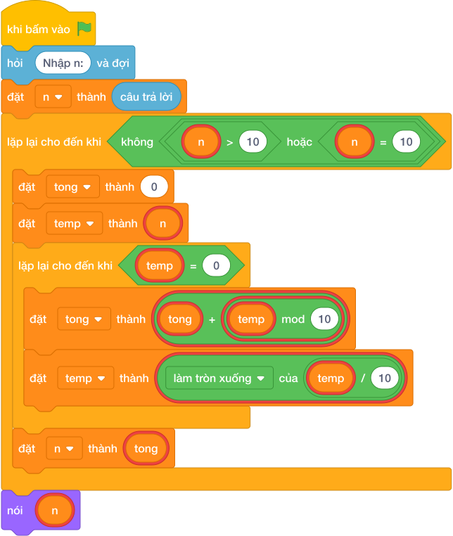

# Hướng Dẫn Giảng Dạy

## 1. Ý tưởng & Phân tích thuật toán

- Bản chất của bài này là trò gộp hạt đậu: cộng các chữ số lại, nếu còn từ 2 chữ số trở lên thì cộng tiếp cho tới khi chỉ còn một chữ số.
- Quy trình từng bước với đúng tên biến trong lời giải:
  - Bước 1: `n = câu trả lời` đọc số. Với mẫu, `n = 9875`.
  - Bước 2: vòng ngoài `while n >= 10` lặp chừng nào `n` còn từ 10 trở lên.
  - Bước 3: mỗi vòng ngoài đặt `tong = 0`, sao chép `temp = n` rồi gọt `temp` để cộng từng chữ số vào `tong`, sau đó gán `n = tong`.
  - Bước 4: khi `n` còn một chữ số thì in `n`.
- Giá trị biên cụ thể: với mẫu `9875 -> 29 -> 11 -> 2` nên đáp án là 2; số có 1 chữ số như 7 thì vòng ngoài không chạy và in ngay 7.

---

## 2. Bảng chạy tay trên số liệu mẫu (Dry Run Table - Sample 1: 9875)

| Vòng ngoài | `n` đầu vòng | Các chữ số cộng dồn | `tong` | `n` cuối vòng | Còn lặp không |
|---|---|---|---|---|---|
| 1 | 9875 | `9 + 8 + 7 + 5` | 29 | 29 | `29 >= 10` đúng, lặp tiếp |
| 2 | 29 | `2 + 9` | 11 | 11 | `11 >= 10` đúng, lặp tiếp |
| 3 | 11 | `1 + 1` | 2 | 2 | `2 >= 10` sai, dừng |

- In ra `2`, trùng kết quả mẫu.

---

## 3. Lưu ý & Bẫy lỗi thường gặp

- Bẫy 1: chỉ cộng chữ số một lần rồi dừng, thiếu vòng ngoài. Với mẫu `9875` sẽ in `29`, là kết quả sai vì 29 còn 2 chữ số. Cách sửa: bọc trong `while n >= 10` để cộng tới khi còn một chữ số.
```text
n = câu trả lời
tong = 0
temp = n
while temp > 0:
    tong = tong + (temp mod 10)
    temp = làm tròn xuống của (temp / 10)
n = tong
nói (n)

```
- Bẫy 2: quên đặt lại `tong = 0` ở đầu mỗi vòng ngoài, tổng bị cộng dồn qua các vòng. Với mẫu vòng 2 sẽ tính `29 + 11 = 40` thay vì 11, là kết quả sai. Cách sửa: mỗi vòng ngoài đặt lại `tong = 0`.
```text
n = câu trả lời
tong = 0
while n >= 10:
    temp = n
    while temp > 0:
        tong = tong + (temp mod 10)
        temp = làm tròn xuống của (temp / 10)
    n = tong
nói (n)

```
- Bẫy 3: viết điều kiện vòng ngoài `while n > 10` (thiếu dấu bằng). Với `n = 10` vòng lặp không chạy và in `10`, là kết quả sai (đáp án đúng là 1). Cách sửa: dùng `while n >= 10`.
```text
n = câu trả lời
while n > 10:
    tong = 0
    temp = n
    while temp > 0:
        tong = tong + (temp mod 10)
        temp = làm tròn xuống của (temp / 10)
    n = tong
nói (n)

```

---

## 4. Lời giải tham khảo & Kịch bản Khối lệnh Scratch 3.0

### 4.1. Khối lệnh đồ họa trực quan (Visual Scratch Blocks)



> 💡 **Kịch bản thực hiện từng bước:**
> - khi bấm vào cờ xanh
> - hỏi [Nhập n:] và đợi
> - đặt [n] thành (câu trả lời)
> - lặp lại cho đến khi không còn <n >= 10>:
> -   đặt [tong] thành (0)
> -   đặt [temp] thành (n)
> -   lặp lại cho đến khi <temp = 0>:
> -     đặt [tong] thành (tong + temp mod 10)
> -     đặt [temp] thành (temp chia nguyên 10)
> -   đặt [n] thành (tong)
> - nói (n)
