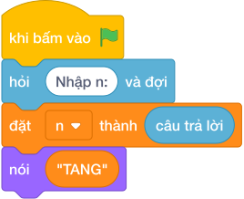

# Hướng Dẫn Giảng Dạy: Số tăng giảm đẹp
Chuyên đề: **Lập Trình Thuật Toán & Khối Lệnh Scratch 3.0**

---

## 1. Ý tưởng & Phân tích thuật toán

- Bản chất của bài này là xem các chữ số từ trái sang phải có tạo thành cầu thang đi lên (mỗi chữ số sau lớn hơn chữ số trước) hay cầu thang đi xuống (mỗi chữ số sau nhỏ hơn chữ số trước) hay không.
- Quy trình từng bước với đúng tên biến trong lời giải:
  - Bước 1: `n = int(câu trả lời)` đọc số. Với mẫu, `n = 1379`.
  - Bước 2: gọt từng chữ số bằng `digits.append(n % 10)` rồi đảo lại `digits = digits[::-1]` để được thứ tự từ trái sang phải. Với mẫu, `digits = [1, 3, 7, 9]`.
  - Bước 3: kiểm tra `tang` bằng cách xem mọi cặp kề có `digits[i] < digits[i + 1]` không; kiểm tra `giam` bằng cách xem mọi cặp kề có `digits[i] > digits[i + 1]` không.
  - Bước 4: nếu `tang` thì in `TANG`, ngược lại nếu `giam` thì in `GIAM`, còn lại in `KHONG`.
- Giá trị biên cụ thể: với mẫu `1379` có `1 < 3 < 7 < 9` nên in `TANG`; số như 1335 có hai chữ số 3 bằng nhau nên in `KHONG`.

---

## 2. Bảng chạy tay trên số liệu mẫu (Dry Run Table - Sample 1: 1379)

| Bước | Việc làm | `digits` | Kết quả kiểm tra |
|---|---|---|---|
| 1 | Đọc `n = 1379`, gọt từng chữ số | `[9, 7, 3, 1]` rồi đảo thành `[1, 3, 7, 9]` | — |
| 2 | Kiểm tra tăng: `1 < 3`, `3 < 7`, `7 < 9` | `[1, 3, 7, 9]` | `tang = True` |
| 3 | Kiểm tra giảm: `1 > 3` sai ngay | `[1, 3, 7, 9]` | `giam = False` |
| 4 | `tang` đúng nên in | `[1, 3, 7, 9]` | in ra `TANG` |

- Kết quả `TANG` trùng kết quả mẫu.

---

## 3. Lưu ý & Bẫy lỗi thường gặp

- Bẫy 1: quên đảo danh sách `digits`, để nguyên thứ tự từ phải sang trái. Với mẫu `digits = [9, 7, 3, 1]` thì kiểm tra tăng sai mà kiểm tra giảm đúng nên in `GIAM`, là kết quả sai. Cách sửa: đảo lại `digits = digits[::-1]` trước khi kiểm tra.
```text
n = int(câu trả lời)
digits = []
while n > 0:
    digits.append(n % 10)
    n //= 10
tang = all(digits[i] < digits[i + 1] for i in range(len(digits) - 1))
giam = all(digits[i] > digits[i + 1] for i in range(len(digits) - 1))
if tang:
    print("TANG")
elif giam:
    print("GIAM")
else:
    print("KHONG")
```
- Bẫy 2: dùng `<=` thay vì `<` khi kiểm tra tăng. Với số như 1335 có hai chữ số 3 bằng nhau mà `3 <= 3` vẫn đúng nên in `TANG`, là kết quả sai (đáp án đúng là `KHONG`). Cách sửa: tăng dần phải là `<` tuyệt đối, giảm dần phải là `>` tuyệt đối.
```text
n = int(câu trả lời)
digits = []
while n > 0:
    digits.append(n % 10)
    n //= 10
digits = digits[::-1]
tang = all(digits[i] <= digits[i + 1] for i in range(len(digits) - 1))
giam = all(digits[i] >= digits[i + 1] for i in range(len(digits) - 1))
if tang:
    print("TANG")
elif giam:
    print("GIAM")
else:
    print("KHONG")
```
- Bẫy 3: kiểm tra giảm trước tăng, rồi với số vừa tăng vừa giảm không thể xảy ra nên thứ tự không sai; lỗi thật sự hay gặp là in chữ thường `tang`. Với mẫu sẽ in `tang`, là kết quả sai vì đề bài yêu cầu in hoa. Cách sửa: in đúng `TANG`, `GIAM`, `KHONG`.
```text
n = int(câu trả lời)
digits = []
while n > 0:
    digits.append(n % 10)
    n //= 10
digits = digits[::-1]
tang = all(digits[i] < digits[i + 1] for i in range(len(digits) - 1))
giam = all(digits[i] > digits[i + 1] for i in range(len(digits) - 1))
if tang:
    print("tang")
elif giam:
    print("giam")
else:
    print("khong")
```

---

## 4. Lời giải tham khảo & Kịch bản Khối lệnh Scratch 3.0

### 4.1. Khối lệnh đồ họa trực quan (Visual Scratch Blocks)



> 💡 **Kịch bản thực hiện từng bước:**
> - khi bấm vào cờ xanh
> - hỏi [Nhập n:] và đợi
> - đặt [n] thành (câu trả lời)
> - nói ("TANG")
