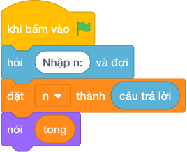

# Hướng Dẫn Giảng Dạy: Tính tổng các ước số
Chuyên đề: **Lập Trình Thuật Toán & Khối Lệnh Scratch 3.0**

---

## 1. Ý tưởng & Phân tích thuật toán
- Bản chất của bài này: với `n = 6`, duyệt mọi `i` từ `1` tới `6`, gặp ước nào thì cộng ngay vào biến `tong`.
- Biến `tong` bắt đầu bằng `0`; mỗi khi `6 % i == 0` thì `tong = tong + i`.
- Với `n = 6` các ước là `1, 2, 3, 6` nên `tong = 1 + 2 + 3 + 6 = 12`.
- Thầy cô cho các em liệt kê ước của `6` ra giấy trước, rồi so với từng bước cộng của chương trình.

---

## 2. Bảng chạy tay trên số liệu mẫu (Dry Run Table - Sample 1: 6)
| `i` | `6 % i` | `tong` sau bước | Ghi chú |
| --- | --- | --- | --- |
| 1 | 0 | 1 | cộng 1 |
| 2 | 0 | 3 | cộng 2 |
| 3 | 0 | 6 | cộng 3 |
| 4 | 2 | 6 | không cộng |
| 5 | 1 | 6 | không cộng |
| 6 | 0 | 12 | cộng 6 |

Kết quả in ra: `12`, khớp với kết quả mẫu.

---

## 3. Lưu ý & Bẫy lỗi thường gặp
- Bẫy 1: khởi đầu `tong = 1` rồi vẫn cộng cả ước `1`. Với mẫu `6` sẽ ra `13`, là kết quả sai. Sửa lại: `tong = 0` ngay từ đầu.
- Bẫy 2: viết `tong + i` mà quên gán lại. Với mẫu `6` chương trình in ra `0`. Sửa lại một dòng: `tong = tong + i`.
- Bẫy 3: nhầm với bài đếm ước nên viết `tong = tong + 1`. Với mẫu `6` sẽ in ra `4` thay vì `12`. Sửa lại: cộng `i`, không cộng `1`.

---

## 4. Lời giải tham khảo & Kịch bản Khối lệnh Scratch 3.0

### 4.1. Khối lệnh đồ họa trực quan (Visual Scratch Blocks)

> 💡 **Kịch bản thực hiện từng bước:**
> - khi bấm vào cờ xanh
> - hỏi [Nhập n:] và đợi
> - đặt [n] thành (câu trả lời)
> - nói (tong)
