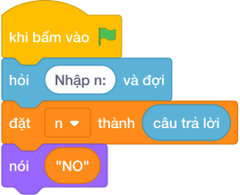

# Hướng Dẫn Giảng Dạy: Kiểm tra số nguyên tố
Chuyên đề: **Lập Trình Thuật Toán & Khối Lệnh Scratch 3.0**

---

## 1. Ý tưởng & Phân tích thuật toán
- Bản chất của bài này: số nguyên tố là số lớn hơn `1` và không chia hết cho số nào từ `2` tới căn bậc hai của nó.
- Với `n = 7`: `7 >= 2` nên đi tiếp; chỉ cần thử `i = 2` vì căn bậc hai của `7` khoảng `2,6`.
- `7 % 2 = 1` nên cờ `la_snt` giữ nguyên `True` và in ra `YES`.
- Thầy cô nhắc thêm hai mốc trong đề: `n = 1` in `NO` (nhỏ hơn `2`), `n = 9` in `NO` (vì `9 % 3 == 0`).

---

## 2. Bảng chạy tay trên số liệu mẫu (Dry Run Table - Sample 1: 7)
| Bước | Giá trị | Ghi chú |
| --- | --- | --- |
| Đọc | `n = 7` | |
| So `n < 2` | `7 < 2` sai | đi tiếp |
| `i = 2` | `7 % 2 = 1` | không chia hết, `la_snt` vẫn `True` |
| Hết vòng | căn của 7 khoảng 2,6 | chỉ thử tới `2` |
| Kết luận | `la_snt` đúng | in `YES` |

Kết quả in ra: `YES`, khớp với kết quả mẫu.

---

## 3. Lưu ý & Bẫy lỗi thường gặp
- Bẫy 1: quên loại số nhỏ hơn `2`. Đoạn sai:
```text
la_snt = True
for i in range(2, int(n ** 0.5) + 1):
    ...
```
với `n = 1` vòng lặp rỗng nên vẫn in `YES`, là kết quả sai. Sửa lại: giữ nhánh `if n < 2: print("NO")` như bài giải.
- Bẫy 2: thử tới `n - 1` thay vì tới căn bậc hai. Với `n = 7` vẫn đúng nhưng với `n` tới `10^7` vòng lặp quá dài, chương trình chạy không xong. Sửa lại: `range(2, int(n ** 0.5) + 1)`.
- Bẫy 3: in `True`/`False`. Với mẫu `7` sẽ in `True` thay vì `YES`. Sửa lại: in đúng chữ hoa `YES`/`NO`.

---

## 4. Lời giải tham khảo & Kịch bản Khối lệnh Scratch 3.0

### 4.1. Khối lệnh đồ họa trực quan (Visual Scratch Blocks)



> 💡 **Kịch bản thực hiện từng bước:**
> - khi bấm vào cờ xanh
> - hỏi [Nhập n:] và đợi
> - đặt [n] thành (câu trả lời)
> - nói ("NO")
