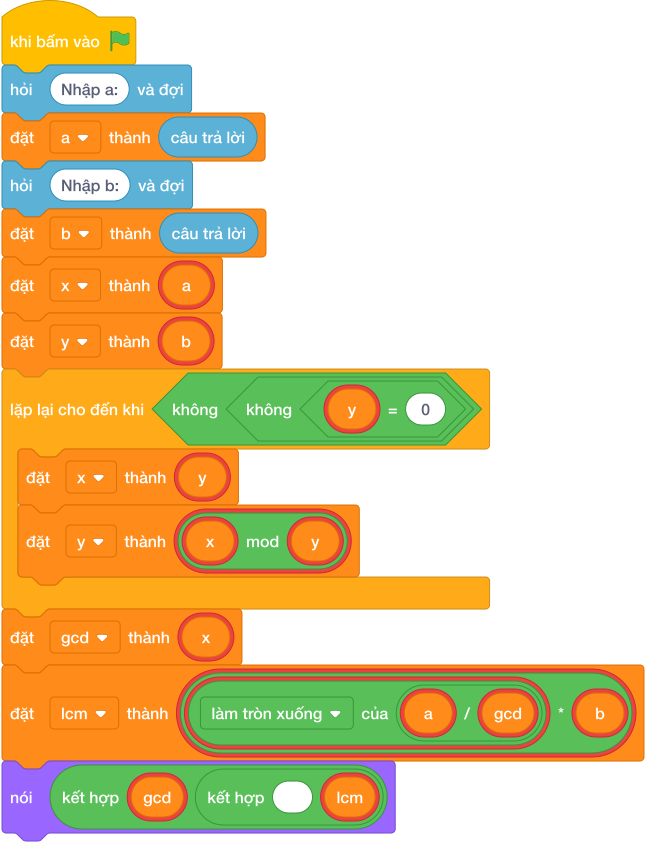

# Hướng Dẫn Giảng Dạy

## 1. Ý tưởng & Phân tích thuật toán
- Bản chất của bài này: với hai số `a = 12` và `b = 18`, tìm ước chung lớn nhất rồi suy ra bội chung nhỏ nhất theo công thức `lcm = làm tròn xuống của (a / gcd) * b`.
- Lời giải dùng vòng lặp chia lấy dư với hai biến `x`, `y`: khởi đầu `x = 12`, `y = 18`, mỗi bước gán `x, y = y, (x mod y)` cho tới khi `y == 0`, khi đó `x` chính là ước chung lớn nhất.
- Với `12` và `18`: `làm tròn xuống của (12 / 6) * 18 = 2 * 18 = 36`, nên in ra `6 36`.
- Thầy cô nhấn mạnh thứ tự in: ước chung lớn nhất in trước, bội chung nhỏ nhất in sau, cách nhau một khoảng trắng.

---

## 2. Bảng chạy tay trên số liệu mẫu (Dry Run Table - Sample 1: 12 18)
| Bước | `x` | `y` | `(x mod y)` | Ghi chú |
| --- | --- | --- | --- | --- |
| Khởi đầu | 12 | 18 | — | `x = a = 12`, `y = b = 18` |
| 1 | 18 | 12 | 12 | `(18 mod 12) = 6`, gán tiếp |
| 2 | 12 | 6 | 0 | `(12 mod 6) = 0`, gán tiếp |
| 3 | 6 | 0 | — | `y == 0` nên dừng, `gcd = 6` |
| Tính | — | — | — | `lcm = làm tròn xuống của (12 / 6) * 18 = 36` |

Kết quả in ra: `6 36`, khớp với kết quả mẫu.

---

## 3. Lưu ý & Bẫy lỗi thường gặp
- Bẫy 1: tính bội chung nhỏ nhất bằng `a * làm tròn xuống của (b / gcd)` khi `a`, `b` tới `10^9`. Với `12` và `18` vẫn đúng (`làm tròn xuống của (216 / 6) = 36`), nhưng với số lớn tích `a * b` phình to không cần thiết. Cách viết đúng như bài giải: `làm tròn xuống của (a / gcd) * b` (chia trước, nhân sau).
- Bẫy 2: dùng hàm `round` hoặc phép chia `/` rồi ép kiểu để tìm ước chung. Sai mẫu:
```text
gcd = int(12 / 18)
nói (gcd, 12 * làm tròn xuống của (18 / gcd))

```
chạy sẽ lỗi chia cho 0. Sửa lại: dùng vòng lặp chia lấy dư như bài giải.
- Bẫy 3: in ngược thứ tự `nói (lcm, gcd)` cho mẫu sẽ ra `36 6`, là kết quả sai. Sửa lại: `nói (gcd, lcm)`.

---

## 4. Lời giải tham khảo & Kịch bản Khối lệnh Scratch 3.0

### 4.1. Khối lệnh đồ họa trực quan (Visual Scratch Blocks)



> 💡 **Kịch bản thực hiện từng bước:**
> - khi bấm vào cờ xanh
> - hỏi [Nhập a:] và đợi
> - đặt [a] thành (câu trả lời)
> - hỏi [Nhập b:] và đợi
> - đặt [b] thành (câu trả lời)
> - đặt [x] thành (a)
> - đặt [y] thành (b)
> - lặp lại cho đến khi không còn <y != 0>:
> -   đặt [x] thành (y)
> -   đặt [y] thành (x mod y)
> - đặt [gcd] thành (x)
> - đặt [lcm] thành (a chia nguyên gcd * b)
> - nói (kết hợp gcd và ' ' và lcm)
