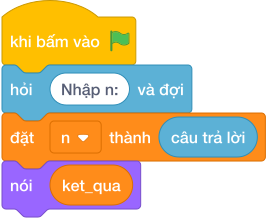

# Hướng Dẫn Giảng Dạy: Tìm ước số lớn thứ hai
Chuyên đề: **Lập Trình Thuật Toán & Khối Lệnh Scratch 3.0**

---

## 1. Ý tưởng & Phân tích thuật toán
- Bản chất của bài này: ước lớn thứ hai của `n = 24` chính là `24` chia cho ước nguyên tố nhỏ nhất của `24`.
- Chương trình duyệt `i` từ `2` tới căn bậc hai của `24` (khoảng `4`), gặp `i` đầu tiên mà `24 % i == 0` thì đáp án là `24 // i` rồi dừng ngay.
- Với `24`, `i = 2` chia hết ngay nên `ket_qua = 24 // 2 = 12`.
- Thầy cô giải thích thêm: nếu `n = 7` là số nguyên tố thì vòng lặp không gặp `i` nào, `ket_qua` giữ nguyên `1`.

---

## 2. Bảng chạy tay trên số liệu mẫu (Dry Run Table - Sample 1: 24)
| `i` | Điều kiện | `ket_qua` | Ghi chú |
| --- | --- | --- | --- |
| Khởi đầu | — | 1 | giá trị mặc định |
| 2 | `24 % 2 == 0` đúng | 12 | `24 // 2 = 12`, dừng ngay |

Kết quả in ra: `12`, khớp với kết quả mẫu.

---

## 3. Lưu ý & Bẫy lỗi thường gặp
- Bẫy 1: duyệt từ `1` thay vì từ `2`. Với mẫu `24` thì `i = 1` chia hết ngay nên `ket_qua = 24 // 1 = 24`, là kết quả sai (lấy lại chính `24`). Sửa lại: `range(2, ...)`.
- Bẫy 2: quên dừng sau khi gặp `i` đầu tiên. Với mẫu `24` thì `i = 3` cũng chia hết, `ket_qua` bị ghi đè thành `24 // 3 = 8`. Sửa lại: thêm `break` ngay sau khi gán (dừng vòng lặp).
- Bẫy 3: in `n // 2` cho mọi số. Với mẫu `24` thì trùng cờ ra `12`, nhưng với số lẻ như `15` sẽ ra `7` trong khi đáp án đúng là `5`. Sửa lại: tìm ước nhỏ nhất bằng vòng lặp như bài giải.

---

## 4. Lời giải tham khảo & Kịch bản Khối lệnh Scratch 3.0

### 4.1. Khối lệnh đồ họa trực quan (Visual Scratch Blocks)

> 💡 **Kịch bản thực hiện từng bước:**
> - khi bấm vào cờ xanh
> - hỏi [Nhập n:] và đợi
> - đặt [n] thành (câu trả lời)
> - nói (ket_qua)
