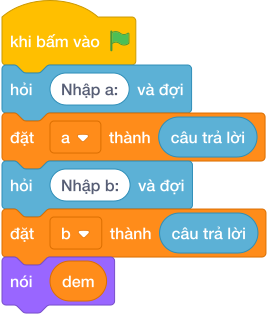

# Hướng Dẫn Giảng Dạy: Đếm số nguyên tố trong đoạn
Chuyên đề: **Lập Trình Thuật Toán & Khối Lệnh Scratch 3.0**

---

## 1. Ý tưởng & Phân tích thuật toán
- Bản chất của bài này: xét từng `num` từ `10` tới `20`, số nào là số nguyên tố thì `dem = dem + 1`.
- Số nhỏ hơn `2` bị bỏ qua bằng `continue`; mỗi số còn lại được thử chia từ `2` tới căn bậc hai của nó.
- Trong đoạn `10` tới `20` chỉ có `11, 13, 17, 19` vượt qua vòng kiểm tra nên `dem = 4`.
- Thầy cô cho các em khoanh trước `11, 13, 17, 19` trên giấy rồi đối chiếu với chương trình.

---

## 2. Bảng chạy tay trên số liệu mẫu (Dry Run Table - Sample 1: 10 20)
| `num` | Kiểm tra | Kết luận | `dem` |
| --- | --- | --- | --- |
| 10 | `10 % 2 == 0` | hợp số | 0 |
| 11 | không chia hết cho 2, 3 | nguyên tố | 1 |
| 12 | `12 % 2 == 0` | hợp số | 1 |
| 13 | không chia hết cho 2, 3 | nguyên tố | 2 |
| 14 | `14 % 2 == 0` | hợp số | 2 |
| 15 | `15 % 3 == 0` | hợp số | 2 |
| 16 | `16 % 2 == 0` | hợp số | 2 |
| 17 | không chia hết cho 2, 3, 4 | nguyên tố | 3 |
| 18 | `18 % 2 == 0` | hợp số | 3 |
| 19 | không chia hết cho 2, 3, 4 | nguyên tố | 4 |
| 20 | `20 % 2 == 0` | hợp số | 4 |

Kết quả in ra: `4`, khớp với kết quả mẫu.

---

## 3. Lưu ý & Bẫy lỗi thường gặp
- Bẫy 1: quên bỏ qua số nhỏ hơn `2` khi đoạn bắt đầu từ `1`. Đoạn sai thiếu `if num < 2: continue` có thể đếm nhầm `1` thành số nguyên tố. Sửa lại: giữ nguyên dòng `continue` như bài giải.
- Bẫy 2: đặt lại `dem = 0` bên trong vòng lặp. Với mẫu `10 20` mỗi lần gặp nguyên tố `dem` lại tính từ đầu, cuối cùng in `1` thay vì `4`. Sửa lại: `dem = 0` nằm trước vòng `for num`.
- Bẫy 3: duyệt `range(a, b)` thiếu `b`. Với mẫu `10 20` sẽ bỏ qua số `20` (không ảnh hưởng đáp án này) nhưng với đoạn `10 19` sẽ mất số `19` và ra `3`. Sửa lại: `range(a, b + 1)`.

---

## 4. Lời giải tham khảo & Kịch bản Khối lệnh Scratch 3.0

### 4.1. Khối lệnh đồ họa trực quan (Visual Scratch Blocks)

> 💡 **Kịch bản thực hiện từng bước:**
> - khi bấm vào cờ xanh
> - hỏi [Nhập a:] và đợi
> - đặt [a] thành (câu trả lời)
> - hỏi [Nhập b:] và đợi
> - đặt [b] thành (câu trả lời)
> - nói (dem)
