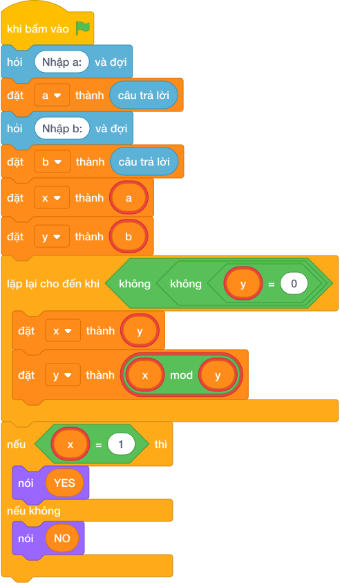

# Hướng Dẫn Giảng Dạy

## 1. Ý tưởng & Phân tích thuật toán
- Bản chất của bài này: hai số nguyên tố cùng nhau nghĩa là ước chung lớn nhất của chúng bằng `1`.
- Với `a = 8`, `b = 9`, chương trình đặt `x = 8`, `y = 9` rồi lặp `x, y = y, (x mod y)` tới khi `y == 0`; `x` còn lại chính là ước chung lớn nhất.
- Ước chung lớn nhất của `8` và `9` là `1` nên in ra `YES`.
- Thầy cô cho các em liệt kê ước của `8` (`1, 2, 4, 8`) và của `9` (`1, 3, 9`) để thấy ước chung duy nhất là `1`.

---

## 2. Bảng chạy tay trên số liệu mẫu (Dry Run Table - Sample 1: 8 9)
| Bước | `x` | `y` | `(x mod y)` | Ghi chú |
| --- | --- | --- | --- | --- |
| Khởi đầu | 8 | 9 | — | `x = 8`, `y = 9` |
| 1 | 9 | 8 | 1 | `(8 mod 9) = 8`, gán tiếp |
| 2 | 8 | 1 | 0 | `(9 mod 8) = 1`, gán tiếp |
| 3 | 1 | 0 | — | dừng, ước chung lớn nhất là `1` |

Vì `x == 1` nên in ra `YES`, khớp với kết quả mẫu.

---

## 3. Lưu ý & Bẫy lỗi thường gặp
- Bẫy 1: tưởng "nguyên tố cùng nhau" nghĩa là cả hai số đều nguyên tố. Với mẫu `8 9` bạn ấy kết luận `NO` vì `8` và `9` đều là hợp số, là kết quả sai. Sửa lại: chỉ cần ước chung lớn nhất bằng `1` thì in `YES`.
- Bẫy 2: in chữ thường `yes`/`no`. Với mẫu `8 9` sẽ in `yes`, chương trình kiểm tra không chấp nhận. Sửa lại: in đúng chữ hoa `YES`/`NO`.
- Bẫy 3: so sánh sai `if x == 0`. Với mẫu `8 9` thì `x = 1` nên rẽ nhánh sai và in `NO`. Sửa lại: `if x == 1`.

---

## 4. Lời giải tham khảo & Kịch bản Khối lệnh Scratch 3.0

### 4.1. Khối lệnh đồ họa trực quan (Visual Scratch Blocks)

> 💡 **Kịch bản thực hiện từng bước:**
> - khi bấm vào cờ xanh
> - hỏi [Nhập a:] và đợi
> - đặt [a] thành (câu trả lời)
> - hỏi [Nhập b:] và đợi
> - đặt [b] thành (câu trả lời)
> - đặt [x] thành (a)
> - đặt [y] thành (b)
> - lặp lại cho đến khi không còn <y != 0>:
> -   đặt [x] thành (y)
> -   đặt [y] thành (x mod y)
> - nếu <x = 1> thì:
> -   nói (YES)
> - nếu không thì:
> -   nói (NO)
