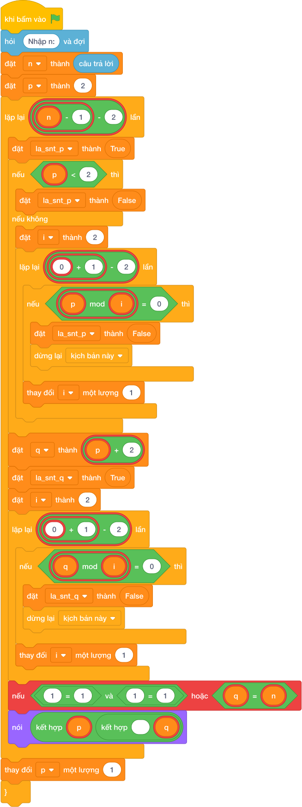

# Hướng Dẫn Giảng Dạy

## 1. Ý tưởng & Phân tích thuật toán
- Bản chất của bài này: cặp sinh đôi là hai số nguyên tố hơn kém nhau đúng `2` đơn vị, tức `(p, p + 2)` với `p + 2 <= 15`.
- Chương trình cho `p` chạy từ `2` tới `13`, mỗi `p` kiểm tra cả `p` và `q = p + 2` có phải số nguyên tố không.
- Với `N = 15`: `p = 3` cho cặp `3 5`, `p = 5` cho cặp `5 7`, `p = 11` cho cặp `11 13`; các `p` còn lại có ít nhất một số là hợp số.
- Mỗi cặp in trên một dòng theo thứ tự tăng dần của `p`.

---

## 2. Bảng chạy tay trên số liệu mẫu (Dry Run Table - Sample 1: 15)
| `p` | `q = p + 2` | Kiểm tra | In? |
| --- | --- | --- | --- |
| 2 | 4 | `(4 mod 2) == 0`, hợp số | không |
| 3 | 5 | cả hai nguyên tố | in `3 5` |
| 4 | 6 | `(4 mod 2) == 0`, hợp số | không |
| 5 | 7 | cả hai nguyên tố | in `5 7` |
| 6–10 | 8–12 | `p` hoặc `q` chẵn, hợp số | không |
| 11 | 13 | cả hai nguyên tố | in `11 13` |
| 12 | 14 | hợp số | không |
| 13 | 15 | `(15 mod 3) == 0`, hợp số | không |

Kết quả in ra ba dòng `3 5`, `5 7`, `11 13`, khớp với kết quả mẫu.

---

## 3. Lưu ý & Bẫy lỗi thường gặp
- Bẫy 1: quên điều kiện `q <= n`. Với mẫu `15`, `p = 13` cho `q = 15` là hợp số nên không sao, nhưng với `N = 14` mà thiếu điều kiện, cặp `13 15` vẫn bị xét. Sửa lại: giữ `if la_snt_p and la_snt_q and q <= n`.
- Bẫy 2: in hai số trên cùng một dòng cách nhau bởi dấu phẩy. Với mẫu `15` dòng đầu thành `3, 5`, chương trình kiểm tra không chấp nhận. Sửa lại: `nói (p, q)` (mặc định cách nhau một khoảng trắng).
- Bẫy 3: chỉ kiểm tra `p` mà quên kiểm tra `q`. Với mẫu `15`, `p = 7` là nguyên tố nhưng `q = 9` là hợp số, làm sai sẽ in thêm dòng `7 9`. Sửa lại: kiểm tra cả hai cờ như bài giải.

---

## 4. Lời giải tham khảo & Kịch bản Khối lệnh Scratch 3.0

### 4.1. Khối lệnh đồ họa trực quan (Visual Scratch Blocks)

> 💡 **Kịch bản thực hiện từng bước:**
> - khi bấm vào cờ xanh
> - hỏi [Nhập n:] và đợi
> - đặt [n] thành (câu trả lời)
> - đặt [p] thành (2)
> - lặp lại (n - 1 - 2) lần:
> -   đặt [la_snt_p] thành (True)
> -   nếu 
 thì:
> -     đặt [la_snt_p] thành (False)
> -   nếu không thì:
> -     đặt [i] thành (2)
> -     lặp lại (int(...) + 1 - 2) lần:
> -       nếu 
 thì:
> -         đặt [la_snt_p] thành (False)
> -         dừng kịch bản này
> -       thay đổi [i] một lượng 1
> -   đặt [q] thành (p + 2)
> -   đặt [la_snt_q] thành (True)
> -   đặt [i] thành (2)
> -   lặp lại (int(...) + 1 - 2) lần:
> -     nếu <q mod i = 0> thì:
> -       đặt [la_snt_q] thành (False)
> -       dừng kịch bản này
> -     thay đổi [i] một lượng 1
> -   nếu <điều kiện> thì:
> -     nói (kết hợp p và ' ' và q)
> -   thay đổi [p] một lượng 1
