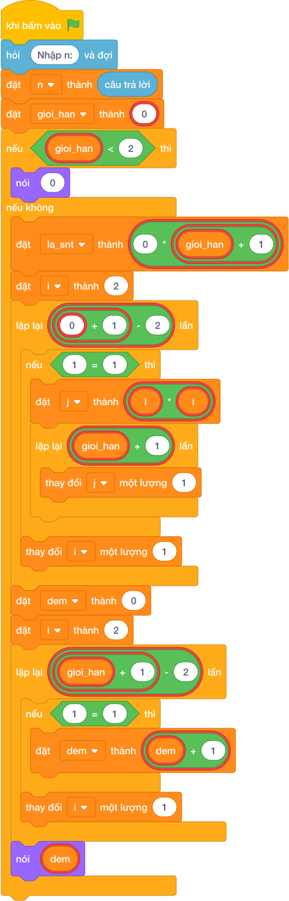

# Hướng Dẫn Giảng Dạy

## 1. Ý tưởng & Phân tích thuật toán
- Bản chất của bài này: số có đúng 3 ước chính là bình phương của một số nguyên tố (ví dụ `4 = 2 * 2`, `9 = 3 * 3`, `25 = 5 * 5`), nên chỉ cần đếm số nguyên tố tới căn bậc hai của `N`.
- Với `N = 30`: `gioi_han = int(30 ** 0.5) = 5`; sàng các số từ `2` tới `5` giữ lại `2, 3, 5`.
- Mỗi số nguyên tố `P` cho một đáp án `P * P <= 30`, vậy có đúng `3` số là `4, 9, 25`.
- Thầy cô cho các em kiểm tra tay: ước của `4` là `1, 2, 4`; ước của `9` là `1, 3, 9`; ước của `25` là `1, 5, 25`.

---

## 2. Bảng chạy tay trên số liệu mẫu (Dry Run Table - Sample 1: 30)
| Bước | Giá trị | Ghi chú |
| --- | --- | --- |
| Đọc | `n = 30` | |
| Giới hạn | `gioi_han = 5` | `int(30 ** 0.5)` |
| Sàng | `[True]*6`, đánh dấu `0, 1` sai | |
| Sàng `i = 2` | gạch `4` | `2 * 2 = 4` |
| Đếm | `2, 3, 5` còn đúng | `dem = 3` |

Kết quả in ra: `3`, khớp với kết quả mẫu.

---

## 3. Lưu ý & Bẫy lỗi thường gặp
- Bẫy 1: đếm trực tiếp từng số từ `1` tới `N` rồi đếm ước. Với `N = 30` vẫn ra `3`, nhưng với `N` tới `10^9` vòng lặp không bao giờ xong. Sửa lại: chỉ sàng số nguyên tố tới căn bậc hai như bài giải.
- Bẫy 2: quên xử lý `gioi_han < 2` (tức `N = 1, 2, 3`). Khi đó danh sách sàng rỗng và dễ báo lỗi, trong khi đáp án đúng là `0`. Sửa lại: giữ nhánh `if gioi_han < 2: nói (0)` như bài giải.
- Bẫy 3: đếm cả `1` thành số nguyên tố. Với mẫu `30` sẽ ra `4` thay vì `3`. Sửa lại: `la_snt[0] = False` và `la_snt[1] = False`.

---

## 4. Lời giải tham khảo & Kịch bản Khối lệnh Scratch 3.0

### 4.1. Khối lệnh đồ họa trực quan (Visual Scratch Blocks)

> 💡 **Kịch bản thực hiện từng bước:**
> - khi bấm vào cờ xanh
> - hỏi [Nhập n:] và đợi
> - đặt [n] thành (câu trả lời)
> - đặt [gioi_han] thành (int(...))
> - nếu <gioi_han < 2> thì:
> -   nói (0)
> - nếu không thì:
> -   đặt [la_snt] thành (giá trị * gioi_han + 1)
> -   đặt [i] thành (2)
> -   lặp lại (int(...) + 1 - 2) lần:
> -     nếu <điều kiện> thì:
> -       đặt [j] thành (i * i)
> -       lặp lại (gioi_han + 1) lần:
> -         thay đổi [j] một lượng 1
> -     thay đổi [i] một lượng 1
> -   đặt [dem] thành (0)
> -   đặt [i] thành (2)
> -   lặp lại (gioi_han + 1 - 2) lần:
> -     nếu <điều kiện> thì:
> -       đặt [dem] thành (dem + 1)
> -     thay đổi [i] một lượng 1
> -   nói (dem)
