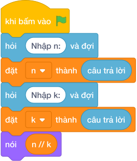

# Hướng Dẫn Giảng Dạy: Đếm số chia hết cho K
Chuyên đề: **Lập Trình Thuật Toán & Khối Lệnh Scratch 3.0**

---

## 1. Ý tưởng & Phân tích thuật toán
- Bản chất của bài này: các số chia hết cho `K = 3` trong đoạn `1..20` chính là `3, 6, 9, ..., 18`, đếm được bằng một phép chia nguyên `20 // 3`.
- Với `n = 20`, `k = 3`: `20 // 3 = 6` vì `3 * 6 = 18 <= 20` còn `3 * 7 = 21 > 20`.
- Không cần vòng lặp duyệt từng số, một phép tính là ra ngay đáp án `6`.
- Thầy cô cho các em liệt kê tay `3, 6, 9, 12, 15, 18` rồi đối chiếu với phép chia.

---

## 2. Bảng chạy tay trên số liệu mẫu (Dry Run Table - Sample 1: 20 3)
| Bước | Tính | Ghi chú |
| --- | --- | --- |
| Đọc | `n = 20`, `k = 3` | |
| Chia nguyên | `20 // 3 = 6` | `3 * 6 = 18 <= 20 < 21 = 3 * 7` |
| In | `6` | xong |

Kết quả in ra: `6`, khớp với kết quả mẫu.

---

## 3. Lưu ý & Bẫy lỗi thường gặp
- Bẫy 1: duyệt vòng lặp từ `1` tới `N` để đếm. Với mẫu `20 3` vẫn ra `6`, nhưng với `N` tới `10^9` vòng lặp không bao giờ xong. Sửa lại: `nói (n // k)`.
- Bẫy 2: dùng chia thực `n / k` rồi làm tròn. Với mẫu `20 3` được `6.666...`, ép kiểu hay làm tròn đều dễ lệch. Sửa lại: chia nguyên `n // k`.
- Bẫy 3: đếm từ `0` nên cộng dư một số. Với mẫu `20 3` sẽ ra `7` vì tính cả số `0`. Sửa lại: đoạn xét từ `1` tới `N` nên đáp án đúng là `n // k`.

---

## 4. Lời giải tham khảo & Kịch bản Khối lệnh Scratch 3.0

### 4.1. Khối lệnh đồ họa trực quan (Visual Scratch Blocks)

> 💡 **Kịch bản thực hiện từng bước:**
> - khi bấm vào cờ xanh
> - hỏi [Nhập n:] và đợi
> - đặt [n] thành (câu trả lời)
> - hỏi [Nhập k:] và đợi
> - đặt [k] thành (câu trả lời)
> - nói (n // k)
