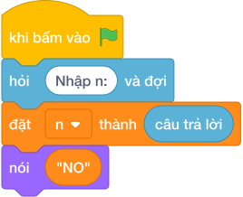

# Hướng Dẫn Giảng Dạy: Kiểm tra số hoàn hảo
Chuyên đề: **Lập Trình Thuật Toán & Khối Lệnh Scratch 3.0**

---

## 1. Ý tưởng & Phân tích thuật toán
- Bản chất của bài này: số hoàn hảo là số mà tổng các ước nhỏ hơn nó bằng chính nó; ước nhỏ hơn `6` là `1, 2, 3` và `1 + 2 + 3 = 6`.
- Chương trình duyệt `i` từ `1` tới căn bậc hai của `6` (tức `2`), mỗi `i` là ước thì cộng cả cặp `i` và `j = 6 // i` (trừ chính số `6`).
- Với `n = 6`: `i = 1` cộng `1` (bỏ `6`), `i = 2` cộng `2` và `3`; tổng `tong = 6`.
- Vì `tong == n` nên in `YES`. Số `1` trở xuống in `NO` ngay từ đầu.

---

## 2. Bảng chạy tay trên số liệu mẫu (Dry Run Table - Sample 1: 6)
| `i` | `j = 6 // i` | Cộng vào `tong` | `tong` |
| --- | --- | --- | --- |
| 1 | 6 | cộng `1` (bỏ `6` vì bằng `n`) | 1 |
| 2 | 3 | cộng `2` và `3` | 6 |
| So sánh | `6 == 6` đúng | — | in `YES` |

Kết quả in ra: `YES`, khớp với kết quả mẫu.

---

## 3. Lưu ý & Bẫy lỗi thường gặp
- Bẫy 1: cộng cả chính số `n` vào tổng. Với mẫu `6` tổng thành `1 + 2 + 3 + 6 = 12` nên in nhầm `NO`. Sửa lại: chỉ cộng khi `i < n` và `j < n` như bài giải.
- Bẫy 2: cộng trùng khi `i == j` (số chính phương). Với `n = 36` mà thiếu kiểm tra `j != i`, ước `6` bị cộng hai lần. Sửa lại: giữ điều kiện `j != i` như bài giải.
- Bẫy 3: quên loại `n <= 1`. Với `n = 1` vòng lặp cộng được `tong = 0` rồi so sánh lung tung. Sửa lại: giữ nhánh `if n <= 1: print("NO")` như bài giải.

---

## 4. Lời giải tham khảo & Kịch bản Khối lệnh Scratch 3.0

### 4.1. Khối lệnh đồ họa trực quan (Visual Scratch Blocks)

> 💡 **Kịch bản thực hiện từng bước:**
> - khi bấm vào cờ xanh
> - hỏi [Nhập n:] và đợi
> - đặt [n] thành (câu trả lời)
> - nói ("NO")
