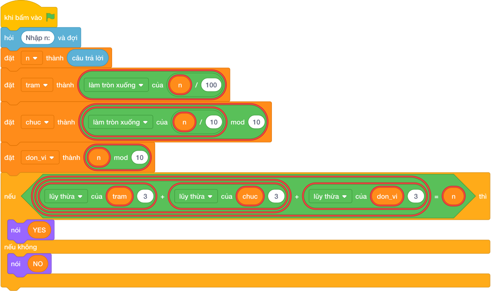

# Hướng Dẫn Giảng Dạy

## 1. Ý tưởng & Phân tích thuật toán
- Bản chất của bài này: tách số `N = 153` thành ba chữ số rồi kiểm tra `a^3 + b^3 + c^3` có bằng chính `N` không.
- Tách chữ số: hàng trăm `tram = làm tròn xuống của (153 / 100) = 1`, hàng chục `chuc = (làm tròn xuống của (153 / 10)) % 10 = 5`, hàng đơn vị `don_vi = (153 mod 10) = 3`.
- Kiểm tra: `1^3 + 5^3 + 3^3 = 1 + 125 + 27 = 153`, bằng chính `N` nên in `YES`.
- Thầy cô cho các em tính tay `1 + 125 + 27` trên giấy rồi so với số `153` ban đầu.

---

## 2. Bảng chạy tay trên số liệu mẫu (Dry Run Table - Sample 1: 153)
| Biến | Phép tính | Giá trị |
| --- | --- | --- |
| `tram` | `làm tròn xuống của (153 / 100)` | `1` |
| `chuc` | `(làm tròn xuống của (153 / 10)) % 10` | `5` |
| `don_vi` | `(153 mod 10)` | `3` |
| Tổng lập phương | `1 + 125 + 27` | `153` |
| So sánh | `153 == 153` đúng | in `YES` |

Kết quả in ra: `YES`, khớp với kết quả mẫu.

---

## 3. Lưu ý & Bẫy lỗi thường gặp
- Bẫy 1: tách sai chữ số hàng chục, viết `chuc = làm tròn xuống của (n / 10)`. Với mẫu `153` sẽ được `chuc = 15` và tổng thành `1 + 3375 + 27`, ra `NO`. Sửa lại: `chuc = (làm tròn xuống của (n / 10)) % 10`.
- Bẫy 2: dùng bình phương thay vì lập phương:
```text
if tram ** 2 + chuc ** 2 + don_vi ** 2 == n:

```
với mẫu `153` được `1 + 25 + 9 = 35` nên in nhầm `NO`. Sửa lại: mũ `3` như bài giải.
- Bẫy 3: in `True`/`False`. Với mẫu `153` sẽ in `True` thay vì `YES`. Sửa lại: in đúng chữ hoa `YES`/`NO`.

---

## 4. Lời giải tham khảo & Kịch bản Khối lệnh Scratch 3.0

### 4.1. Khối lệnh đồ họa trực quan (Visual Scratch Blocks)



> 💡 **Kịch bản thực hiện từng bước:**
> - khi bấm vào cờ xanh
> - hỏi [Nhập n:] và đợi
> - đặt [n] thành (câu trả lời)
> - đặt [tram] thành (n chia nguyên 100)
> - đặt [chuc] thành (n chia nguyên 10 mod 10)
> - đặt [don_vi] thành (n mod 10)
> - nếu <tram + 3 + chuc + 3 + don_vi + 3 = n> thì:
> -   nói (YES)
> - nếu không thì:
> -   nói (NO)
