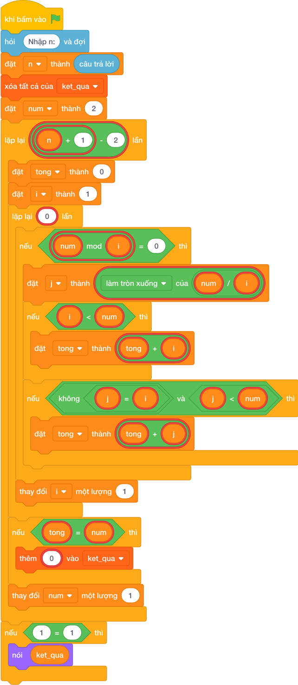

# Hướng Dẫn Giảng Dạy

## 1. Ý tưởng & Phân tích thuật toán
- Bản chất của bài này: xét từng `num` từ `2` tới `30`, tính tổng các ước nhỏ hơn `num`, tổng bằng `num` thì ghi vào danh sách `ket_qua`.
- Với `num = 6`: các ước nhỏ hơn là `1, 2, 3`, tổng `6` nên ghi `6`.
- Với `num = 28`: các ước nhỏ hơn là `1, 2, 4, 7, 14`, tổng `1 + 2 + 4 + 7 + 14 = 28` nên ghi `28`.
- Các `num` còn lại tới `30` không thỏa mãn, danh sách cuối là `["6", "28"]`, in ra `6 28`.

---

## 2. Bảng chạy tay trên số liệu mẫu (Dry Run Table - Sample 1: 30)
| `num` | Các ước nhỏ hơn `num` | Tổng | Ghi? |
| --- | --- | --- | --- |
| 6 | `1, 2, 3` | `6` | ghi `6` |
| 7–27 (trừ 28) | — | khác chính nó | không ghi |
| 28 | `1, 2, 4, 7, 14` | `28` | ghi `28` |
| 29, 30 | — | khác chính nó | không ghi |

Kết quả in ra: `6 28`, khớp với kết quả mẫu.

---

## 3. Lưu ý & Bẫy lỗi thường gặp
- Bẫy 1: cộng cả chính `num` vào tổng. Với mẫu `30`, `num = 6` cho tổng `12` nên bị loại, danh sách rỗng và không in gì. Sửa lại: chỉ cộng khi `i < num` và `j < num` như bài giải.
- Bẫy 2: quên kiểm tra `j != i`. Với `num = 36` (chính phương) ước `6` bị cộng hai lần, tổng sai. Sửa lại: giữ điều kiện `j != i` như bài giải.
- Bẫy 3: in danh sách trực tiếp `nói (ket_qua)`. Với mẫu `30` sẽ in `['6', '28']` kèm ngoặc và dấu phẩy, là kết quả sai. Sửa lại: `nói (" ".join(ket_qua))`.

---

## 4. Lời giải tham khảo & Kịch bản Khối lệnh Scratch 3.0

### 4.1. Khối lệnh đồ họa trực quan (Visual Scratch Blocks)

> 💡 **Kịch bản thực hiện từng bước:**
> - khi bấm vào cờ xanh
> - hỏi [Nhập n:] và đợi
> - đặt [n] thành (câu trả lời)
> - xóa tất cả của [ket_qua]
> - đặt [num] thành (2)
> - lặp lại (n + 1 - 2) lần:
> -   đặt [tong] thành (0)
> -   đặt [i] thành (1)
> -   lặp lại (int(...)) lần:
> -     nếu <num mod i = 0> thì:
> -       đặt [j] thành (num chia nguyên i)
> -       nếu <i < num> thì:
> -         đặt [tong] thành (tong + i)
> -       nếu <điều kiện> thì:
> -         đặt [tong] thành (tong + j)
> -     thay đổi [i] một lượng 1
> -   nếu <tong = num> thì:
> -     thêm (str(...)) vào [ket_qua]
> -   thay đổi [num] một lượng 1
> - nếu <điều kiện> thì:
> -   nói (ket_qua)
