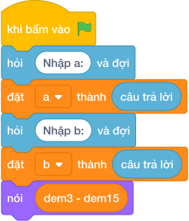

# Hướng Dẫn Giảng Dạy: Đếm bội của 3 nhưng không chia hết cho 5
Chuyên đề: **Lập Trình Thuật Toán & Khối Lệnh Scratch 3.0**

---

## 1. Ý tưởng & Phân tích thuật toán
- Bản chất của bài này: đếm bội của `3` trong đoạn `[1, 30]` rồi trừ đi những số vừa là bội của `3` vừa là bội của `5` (tức bội của `15`).
- Số bội của `3`: `30 // 3 - 0 // 3 = 10 - 0 = 10` (`3, 6, 9, 12, 15, 18, 21, 24, 27, 30`).
- Số bội của `15`: `30 // 15 - 0 // 15 = 2 - 0 = 2` (`15, 30`).
- Đáp án là `10 - 2 = 8`.
- Thầy cô cho các em gạch bỏ `15` và `30` khỏi danh sách bội của `3` để thấy còn đúng `8` số.

---

## 2. Bảng chạy tay trên số liệu mẫu (Dry Run Table - Sample 1: 1 30)
| Nhóm | Phép tính | Kết quả |
| --- | --- | --- |
| Bội của 3 trong `1..30` | `30 // 3 - 0 // 3` | `10` |
| Bội của 15 trong `1..30` | `30 // 15 - 0 // 15` | `2` (`15, 30`) |
| Thỏa mãn | `10 - 2` | `8` |

Kết quả in ra: `8`, khớp với kết quả mẫu.

---

## 3. Lưu ý & Bẫy lỗi thường gặp
- Bẫy 1: chỉ đếm bội của `3` mà quên trừ bội của `15`:
```text
print(b // 3 - (a - 1) // 3)
```
với mẫu `1 30` sẽ ra `10` thay vì `8`. Sửa lại: lấy `dem3 - dem15` như bài giải.
- Bẫy 2: trừ bội của `5` thay vì bội của `15`. Với mẫu `1 30` bội của `5` có `6` số nên ra `10 - 6 = 4`, là kết quả sai (loại cả những số không phải bội của `3`). Sửa lại: phần trừ là `dem15`.
- Bẫy 3: quên `(a - 1)` mà dùng `a // 3`. Với mẫu `1 30` thì trùng cờ vẫn ra `8`, nhưng với đoạn `3 30` sẽ tính sai mốc đầu. Sửa lại: `b // 3 - (a - 1) // 3`.

---

## 4. Lời giải tham khảo & Kịch bản Khối lệnh Scratch 3.0

### 4.1. Khối lệnh đồ họa trực quan (Visual Scratch Blocks)



> 💡 **Kịch bản thực hiện từng bước:**
> - khi bấm vào cờ xanh
> - hỏi [Nhập a:] và đợi
> - đặt [a] thành (câu trả lời)
> - hỏi [Nhập b:] và đợi
> - đặt [b] thành (câu trả lời)
> - nói (dem3 - dem15)
