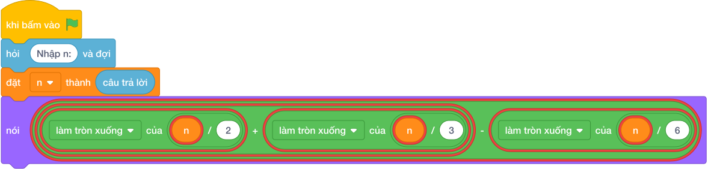

# Hướng Dẫn Giảng Dạy

## 1. Ý tưởng & Phân tích thuật toán
- Bản chất của bài này: đếm số chia hết cho `2` cộng với số chia hết cho `3`, rồi trừ đi phần đếm trùng (số chia hết cho cả hai, tức chia hết cho `6`).
- Với `n = 10`: có `làm tròn xuống của (10 / 2) = 5` số chia hết cho `2` (`2, 4, 6, 8, 10`), `làm tròn xuống của (10 / 3) = 3` số chia hết cho `3` (`3, 6, 9`), `làm tròn xuống của (10 / 6) = 1` số bị trùng (`6`).
- Đáp án là `5 + 3 - 1 = 7`, gồm `2, 3, 4, 6, 8, 9, 10`.
- Thầy cô cho các em khoanh tròn hai nhóm rồi chỉ ra số `6` nằm ở phần giao nhau.

---

## 2. Bảng chạy tay trên số liệu mẫu (Dry Run Table - Sample 1: 10)
| Nhóm | Phép tính | Các số |
| --- | --- | --- |
| Chia hết cho 2 | `làm tròn xuống của (10 / 2) = 5` | `2, 4, 6, 8, 10` |
| Chia hết cho 3 | `làm tròn xuống của (10 / 3) = 3` | `3, 6, 9` |
| Trùng (chia hết cho 6) | `làm tròn xuống của (10 / 6) = 1` | `6` |
| Tổng | `5 + 3 - 1 = 7` | `2, 3, 4, 6, 8, 9, 10` |

Kết quả in ra: `7`, khớp với kết quả mẫu.

---

## 3. Lưu ý & Bẫy lỗi thường gặp
- Bẫy 1: cộng mà quên trừ phần trùng:
```text
nói (làm tròn xuống của (n / 2) + làm tròn xuống của (n / 3))

```
với mẫu `10` sẽ ra `8` vì số `6` bị đếm hai lần. Sửa lại: `làm tròn xuống của (n / 2) + làm tròn xuống của (n / 3) - làm tròn xuống của (n / 6)`.
- Bẫy 2: trừ nhầm `làm tròn xuống của (n / 5)` thay vì `làm tròn xuống của (n / 6)`. Với mẫu `10` thì `làm tròn xuống của (10 / 5) = 2` nên ra `5 + 3 - 2 = 6`, là kết quả sai. Sửa lại: phần trùng là bội của `6` nên trừ `làm tròn xuống của (n / 6)`.
- Bẫy 3: duyệt vòng lặp tới `N`. Với mẫu `10` vẫn ra `7`, nhưng với `N` tới `10^12` vòng lặp không bao giờ xong. Sửa lại: dùng ba phép chia nguyên như bài giải.

---

## 4. Lời giải tham khảo & Kịch bản Khối lệnh Scratch 3.0

### 4.1. Khối lệnh đồ họa trực quan (Visual Scratch Blocks)



> 💡 **Kịch bản thực hiện từng bước:**
> - khi bấm vào cờ xanh
> - hỏi [Nhập n:] và đợi
> - đặt [n] thành (câu trả lời)
> - nói (n chia nguyên 2 + n chia nguyên 3 - n chia nguyên 6)
