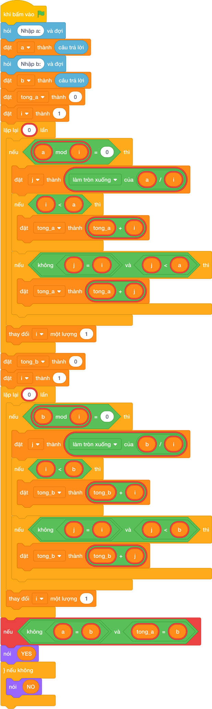

# Hướng Dẫn Giảng Dạy

## 1. Ý tưởng & Phân tích thuật toán
- Bản chất của bài này: hai số thân thiết là hai số khác nhau mà tổng ước nhỏ hơn của số này bằng số kia, và ngược lại.
- Tính `tong_a` cho `a = 220`: các ước nhỏ hơn `220` gồm `1, 2, 4, 5, 10, 11, 20, 22, 44, 55, 110`, tổng đúng bằng `284`.
- Tính `tong_b` cho `b = 284`: các ước nhỏ hơn `284` gồm `1, 2, 4, 71, 142`, tổng đúng bằng `220`.
- Vì `220 != 284`, `tong_a == 284` và `tong_b == 220` nên in `YES`.
- Thầy cô cho các em cộng tay `1 + 2 + 4 + 71 + 142 = 220` để tin vào chiều ngược lại.

---

## 2. Bảng chạy tay trên số liệu mẫu (Dry Run Table - Sample 1: 220 284)
| Biến | Tính | Giá trị |
| --- | --- | --- |
| `tong_a` | tổng ước nhỏ hơn `220` | `284` |
| `tong_b` | tổng ước nhỏ hơn `284` (`1 + 2 + 4 + 71 + 142`) | `220` |
| So sánh | `220 != 284`, `284 == 284`, `220 == 220` | cả ba đúng, in `YES` |

Kết quả in ra: `YES`, khớp với kết quả mẫu.

---

## 3. Lưu ý & Bẫy lỗi thường gặp
- Bẫy 1: quên kiểm tra `a != b`. Với cặp `6 6` (số hoàn hảo), tổng ước mỗi bên đều bằng `6` nên làm sai sẽ in `YES`, trong khi đáp án đúng là `NO`. Sửa lại: giữ `a != b` như bài giải.
- Bẫy 2: chỉ kiểm tra một chiều (`tong_a == b`) mà bỏ chiều còn lại. Với cặp `10 20` làm sai có thể kết luận vội, đáp án đúng phải kiểm tra cả hai chiều. Sửa lại: `tong_a == b and tong_b == a`.
- Bẫy 3: cộng cả chính số vào tổng ước. Với mẫu `220 284`, `tong_a` thành `504` nên in nhầm `NO`. Sửa lại: chỉ cộng khi `i < a` và `j < a` (tương tự với `b`) như bài giải.

---

## 4. Lời giải tham khảo & Kịch bản Khối lệnh Scratch 3.0

### 4.1. Khối lệnh đồ họa trực quan (Visual Scratch Blocks)

> 💡 **Kịch bản thực hiện từng bước:**
> - khi bấm vào cờ xanh
> - hỏi [Nhập a:] và đợi
> - đặt [a] thành (câu trả lời)
> - hỏi [Nhập b:] và đợi
> - đặt [b] thành (câu trả lời)
> - đặt [tong_a] thành (0)
> - đặt [i] thành (1)
> - lặp lại (int(...)) lần:
> -   nếu <a mod i = 0> thì:
> -     đặt [j] thành (a chia nguyên i)
> -     nếu <i < a> thì:
> -       đặt [tong_a] thành (tong_a + i)
> -     nếu <điều kiện> thì:
> -       đặt [tong_a] thành (tong_a + j)
> -   thay đổi [i] một lượng 1
> - đặt [tong_b] thành (0)
> - đặt [i] thành (1)
> - lặp lại (int(...)) lần:
> -   nếu <b mod i = 0> thì:
> -     đặt [j] thành (b chia nguyên i)
> -     nếu <i < b> thì:
> -       đặt [tong_b] thành (tong_b + i)
> -     nếu <điều kiện> thì:
> -       đặt [tong_b] thành (tong_b + j)
> -   thay đổi [i] một lượng 1
> - nếu <điều kiện> thì:
> -   nói (YES)
> - nếu không thì:
> -   nói (NO)
