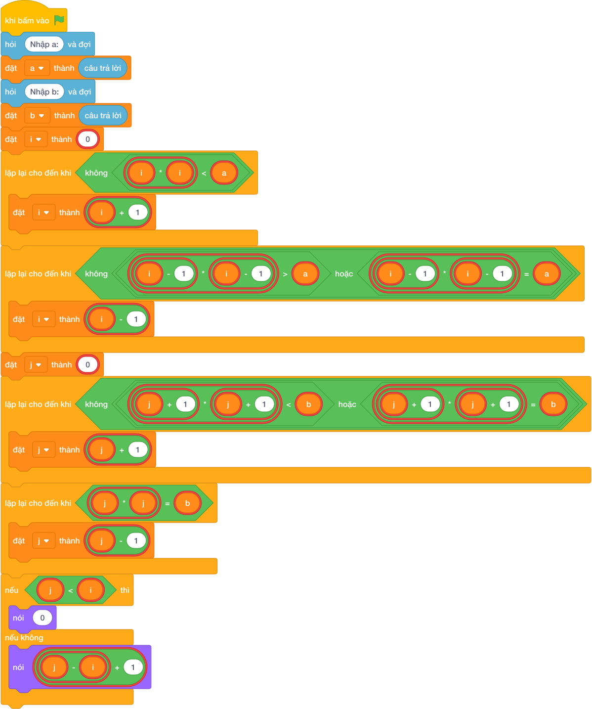

# Hướng Dẫn Giảng Dạy

## 1. Ý tưởng & Phân tích thuật toán
- Bản chất của bài này: thay vì duyệt từng số từ `5` tới `25`, tìm căn nguyên nhỏ nhất `i` mà `i * i >= 5` và căn nguyên lớn nhất `j` mà `j * j <= 25`, đáp án là `j - i + 1`.
- Với `a = 5`: đoán `i = int(5 ** 0.5) = 2`, vì `2 * 2 = 4 < 5` nên tăng lên `i = 3` (`3 * 3 = 9`).
- Với `b = 25`: đoán `j = int(25 ** 0.5) = 5`, `6 * 6 = 36 > 25` và `5 * 5 = 25 <= 25` nên giữ `j = 5`.
- Đáp án là `5 - 3 + 1 = 3`, gồm `9, 16, 25`.

---

## 2. Bảng chạy tay trên số liệu mẫu (Dry Run Table - Sample 1: 5 25)
| Bước | Tính | Giá trị |
| --- | --- | --- |
| Đọc | `a = 5`, `b = 25` | |
| Đoán `i` | `int(5 ** 0.5)` | `2` |
| Nâng `i` | `2 * 2 = 4 < 5` | `i = 3` (`3 * 3 = 9`) |
| Đoán `j` | `int(25 ** 0.5)` | `5` |
| Giữ `j` | `5 * 5 = 25 <= 25` | `j = 5` |
| Đếm | `5 - 3 + 1` | `3` |

Kết quả in ra: `3`, khớp với kết quả mẫu.

---

## 3. Lưu ý & Bẫy lỗi thường gặp
- Bẫy 1: duyệt từng số từ `A` tới `B` rồi kiểm tra chính phương. Với mẫu `5 25` vẫn ra `3`, nhưng với `B` tới `10^14` vòng lặp không bao giờ xong. Sửa lại: tìm `i`, `j` bằng căn bậc hai như bài giải.
- Bẫy 2: quên hiệu chỉnh `i`, `j` sau khi đoán bằng căn. Với số lớn, `int(a ** 0.5)` có thể lệch 1 đơn vị và đếm thiếu hoặc thừa một số. Sửa lại: giữ nguyên các vòng lặp hiệu chỉnh của bài giải.
- Bẫy 3: quên trường hợp `j < i` (đoạn không chứa số chính phương nào). Khi đó `j - i + 1` ra số âm, là kết quả sai. Sửa lại: giữ nhánh `if j < i: nói (0)` như bài giải.

---

## 4. Lời giải tham khảo & Kịch bản Khối lệnh Scratch 3.0

### 4.1. Khối lệnh đồ họa trực quan (Visual Scratch Blocks)

> 💡 **Kịch bản thực hiện từng bước:**
> - khi bấm vào cờ xanh
> - hỏi [Nhập a:] và đợi
> - đặt [a] thành (câu trả lời)
> - hỏi [Nhập b:] và đợi
> - đặt [b] thành (câu trả lời)
> - đặt [i] thành (int(...))
> - lặp lại cho đến khi không còn <i * i < a>:
> -   đặt [i] thành (i + 1)
> - lặp lại cho đến khi không còn <i - 1 * i - 1 >= a>:
> -   đặt [i] thành (i - 1)
> - đặt [j] thành (int(...))
> - lặp lại cho đến khi không còn <j + 1 * j + 1 <= b>:
> -   đặt [j] thành (j + 1)
> - lặp lại cho đến khi <j * j = b>:
> -   đặt [j] thành (j - 1)
> - nếu <j < i> thì:
> -   nói (0)
> - nếu không thì:
> -   nói (j - i + 1)
