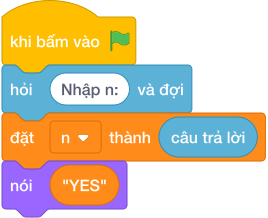

# Hướng Dẫn Giảng Dạy: Số tự mãn (Narcissistic number K chữ số)
Chuyên đề: **Lập Trình Thuật Toán & Khối Lệnh Scratch 3.0**

---

## 1. Ý tưởng & Phân tích thuật toán
- Bản chất của bài này: đếm số chữ số `K` của `N = 1634` rồi kiểm tra tổng lũy thừa bậc `K` các chữ số có bằng `N` không.
- Vòng lặp thứ nhất chia dần `1634` cho `10` (`1634 -> 163 -> 16 -> 1 -> 0`) nên đếm được `k = 4`.
- Vòng lặp thứ hai tách từng chữ số từ phải sang trái (`4, 3, 6, 1`) và cộng `d ** 4`: `256 + 81 + 1296 + 1 = 1634`.
- Vì `tong == n` (`1634 == 1634`) nên in `YES`.
- Thầy cô cho các em tính tay `1 + 1296 + 81 + 256` rồi so với `1634`.

---

## 2. Bảng chạy tay trên số liệu mẫu (Dry Run Table - Sample 1: 1634)
| Bước | `temp` | `d` | `tong` sau bước |
| --- | --- | --- | --- |
| Đếm chữ số | 1634 -> 163 -> 16 -> 1 -> 0 | — | `k = 4` |
| Tách | 1634 | 4 | `0 + 256 = 256` |
| Tách | 163 | 3 | `256 + 81 = 337` |
| Tách | 16 | 6 | `337 + 1296 = 1633` |
| Tách | 1 | 1 | `1633 + 1 = 1634` |
| So sánh | `1634 == 1634` đúng | — | in `YES` |

Kết quả in ra: `YES`, khớp với kết quả mẫu.

---

## 3. Lưu ý & Bẫy lỗi thường gặp
- Bẫy 1: cố định mũ `3` cho mọi số. Với mẫu `1634` được `1 + 216 + 27 + 64 = 308` nên in nhầm `NO`. Sửa lại: đếm `k` bằng vòng lặp rồi dùng `d ** k` như bài giải.
- Bẫy 2: dùng chung biến `temp` mà quên gán lại `temp = n` trước vòng tách chữ số. Khi đó vòng thứ hai không chạy, `tong = 0` và in nhầm `NO`. Sửa lại: `temp = n` trước mỗi vòng như bài giải.
- Bẫy 3: so sánh `tong == k` thay vì `tong == n`. Với mẫu `1634` thì `1634 == 4` sai nên in nhầm `NO`. Sửa lại: `if tong == n`.

---

## 4. Lời giải tham khảo & Kịch bản Khối lệnh Scratch 3.0

### 4.1. Khối lệnh đồ họa trực quan (Visual Scratch Blocks)

> 💡 **Kịch bản thực hiện từng bước:**
> - khi bấm vào cờ xanh
> - hỏi [Nhập n:] và đợi
> - đặt [n] thành (câu trả lời)
> - nói ("YES")
