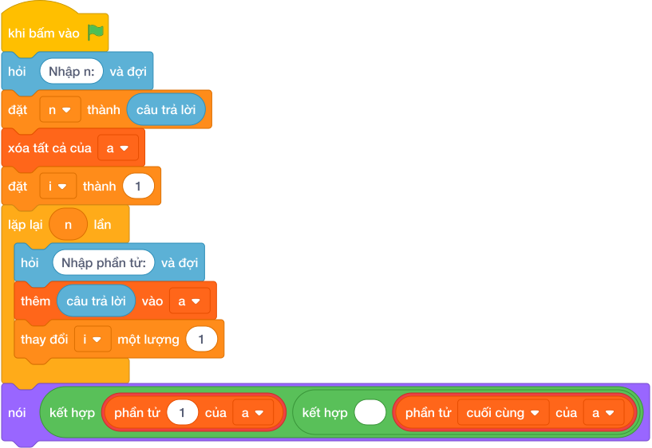

# Hướng Dẫn Giảng Dạy

## 1. Ý tưởng & Phân tích thuật toán

- Bản chất của bài này là lấy hai phần tử ở hai đầu của danh sách: phần tử đầu tiên và phần tử cuối cùng.
- Với số mẫu `N = 5`, dãy `10 25 3 47 99`: phần tử đầu là `10`, phần tử cuối là `99` nên đáp án là `10 99`.
- Quy trình trong lời giải với các biến `n`, `a`:
  - Đọc `n = 5`.
  - Đọc dãy `a = [10, 25, 3, 47, 99]`.
  - Lấy `a[0]` được `10` và `a[-1]` được `99`, in ra `10 99`.
- Giá trị biên cụ thể: `N = 1` thì phần tử đầu và cuối là cùng một số (ví dụ dãy `7` thì in `7 7`).

---

## 2. Bảng chạy tay trên số liệu mẫu (Dry Run Table - Sample 1: 5 / 10 25 3 47 99)

| Bước | Thao tác | Giá trị |
|------|----------|---------|
| 1 | Đọc `n` | `n = 5` |
| 2 | Đọc dãy `a` | `a = [10, 25, 3, 47, 99]` |
| 3 | Lấy `a[0]` | `10` |
| 4 | Lấy `a[-1]` | `99` |
| 5 | In kết quả | màn hình hiện `10 99` |

Kết quả cuối cùng khớp với đáp án mẫu: `10 99`.

---

## 3. Lưu ý & Bẫy lỗi thường gặp

- Bẫy 1 — lấy vị trí cuối bằng `a[n]`:
```text
n = câu trả lời
a = list(các khối hỏi và đợi cho từng biến)
nói (a[0], a[n])

```
Với mẫu `n = 5`, `a[5]` vượt khỏi dãy (vị trí cuối là `a[4]`) nên chương trình báo lỗi. Cách sửa: dùng `a[-1]` hoặc `a[n - 1]`.
- Bẫy 2 — in mỗi số một dòng:
```text
n = câu trả lời
a = list(các khối hỏi và đợi cho từng biến)
nói (a[0])
nói (a[-1])

```
Với mẫu trên in ra hai dòng `10` rồi `99`, không khớp đáp án mẫu `10 99` trên một dòng. Cách sửa: in chung một lệnh `nói (a[0], a[-1])`.
- Bẫy 3 — quên đọc dòng `N` nên đọc nhầm dãy:
```text
a = list(các khối hỏi và đợi cho từng biến)
nói (a[0], a[-1])

```
Với mẫu trên, lệnh đọc đầu tiên lấy nhầm dòng `5` thành dãy `[5]` rồi in ra `5 5` sai. Cách sửa: đọc `n` trước rồi mới đọc dãy `a`.

---

## 4. Lời giải tham khảo & Kịch bản Khối lệnh Scratch 3.0

### 4.1. Khối lệnh đồ họa trực quan (Visual Scratch Blocks)



> 💡 **Kịch bản thực hiện từng bước:**
> - khi bấm vào cờ xanh
> - hỏi [Nhập n:] và đợi
> - đặt [n] thành (câu trả lời)
> - xóa tất cả của danh sách [a]
> - đặt [i] thành 1
> - lặp lại (n) lần:
> -   hỏi [Nhập phần tử:] và đợi
> -   thêm (câu trả lời) vào [a]
> -   thay đổi [i] một lượng 1
> - nói (kết hợp giá trị và ' ' và giá trị)
