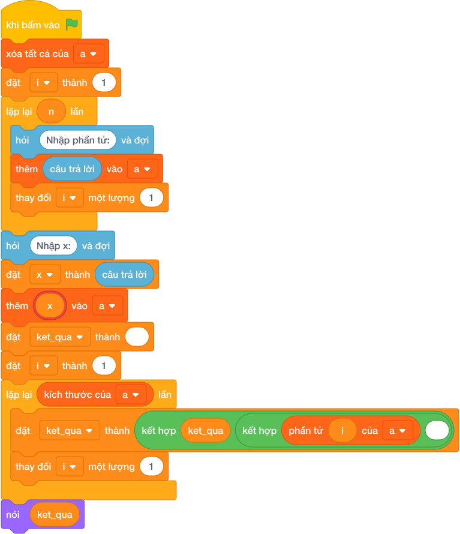

# Hướng Dẫn Giảng Dạy

## 1. Ý tưởng & Phân tích thuật toán

- Bản chất của bài này là gắn thêm điểm `X` vào cuối danh sách có sẵn.
- Với số mẫu, danh sách đầu là `8 9 7 10`, điểm mới `X = 9`: gắn thêm được `8 9 7 10 9`.
- Quy trình trong lời giải với các biến `a`, `x`:
  - Đọc dòng 1 thành `a = [8, 9, 7, 10]`.
  - Đọc dòng 2 thành `x = 9`.
  - Gọi `a.append(9)` được `[8, 9, 7, 10, 9]` rồi in ra.
- Giá trị biên cụ thể: danh sách đầu chỉ có 1 điểm thì kết quả có 2 điểm; điểm `X` trùng với điểm cũ vẫn cứ gắn thêm bình thường.

---

## 2. Bảng chạy tay trên số liệu mẫu (Dry Run Table - Sample 1: 8 9 7 10 / 9)

| Bước | Thao tác | Giá trị |
|------|----------|---------|
| 1 | Đọc dòng 1 thành `a` | `a = [8, 9, 7, 10]` |
| 2 | Đọc dòng 2 thành `x` | `x = 9` |
| 3 | Gọi `a.append(x)` | `a = [8, 9, 7, 10, 9]` |
| 4 | In kết quả | màn hình hiện `8 9 7 10 9` |

Kết quả cuối cùng khớp với đáp án mẫu: `8 9 7 10 9`.

---

## 3. Lưu ý & Bẫy lỗi thường gặp

- Bẫy 1 — cộng số nguyên vào danh sách:
```text
a = list(các khối hỏi và đợi cho từng biến)
x = câu trả lời
nói (*(a + x))

```
Với mẫu trên, `a + x` cộng danh sách với số nguyên gây lỗi chương trình. Cách sửa: dùng `a.append(x)` rồi in `*a`.
- Bẫy 2 — chèn lên đầu thay vì cuối:
```text
a = list(các khối hỏi và đợi cho từng biến)
x = câu trả lời
a.insert(0, x)
nói (*a)

```
Với mẫu trên in ra `9 8 9 7 10` sai. Cách sửa: gắn vào cuối bằng `a.append(x)`.
- Bẫy 3 — in cả ngoặc của danh sách:
```text
a = list(các khối hỏi và đợi cho từng biến)
x = câu trả lời
a.append(x)
nói (a)

```
Với mẫu trên in ra `[8, 9, 7, 10, 9]` có ngoặc và dấu phẩy, không khớp đáp án mẫu. Cách sửa: thêm dấu sao `nói (*a)`.

---

## 4. Lời giải tham khảo & Kịch bản Khối lệnh Scratch 3.0

### 4.1. Khối lệnh đồ họa trực quan (Visual Scratch Blocks)



> 💡 **Kịch bản thực hiện từng bước:**
> - khi bấm vào cờ xanh
> - xóa tất cả của danh sách [a]
> - đặt [i] thành 1
> - lặp lại (n) lần:
> -   hỏi [Nhập phần tử:] và đợi
> -   thêm (câu trả lời) vào [a]
> -   thay đổi [i] một lượng 1
> - hỏi [Nhập x:] và đợi
> - đặt [x] thành (câu trả lời)
> - thêm (x) vào [a]
> - đặt [ket_qua] thành rỗng
> - đặt [i] thành 1
> - lặp lại (kích thước của [a]) lần:
> -   đặt [ket_qua] thành kết hợp ket_qua và phần tử i và dấu cách
> -   thay đổi [i] một lượng 1
> - nói (ket_qua)
