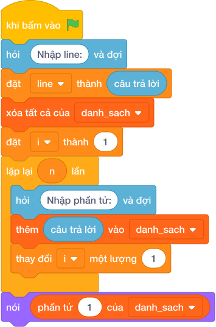

# Hướng Dẫn Giảng Dạy: Đếm số lần xuất hiện của X
Chuyên đề: **Lập Trình Thuật Toán & Khối Lệnh Scratch 3.0**

---

## 1. Ý tưởng & Phân tích thuật toán

- Bản chất của bài này là đếm xem số `X` ló mặt bao nhiêu lần trong dãy.
- Với số mẫu `N = 6`, `X = 5`, dãy `5 2 5 7 5 9`: số 5 xuất hiện ở vị trí 0, 2 và 4, tổng cộng `3` lần.
- Quy trình trong lời giải với các biến `line`, `n`, `x`, `a`:
  - Tách dòng đầu thành `n = 6`, `x = 5`.
  - Đọc dãy `a = [5, 2, 5, 7, 5, 9]`.
  - Gọi `a.count(5)` được `3` rồi in ra.
- Giá trị biên cụ thể: `X` không có trong dãy thì `count` trả `0` và in `0`.

---

## 2. Bảng chạy tay trên số liệu mẫu (Dry Run Table - Sample 1: 6 5 / 5 2 5 7 5 9)

| Bước | Thao tác | Giá trị |
|------|----------|---------|
| 1 | Tách dòng 1 | `["6", "5"]` |
| 2 | Lấy `n`, `x` | `n = 6`, `x = 5` |
| 3 | Đọc dãy `a` | `a = [5, 2, 5, 7, 5, 9]` |
| 4 | Gọi `a.count(5)` | gặp 5 ở 3 chỗ nên được `3` |
| 5 | In kết quả | màn hình hiện `3` |

Kết quả cuối cùng khớp với đáp án mẫu: `3`.

---

## 3. Lưu ý & Bẫy lỗi thường gặp

- Bẫy 1 — viết nhầm phép gán `=` trong chỗ so sánh:
```text
line = câu trả lời.split()
n, x = int(line[0]), int(line[1])
a = list(map(int, câu trả lời.split()))
dem = 0
for v in a:
    if v == x:
        dem = dem + 1
print(dem + 1)
```
Với mẫu trên in ra `4` vì cộng dư 1. Cách sửa: in đúng `dem`, hoặc dùng `a.count(x)`.
- Bẫy 2 — nhầm vị trí đầu tiên với số lần xuất hiện:
```text
line = câu trả lời.split()
n, x = int(line[0]), int(line[1])
a = list(map(int, câu trả lời.split()))
print(a.index(x))
```
Với mẫu trên in ra `2` (vị trí của số 5 đầu tiên), không khớp đáp án mẫu `3`. Cách sửa: đếm bằng `a.count(x)`.
- Bẫy 3 — đọc `N` và `X` sai thứ tự:
```text
line = câu trả lời.split()
x, n = int(line[0]), int(line[1])
a = list(map(int, câu trả lời.split()))
print(a.count(x))
```
Với mẫu trên, `x` nhận nhầm `6` nên đếm số 6 được `0`, không khớp đáp án mẫu `3`. Cách sửa: giữ đúng thứ tự `n, x = int(line[0]), int(line[1])`.

---

## 4. Lời giải tham khảo & Kịch bản Khối lệnh Scratch 3.0

### 4.1. Khối lệnh đồ họa trực quan (Visual Scratch Blocks)



> 💡 **Kịch bản thực hiện từng bước:**
> - khi bấm vào cờ xanh
> - hỏi [Nhập line:] và đợi
> - đặt [line] thành (câu trả lời)
> - xóa tất cả của [danh_sach]
> - đặt [i] thành (1)
> - lặp lại (n) lần:
> -   hỏi [Nhập phần tử:] và đợi
> -   thêm (câu trả lời) vào [danh_sach]
> -   thay đổi [i] một lượng (1)
> - nói (phần tử thứ 1 của [danh_sach])
