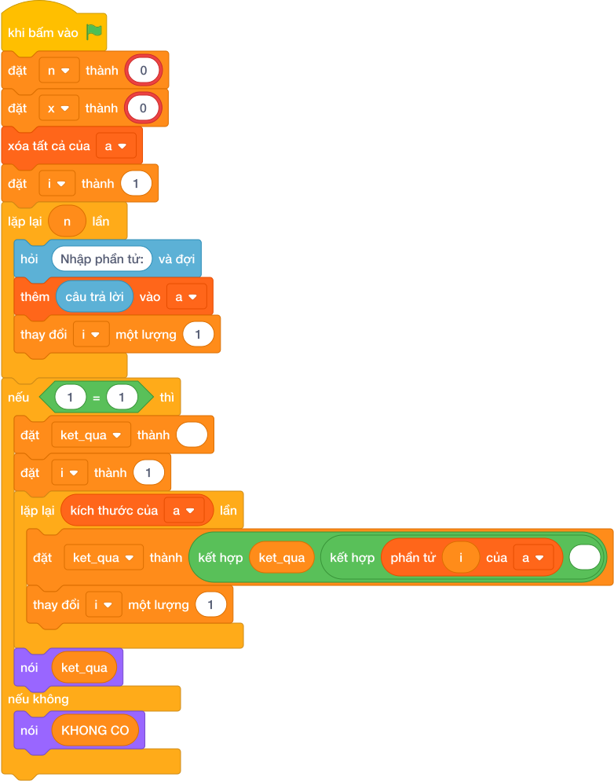

# Hướng Dẫn Giảng Dạy

## 1. Ý tưởng & Phân tích thuật toán

- Bản chất của bài này là tìm số `X` đầu tiên trong dãy rồi gạch nó đi, các số còn lại giữ nguyên thứ tự.
- Với số mẫu `N = 5`, `X = 3`, dãy `1 3 5 3 7`: số 3 đầu tiên ở vị trí 1 bị xóa, còn lại `1 5 3 7` (số 3 thứ hai vẫn ở lại).
- Quy trình trong lời giải với các biến `line`, `n`, `x`, `a`:
  - Tách dòng đầu thành `n = 5`, `x = 3`.
  - Đọc dãy `a = [1, 3, 5, 3, 7]`.
  - Vì `3` có trong dãy nên gọi `a.remove(3)` xóa đúng phần tử 3 đầu tiên, còn `[1, 5, 3, 7]` rồi in ra; nếu `X` vắng mặt thì in `KHONG CO`.
- Giá trị biên cụ thể: `X` nằm ở cuối dãy thì xóa xong dãy ngắn đi 1 ở đuôi; `X` không có trong dãy thì in đúng chữ `KHONG CO`.

---

## 2. Bảng chạy tay trên số liệu mẫu (Dry Run Table - Sample 1: 5 3 / 1 3 5 3 7)

| Bước | Thao tác | Giá trị |
|------|----------|---------|
| 1 | Tách dòng 1 | `["5", "3"]` |
| 2 | Lấy `n`, `x` | `n = 5`, `x = 3` |
| 3 | Đọc dãy `a` | `a = [1, 3, 5, 3, 7]` |
| 4 | Kiểm tra `x in a` | `3` có mặt nên xóa |
| 5 | Gọi `a.remove(3)` | `a = [1, 5, 3, 7]` (mất số 3 đầu tiên) |
| 6 | In kết quả | màn hình hiện `1 5 3 7` |

Kết quả cuối cùng khớp với đáp án mẫu: `1 5 3 7`.

---

## 3. Lưu ý & Bẫy lỗi thường gặp

- Bẫy 1 — xóa hết mọi số bằng `X`:
```text
line = câu trả lời
n, x = int(line[0]), int(line[1])
a = list(các khối hỏi và đợi cho từng biến)
a = [v for v in a if v != x]
nói (*a)

```
Với mẫu trên in ra `1 5 7` (mất cả hai số 3), không khớp đáp án mẫu `1 5 3 7`. Cách sửa: chỉ xóa một phần tử đầu bằng `a.remove(x)`.
- Bẫy 2 — dùng `pop(x)` nhầm giá trị với vị trí:
```text
line = câu trả lời
n, x = int(line[0]), int(line[1])
a = list(các khối hỏi và đợi cho từng biến)
if x in a:
    a.pop(x)
    nói (*a)
else:
    nói ("KHONG CO")

```
Với mẫu trên, `a.pop(3)` xóa phần tử ở vị trí 3 (số `3` thứ hai) nên in ra `1 3 5 7` sai. Cách sửa: xóa theo giá trị bằng `a.remove(x)`.
- Bẫy 3 — xóa mà không kiểm tra trước:
```text
line = câu trả lời
n, x = int(line[0]), int(line[1])
a = list(các khối hỏi và đợi cho từng biến)
a.remove(x)
nói (*a)

```
Với mẫu trên vẫn ra `1 5 3 7`, nhưng khi `X` vắng mặt thì `remove` gây lỗi và không in được `KHONG CO`. Cách sửa: kiểm tra `if x in a` trước khi xóa.

---

## 4. Lời giải tham khảo & Kịch bản Khối lệnh Scratch 3.0

### 4.1. Khối lệnh đồ họa trực quan (Visual Scratch Blocks)



> 💡 **Kịch bản thực hiện từng bước:**
> - khi bấm vào cờ xanh
> - đặt [n] thành (int(...))
> - đặt [x] thành (int(...))
> - xóa tất cả của danh sách [a]
> - đặt [i] thành 1
> - lặp lại (n) lần:
> -   hỏi [Nhập phần tử:] và đợi
> -   thêm (câu trả lời) vào [a]
> -   thay đổi [i] một lượng 1
> - nếu <x = a> thì:
> -   đặt [ket_qua] thành rỗng
> -   đặt [i] thành 1
> -   lặp lại (kích thước của [a]) lần:
> -     đặt [ket_qua] thành kết hợp ket_qua và phần tử i và dấu cách
> -     thay đổi [i] một lượng 1
> -   nói (ket_qua)
> - nếu không thì:
> -   nói (KHONG CO)
