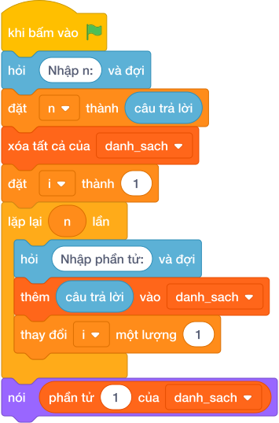

# Hướng Dẫn Giảng Dạy: Thay thế tất cả số âm bằng số 0
Chuyên đề: **Lập Trình Thuật Toán & Khối Lệnh Scratch 3.0**

---

## 1. Ý tưởng & Phân tích thuật toán

- Bản chất của bài này là đi qua từng số, số nào âm thì đổi thành 0, số còn lại giữ nguyên.
- Với số mẫu `N = 5`, dãy `3 -5 8 -2 0`: số `3` giữ lại, `-5` thành `0`, `8` giữ lại, `-2` thành `0`, `0` giữ lại, được dãy mới `3 0 8 0 0`.
- Quy trình trong lời giải với các biến `n`, `a`, `res`, `x`:
  - Đọc `n = 5`, dãy `a = [3, -5, 8, -2, 0]`.
  - Dựng dãy mới `res` bằng cách xét từng `x`: `x < 0` thì lấy `0`, ngược lại lấy `x`.
  - Được `res = [3, 0, 8, 0, 0]` rồi in ra.
- Giá trị biên cụ thể: số `0` không phải số âm nên giữ nguyên `0`; dãy toàn số dương thì dãy mới giống hệt dãy cũ.

---

## 2. Bảng chạy tay trên số liệu mẫu (Dry Run Table - Sample 1: 5 / 3 -5 8 -2 0)

| Bước | Thao tác | Giá trị |
|------|----------|---------|
| 1 | Đọc `n` | `n = 5` |
| 2 | Đọc dãy `a` | `a = [3, -5, 8, -2, 0]` |
| 3 | Xét `3` | `3 >= 0` nên giữ `3` |
| 4 | Xét `-5` | `-5 < 0` nên thành `0` |
| 5 | Xét `8` | giữ `8` |
| 6 | Xét `-2` | thành `0` |
| 7 | Xét `0` | `0` không âm nên giữ `0` |
| 8 | In `res` | màn hình hiện `3 0 8 0 0` |

Kết quả cuối cùng khớp với đáp án mẫu: `3 0 8 0 0`.

---

## 3. Lưu ý & Bẫy lỗi thường gặp

- Bẫy 1 — đổi số trong vòng lặp mà không lưu lại vào danh sách:
```text
n = int(câu trả lời.strip())
a = list(map(int, câu trả lời.split()))
for x in a:
    if x < 0:
        x = 0
print(*a)
```
Với mẫu trên in ra dãy cũ `3 -5 8 -2 0` vì `x` chỉ là bản sao. Cách sửa: dựng dãy mới `res = [0 if x < 0 else x for x in a]` rồi in `res`.
- Bẫy 2 — in cả ngoặc của danh sách:
```text
n = int(câu trả lời.strip())
a = list(map(int, câu trả lời.split()))
res = [0 if x < 0 else x for x in a]
print(res)
```
Với mẫu trên in ra `[3, 0, 8, 0, 0]` có ngoặc và dấu phẩy, không khớp đáp án mẫu. Cách sửa: thêm dấu sao `nói (*res)`.
- Bẫy 3 — viết ngược điều kiện thành đổi số dương:
```text
n = int(câu trả lời.strip())
a = list(map(int, câu trả lời.split()))
res = [0 if x > 0 else x for x in a]
print(*res)
```
Với mẫu trên in ra `0 0 0 -2 0` sai. Cách sửa: điều kiện đúng là `x < 0`.

---

## 4. Lời giải tham khảo & Kịch bản Khối lệnh Scratch 3.0

### 4.1. Khối lệnh đồ họa trực quan (Visual Scratch Blocks)



> 💡 **Kịch bản thực hiện từng bước:**
> - khi bấm vào cờ xanh
> - hỏi [Nhập n:] và đợi
> - đặt [n] thành (câu trả lời)
> - xóa tất cả của [danh_sach]
> - đặt [i] thành (1)
> - lặp lại (n) lần:
> -   hỏi [Nhập phần tử:] và đợi
> -   thêm (câu trả lời) vào [danh_sach]
> -   thay đổi [i] một lượng (1)
> - nói (phần tử thứ 1 của [danh_sach])
