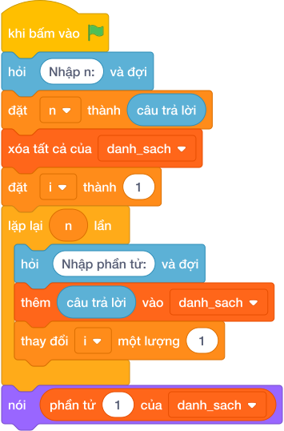

# Hướng Dẫn Giảng Dạy: Chèn số vào vị trí K
Chuyên đề: **Lập Trình Thuật Toán & Khối Lệnh Scratch 3.0**

---

## 1. Ý tưởng & Phân tích thuật toán

- Bản chất của bài này là nhét số `X` vào đúng vị trí `K`, các số từ `K` trở đi lùi sang phải một bước.
- Với số mẫu `N = 4`, dãy `10 20 30 40`, `X = 99`, `K = 1`: nhét `99` vào vị trí 1 được `10 99 20 30 40`.
- Quy trình trong lời giải với các biến `n`, `a`, `line`, `x`, `k`:
  - Đọc `n = 4`, dãy `a = [10, 20, 30, 40]`.
  - Tách dòng 3 thành `x = 99`, `k = 1`.
  - Gọi `a.insert(1, 99)` được `[10, 99, 20, 30, 40]` rồi in ra.
- Giá trị biên cụ thể: `K = 0` thì `X` lên đầu dãy; `K = N` thì `X` xuống cuối dãy.

---

## 2. Bảng chạy tay trên số liệu mẫu (Dry Run Table - Sample 1: 4 / 10 20 30 40 / 99 1)

| Bước | Thao tác | Giá trị |
|------|----------|---------|
| 1 | Đọc `n` | `n = 4` |
| 2 | Đọc dãy `a` | `a = [10, 20, 30, 40]` |
| 3 | Tách dòng 3 | `x = 99`, `k = 1` |
| 4 | Gọi `a.insert(1, 99)` | `a = [10, 99, 20, 30, 40]` |
| 5 | In kết quả | màn hình hiện `10 99 20 30 40` |

Kết quả cuối cùng khớp với đáp án mẫu: `10 99 20 30 40`.

---

## 3. Lưu ý & Bẫy lỗi thường gặp

- Bẫy 1 — ghi đè thay vì chèn:
```text
n = int(câu trả lời.strip())
a = list(map(int, câu trả lời.split()))
line = câu trả lời.split()
x, k = int(line[0]), int(line[1])
a[k] = x
print(*a)
```
Với mẫu trên in ra `10 99 30 40` (số `20` bị mất, dãy còn 4 số), không khớp đáp án mẫu 5 số `10 99 20 30 40`. Cách sửa: dùng `a.insert(k, x)`.
- Bẫy 2 — đọc ngược `X` và `K`:
```text
n = int(câu trả lời.strip())
a = list(map(int, câu trả lời.split()))
line = câu trả lời.split()
k, x = int(line[0]), int(line[1])
a.insert(k, x)
print(*a)
```
Với mẫu trên, `k` nhận nhầm `99` nên chèn số `1` xuống cuối, in ra `10 20 30 40 1` sai. Cách sửa: giữ đúng thứ tự `x, k = int(line[0]), int(line[1])`.
- Bẫy 3 — chèn `X` vào cuối mà không dùng vị trí `K`:
```text
n = int(câu trả lời.strip())
a = list(map(int, câu trả lời.split()))
line = câu trả lời.split()
x, k = int(line[0]), int(line[1])
a.append(x)
print(*a)
```
Với mẫu trên in ra `10 20 30 40 99` sai. Cách sửa: chèn đúng chỗ bằng `a.insert(k, x)`.

---

## 4. Lời giải tham khảo & Kịch bản Khối lệnh Scratch 3.0

### 4.1. Khối lệnh đồ họa trực quan (Visual Scratch Blocks)



> 💡 **Kịch bản thực hiện từng bước:**
> - khi bấm vào cờ xanh
> - hỏi [Nhập n:] và đợi
> - đặt [n] thành (câu trả lời)
> - xóa tất cả của [danh_sach]
> - đặt [i] thành (1)
> - lặp lại (n) lần:
> -   hỏi [Nhập phần tử:] và đợi
> -   thêm (câu trả lời) vào [danh_sach]
> -   thay đổi [i] một lượng (1)
> - nói (phần tử thứ 1 của [danh_sach])
