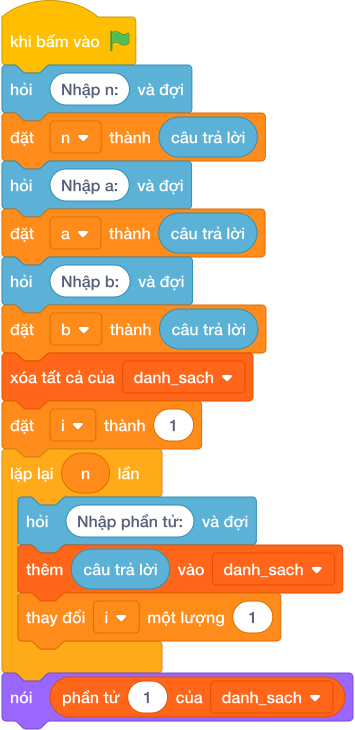

# Hướng Dẫn Giảng Dạy: Heo đất tiết kiệm
Chuyên đề: **Lập Trình Thuật Toán & Khối Lệnh Scratch 3.0**

---

## 1. Ý tưởng & Phân tích thuật toán

- Bản chất của bài này là cộng hai khoản: tiền bỏ đều mỗi ngày và tiền thưởng của các ngày chẵn.
- Với số mẫu `N = 5`, `A = 10`, `B = 3`: 5 ngày mỗi ngày 10 đồng được `50` đồng; các ngày chẵn là ngày 2 và ngày 4, tức `5 // 2 = 2` ngày, thưởng thêm `2 * 3 = 6` đồng; tổng là `50 + 6 = 56`.
- Quy trình trong lời giải với các biến `n`, `a`, `b`:
  - Đọc `n = 5`, `a = 10`, `b = 3`.
  - Tính tiền đều `n * a = 50`, tiền thưởng `(n // 2) * b = 6`.
  - In `50 + 6 = 56`.
- Giá trị biên cụ thể: `N = 1` thì không có ngày chẵn nào nên đáp án là `A`; `N = 10^6`, `A, B = 10^4` thì tổng tới khoảng `1.5 * 10^10`, Python tính trực tiếp không lo tràn số.

---

## 2. Bảng chạy tay trên số liệu mẫu (Dry Run Table - Sample 1: 5 10 3)

| Bước | Thao tác | Giá trị |
|------|----------|---------|
| 1 | Đọc `n, a, b` | `n = 5`, `a = 10`, `b = 3` |
| 2 | Tính tiền đều `n * a` | `5 * 10 = 50` |
| 3 | Đếm ngày chẵn `n // 2` | `5 // 2 = 2` (ngày 2 và 4) |
| 4 | Tính tiền thưởng `2 * b` | `2 * 3 = 6` |
| 5 | In tổng | màn hình hiện `56` |

Kết quả cuối cùng khớp với đáp án mẫu: `56`.

---

## 3. Lưu ý & Bẫy lỗi thường gặp

- Bẫy 1 — đếm ngày chẵn bằng phép chia thực:
```text
n, a, b = map(int, câu trả lời.split())
print(int(n * a + (n / 2) * b))
```
Với mẫu `5 10 3` thì `(5 / 2) * 3 = 7.5`, tổng `57.5` rồi ép kiểu thành `57`, không khớp đáp án mẫu `56`. Cách sửa: đếm ngày chẵn bằng chia nguyên `(n // 2)`.
- Bẫy 2 — thưởng cho cả ngày lẻ:
```text
n, a, b = map(int, câu trả lời.split())
print(n * a + n * b)
```
Với mẫu trên in ra `50 + 15 = 65` sai. Cách sửa: chỉ thưởng `(n // 2)` ngày chẵn.
- Bẫy 3 — mô phỏng từng ngày bằng vòng lặp:
```text
n, a, b = map(int, câu trả lời.split())
tong = 0
for ngay in range(1, n + 1):
    tong = tong + a
    if ngay % 2 == 0:
        tong = tong + b
print(tong)
```
Với mẫu `5 10 3` vẫn ra `56`, nhưng với `N` tới `10^6` vòng lặp chậm hơn hẳn phép tính trực tiếp. Cách sửa: dùng công thức `n * a + (n // 2) * b`.

---

## 4. Lời giải tham khảo & Kịch bản Khối lệnh Scratch 3.0

### 4.1. Khối lệnh đồ họa trực quan (Visual Scratch Blocks)



> 💡 **Kịch bản thực hiện từng bước:**
> - khi bấm vào cờ xanh
> - hỏi [Nhập n:] và đợi
> - đặt [n] thành (câu trả lời)
> - hỏi [Nhập a:] và đợi
> - đặt [a] thành (câu trả lời)
> - hỏi [Nhập b:] và đợi
> - đặt [b] thành (câu trả lời)
> - xóa tất cả của [danh_sach]
> - đặt [i] thành (1)
> - lặp lại (n) lần:
> -   hỏi [Nhập phần tử:] và đợi
> -   thêm (câu trả lời) vào [danh_sach]
> -   thay đổi [i] một lượng (1)
> - nói (phần tử thứ 1 của [danh_sach])
