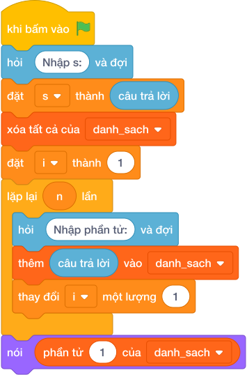

# Hướng Dẫn Giảng Dạy: Mật khẩu bị ẩn
Chuyên đề: **Lập Trình Thuật Toán & Khối Lệnh Scratch 3.0**

---

## 1. Ý tưởng & Phân tích thuật toán

- Bản chất của bài này là đi qua từng ký tự của chuỗi và đếm các ký tự nằm từ `0` đến `9`.
- Với chuỗi mẫu `Abc123x`: các ký tự là `A`, `b`, `c`, `1`, `2`, `3`, `x`; trong đó `1`, `2`, `3` là chữ số nên đáp án là `3`.
- Quy trình trong lời giải với các biến `s`, `d`, `c`:
  - Đọc cả dòng `s = "Abc123x"`, đặt bộ đếm `d = 0`.
  - Với mỗi ký tự `c`, nếu `"0" <= c <= "9"` thì tăng `d` thêm 1: `A` bỏ, `b` bỏ, `c` bỏ, `1` đếm 1, `2` đếm 2, `3` đếm 3, `x` bỏ.
  - In `d = 3`.
- Giá trị biên cụ thể: chuỗi không có chữ số nào thì in `0`; chuỗi dài tới `10^5` ký tự vẫn duyệt một lượt là xong.

---

## 2. Bảng chạy tay trên số liệu mẫu (Dry Run Table - Sample 1: Abc123x)

| Bước | Thao tác | Giá trị |
|------|----------|---------|
| 1 | Đọc `s = câu trả lời` | `s = "Abc123x"`, `d = 0` |
| 2 | Xét `A`, `b`, `c` | không phải chữ số, `d` vẫn `0` |
| 3 | Xét `1` | là chữ số nên `d = 1` |
| 4 | Xét `2` | là chữ số nên `d = 2` |
| 5 | Xét `3` | là chữ số nên `d = 3` |
| 6 | Xét `x` | không phải chữ số, `d` vẫn `3` |
| 7 | In kết quả | màn hình hiện `3` |

Kết quả cuối cùng khớp với đáp án mẫu: `3`.

---

## 3. Lưu ý & Bẫy lỗi thường gặp

- Bẫy 1 — kiểm tra cả chuỗi có phải số không:
```text
s = câu trả lời
if s.isdigit():
    print(len(s))
else:
    print(0)
```
Với mẫu `Abc123x`, cả chuỗi không phải toàn chữ số nên in ra `0`, không khớp đáp án mẫu `3`. Cách sửa: duyệt từng ký tự và đếm riêng.
- Bẫy 2 — đếm nhầm chữ cái thành chữ số:
```text
s = câu trả lời
d = 0
for c in s:
    if c.isalpha():
        d += 1
print(d)
```
Với mẫu trên in ra `4` (đếm `A`, `b`, `c`, `x`) sai. Cách sửa: điều kiện đúng là `"0" <= c <= "9"`.
- Bẫy 3 — chỉ đọc một từ bằng `split`:
```text
s = câu trả lời.split()
d = 0
for c in s[0]:
    if "0" <= c <= "9":
        d += 1
print(d)
```
Với mẫu một từ `Abc123x` vẫn ra `3`, nhưng mật khẩu có khoảng trắng thì phần sau dấu cách bị bỏ mất. Cách sửa: đọc nguyên dòng bằng `s = câu trả lời`.

---

## 4. Lời giải tham khảo & Kịch bản Khối lệnh Scratch 3.0

### 4.1. Khối lệnh đồ họa trực quan (Visual Scratch Blocks)



> 💡 **Kịch bản thực hiện từng bước:**
> - khi bấm vào cờ xanh
> - hỏi [Nhập s:] và đợi
> - đặt [s] thành (câu trả lời)
> - xóa tất cả của [danh_sach]
> - đặt [i] thành (1)
> - lặp lại (n) lần:
> -   hỏi [Nhập phần tử:] và đợi
> -   thêm (câu trả lời) vào [danh_sach]
> -   thay đổi [i] một lượng (1)
> - nói (phần tử thứ 1 của [danh_sach])
