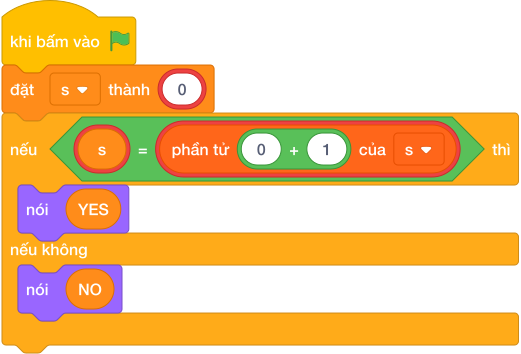

# Hướng Dẫn Giảng Dạy

## 1. Ý tưởng & Phân tích thuật toán

- Bản chất của bài này là kiểm tra chuỗi số đọc xuôi và đọc ngược có giống nhau không.
- Với số mẫu `N = 121`, đọc xuôi là `121`, đọc ngược cũng là `121` nên là ghế vàng, đáp án `YES`.
- Quy trình trong lời giải với biến `s`:
  - Đọc cả dòng thành chuỗi `s`, mẫu đọc được `s = "121"`.
  - Lấy chuỗi đảo ngược `s[::-1]`, với mẫu là `"121"`.
  - So sánh `"121" == "121"` đúng nên in `YES`.
- Giá trị biên cụ thể: `N` có 1 chữ số (ví dụ `7`) luôn đối xứng nên in `YES`; `N` dài tới 19 chữ số vẫn xử lý bằng chuỗi nên không lo tràn số.

---

## 2. Bảng chạy tay trên số liệu mẫu (Dry Run Table - Sample 1: 121)

| Bước | Thao tác | Giá trị |
|------|----------|---------|
| 1 | Đọc `s = câu trả lời` | `s = "121"` |
| 2 | Lấy `s[::-1]` | `"121"` |
| 3 | So sánh `s == s[::-1]` | `"121" == "121"` đúng |
| 4 | In kết quả | màn hình hiện `YES` |

Kết quả cuối cùng khớp với đáp án mẫu: `YES`.

---

## 3. Lưu ý & Bẫy lỗi thường gặp

- Bẫy 1 — đổi số đảo bằng phép tính số học rồi so sánh, dễ sai với số có chữ số 0 ở cuối:
```text
n = câu trả lời
tam = n
dao = 0
while tam > 0:
    dao = dao * 10 + (tam mod 10)
    tam = làm tròn xuống của (tam / 10)
if dao == n:
    nói ("YES")
else:
    nói ("NO")

```
Với mẫu `121` vẫn ra `YES`, nhưng cách làm chuỗi `s == s[::-1]` ngắn gọn và ít nhầm hơn. Cách sửa: giữ nguyên số dưới dạng chuỗi rồi so sánh với chuỗi đảo.
- Bẫy 2 — quên cắt khoảng trắng khi đọc:
```text
s = câu trả lời
if s == s[::-1]:
    nói ("YES")
else:
    nói ("NO")

```
Nếu dòng nhập mẫu `121` kèm dấu xuống dòng hoặc khoảng trắng thừa thì so sánh lệch và in `NO` sai. Cách sửa: đọc bằng `s = câu trả lời`.
- Bẫy 3 — viết hoa thường sai chữ đáp án:
```text
s = câu trả lời
if s == s[::-1]:
    nói ("Yes")
else:
    nói ("No")

```
Với mẫu `121` in ra `Yes`, không khớp đáp án mẫu `YES`. Cách sửa: in đúng chữ in hoa `YES` và `NO`.

---

## 4. Lời giải tham khảo & Kịch bản Khối lệnh Scratch 3.0

### 4.1. Khối lệnh đồ họa trực quan (Visual Scratch Blocks)



> 💡 **Kịch bản thực hiện từng bước:**
> - khi bấm vào cờ xanh
> - đặt [s] thành (giá trị)
> - nếu <s = giá trị> thì:
> -   nói (YES)
> - nếu không thì:
> -   nói (NO)
