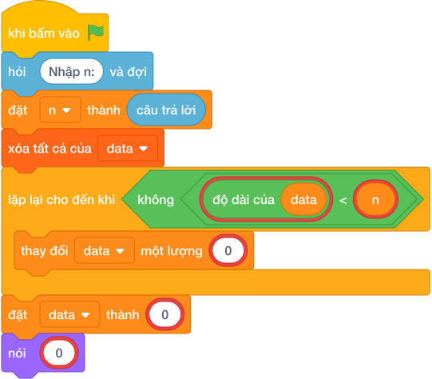

# Hướng Dẫn Giảng Dạy

## 1. Ý tưởng & Phân tích thuật toán

- Bản chất của bài này là sắp xếp các chiều cao từ thấp đến cao.
- Với số mẫu `N = 5`, các chiều cao `160 150 175 165 155`: xếp lại thành `150 155 160 165 175`.
- Quy trình trong lời giải với các biến `n`, `data`:
  - Đọc `n = 5`.
  - Gom đủ 5 số vào `data = [160, 150, 175, 165, 155]` (vòng lặp gom đề phòng các số nằm rải rác nhiều dòng).
  - Gọi `sorted` được `[150, 155, 160, 165, 175]` rồi in ra cách nhau bởi dấu cách.
- Giá trị biên cụ thể: `N = 1` thì in nguyên chiều cao đó; `N` tới `10^5` vẫn sắp xếp kịp.

---

## 2. Bảng chạy tay trên số liệu mẫu (Dry Run Table - Sample 1: 5 / 160 150 175 165 155)

| Bước | Thao tác | Giá trị |
|------|----------|---------|
| 1 | Đọc `n` | `n = 5` |
| 2 | Gom `data` | `data = [160, 150, 175, 165, 155]` |
| 3 | Gọi `sorted` | `[150, 155, 160, 165, 175]` |
| 4 | In kết quả | màn hình hiện `150 155 160 165 175` |

Kết quả cuối cùng khớp với đáp án mẫu: `150 155 160 165 175`.

---

## 3. Lưu ý & Bẫy lỗi thường gặp

- Bẫy 1 — sắp giảm dần thay vì tăng dần:
```text
n = câu trả lời
data = []
while len(data) < n:
    data += list(các khối hỏi và đợi cho từng biến)
data = sorted(data[:n], reverse=True)
nói (" ".join(map(str, data)))

```
Với mẫu trên in ra `175 165 160 155 150` sai. Cách sửa: sắp tăng dần mặc định, không dùng `reverse=True`.
- Bẫy 2 — in cả danh sách kèm ngoặc:
```text
n = câu trả lời
data = []
while len(data) < n:
    data += list(các khối hỏi và đợi cho từng biến)
data = sorted(data[:n])
nói (data)

```
Với mẫu trên in ra `[150, 155, 160, 165, 175]` có ngoặc và dấu phẩy, không khớp đáp án mẫu. Cách sửa: in bằng `" ".join(map(str, data))`.
- Bẫy 3 — loại trùng bằng tập hợp:
```text
n = câu trả lời
data = []
while len(data) < n:
    data += list(các khối hỏi và đợi cho từng biến)
data = sorted(set(data))
nói (" ".join(map(str, data)))

```
Nếu hai bạn cao bằng nhau thì một bạn bị mất khỏi hàng. Cách sửa: sắp trực tiếp danh sách, không dùng `set`.

---

## 4. Lời giải tham khảo & Kịch bản Khối lệnh Scratch 3.0

### 4.1. Khối lệnh đồ họa trực quan (Visual Scratch Blocks)



> 💡 **Kịch bản thực hiện từng bước:**
> - khi bấm vào cờ xanh
> - hỏi [Nhập n:] và đợi
> - đặt [n] thành (câu trả lời)
> - xóa tất cả của [data]
> - lặp lại cho đến khi không còn <độ dài của data < n>:
> -   thay đổi [data] một lượng (list(...))
> - đặt [data] thành (sorted(...))
> - nói (giá trị)
