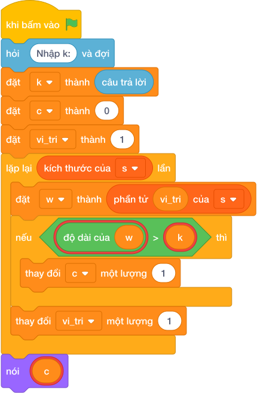

# Hướng Dẫn Giảng Dạy

## 1. Ý tưởng & Phân tích thuật toán

- Bản chất của bài này là cắt câu thành từng từ rồi đếm các từ dài hơn `K` ký tự.
- Với số mẫu `K = 3`, câu `Hom nay Bin di hoc cung ban Na`: các từ dài lần lượt là 3, 3, 3, 2, 3, 4, 3, 2; chỉ có từ `cung` dài 4, lớn hơn 3 nên đáp án là `1`.
- Quy trình trong lời giải với các biến `k`, `s`, `c`, `w`:
  - Đọc `k = 3`, tách câu thành `s = ["Hom", "nay", "Bin", "di", "hoc", "cung", "ban", "Na"]`, đặt `c = 0`.
  - Với mỗi từ `w`, nếu `len(w) > 3` thì tăng `c`: chỉ mỗi `cung` đạt nên `c = 1`.
  - In `1`.
- Giá trị biên cụ thể: `K = 0` thì mọi từ không rỗng đều được đếm; câu chỉ có 1 từ thì đáp án là `1` hoặc `0`.

---

## 2. Bảng chạy tay trên số liệu mẫu (Dry Run Table - Sample 1: 3 / Hom nay Bin di hoc cung ban Na)

| Bước | Thao tác | Giá trị |
|------|----------|---------|
| 1 | Đọc `k` | `k = 3` |
| 2 | Tách câu thành `s` | 8 từ: Hom, nay, Bin, di, hoc, cung, ban, Na |
| 3 | Xét `Hom`, `nay`, `Bin` | dài 3, không lớn hơn 3 nên bỏ |
| 4 | Xét `di` | dài 2 nên bỏ |
| 5 | Xét `hoc` | dài 3 nên bỏ |
| 6 | Xét `cung` | dài 4, lớn hơn 3 nên `c = 1` |
| 7 | Xét `ban`, `Na` | dài 3 và 2 nên bỏ |
| 8 | In kết quả | màn hình hiện `1` |

Kết quả cuối cùng khớp với đáp án mẫu: `1`.

---

## 3. Lưu ý & Bẫy lỗi thường gặp

- Bẫy 1 — dùng `>=` thay vì `>`:
```text
k = câu trả lời
s = câu trả lời
c = 0
for w in s:
    if len(w) >= k:
        c += 1
nói (c)

```
Với mẫu trên, các từ `Hom`, `nay`, `Bin`, `hoc`, `ban` dài đúng 3 cũng bị đếm nên in ra `6`, không khớp đáp án mẫu `1`. Cách sửa: điều kiện đúng là `len(w) > k`.
- Bẫy 2 — đếm ký tự thay vì đếm từ:
```text
k = câu trả lời
s = câu trả lời
c = 0
for w in s:
    if len(w) > k:
        c += 1
nói (c)

```
Với mẫu trên, mỗi `w` là một ký tự đơn nên không ký tự nào dài hơn 3, in ra `0` sai. Cách sửa: tách câu thành từ bằng `s = câu trả lời`.
- Bẫy 3 — quên đọc dòng `K`:
```text
s = câu trả lời
c = 0
for w in s:
    if len(w) > 3:
        c += 1
nói (c)

```
Lệnh đọc đầu tiên lấy nhầm dòng `3` làm câu, tách được `["3"]` dài 1 nên in ra `0` sai. Cách sửa: đọc `k = câu trả lời` trước rồi mới đọc câu.

---

## 4. Lời giải tham khảo & Kịch bản Khối lệnh Scratch 3.0

### 4.1. Khối lệnh đồ họa trực quan (Visual Scratch Blocks)



> 💡 **Kịch bản thực hiện từng bước:**
> - khi bấm vào cờ xanh
> - hỏi [Nhập k:] và đợi
> - đặt [k] thành (câu trả lời)
> - đặt [c] thành (0)
> - đặt [vi_tri] thành 1
> - lặp lại (kích thước của s) lần:
> -   đặt [w] thành phần tử thứ (vi_tri)
> -   nếu <độ dài của w > k> thì:
> -     thay đổi [c] một lượng (1)
> -   thay đổi [vi_tri] một lượng 1
> - nói (c)
