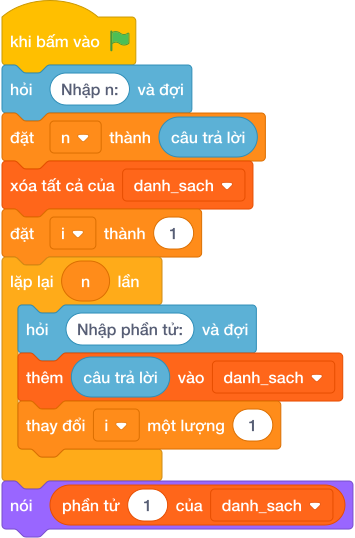

# Hướng Dẫn Giảng Dạy: Điểm số cao nhất & thấp nhất
Chuyên đề: **Lập Trình Thuật Toán & Khối Lệnh Scratch 3.0**

---

## 1. Ý tưởng & Phân tích thuật toán

- Bản chất của bài này là lướt một lượt qua danh sách điểm để nhặt ra điểm cao nhất và điểm thấp nhất.
- Với số mẫu `N = 5`, các điểm `80 95 60 100 75`: cao nhất là `100`, thấp nhất là `60` nên đáp án là `100 60`.
- Quy trình trong lời giải với các biến `n`, `a`:
  - Đọc `n = 5`.
  - Đọc dãy `a = [80, 95, 60, 100, 75]`.
  - Gọi `max(a)` được `100`, `min(a)` được `60`, in ra `100 60`.
- Giá trị biên cụ thể: điểm từ `0` đến `100`; `N = 1` thì cao nhất và thấp nhất trùng nhau.

---

## 2. Bảng chạy tay trên số liệu mẫu (Dry Run Table - Sample 1: 5 / 80 95 60 100 75)

| Bước | Thao tác | Giá trị |
|------|----------|---------|
| 1 | Đọc `n` | `n = 5` |
| 2 | Đọc dãy `a` | `a = [80, 95, 60, 100, 75]` |
| 3 | Tính `max(a)` | `100` |
| 4 | Tính `min(a)` | `60` |
| 5 | In kết quả | màn hình hiện `100 60` |

Kết quả cuối cùng khớp với đáp án mẫu: `100 60`.

---

## 3. Lưu ý & Bẫy lỗi thường gặp

- Bẫy 1 — in ngược thấp trước cao sau:
```text
n = int(câu trả lời.strip())
a = list(map(int, câu trả lời.split()))
print(min(a), max(a))
```
Với mẫu trên in ra `60 100`, không khớp đáp án mẫu `100 60`. Cách sửa: in `nói (max(a), min(a))`.
- Bẫy 2 — tự đặt điểm cao nhất ban đầu là 0:
```text
n = int(câu trả lời.strip())
a = list(map(int, câu trả lời.split()))
cao = 0
for x in a:
    if x > cao:
        cao = x
print(cao, min(a))
```
Với mẫu trên vẫn ra `100 60`, nhưng cách dùng `max` có sẵn ngắn gọn và ít nhầm hơn. Cách sửa: dùng `max(a)`.
- Bẫy 3 — in mỗi số một dòng:
```text
n = int(câu trả lời.strip())
a = list(map(int, câu trả lời.split()))
print(max(a))
print(min(a))
```
Với mẫu trên in ra hai dòng `100` rồi `60`, không khớp đáp án mẫu `100 60` trên một dòng. Cách sửa: in chung một lệnh `nói (max(a), min(a))`.

---

## 4. Lời giải tham khảo & Kịch bản Khối lệnh Scratch 3.0

### 4.1. Khối lệnh đồ họa trực quan (Visual Scratch Blocks)



> 💡 **Kịch bản thực hiện từng bước:**
> - khi bấm vào cờ xanh
> - hỏi [Nhập n:] và đợi
> - đặt [n] thành (câu trả lời)
> - xóa tất cả của [danh_sach]
> - đặt [i] thành (1)
> - lặp lại (n) lần:
> -   hỏi [Nhập phần tử:] và đợi
> -   thêm (câu trả lời) vào [danh_sach]
> -   thay đổi [i] một lượng (1)
> - nói (phần tử thứ 1 của [danh_sach])
