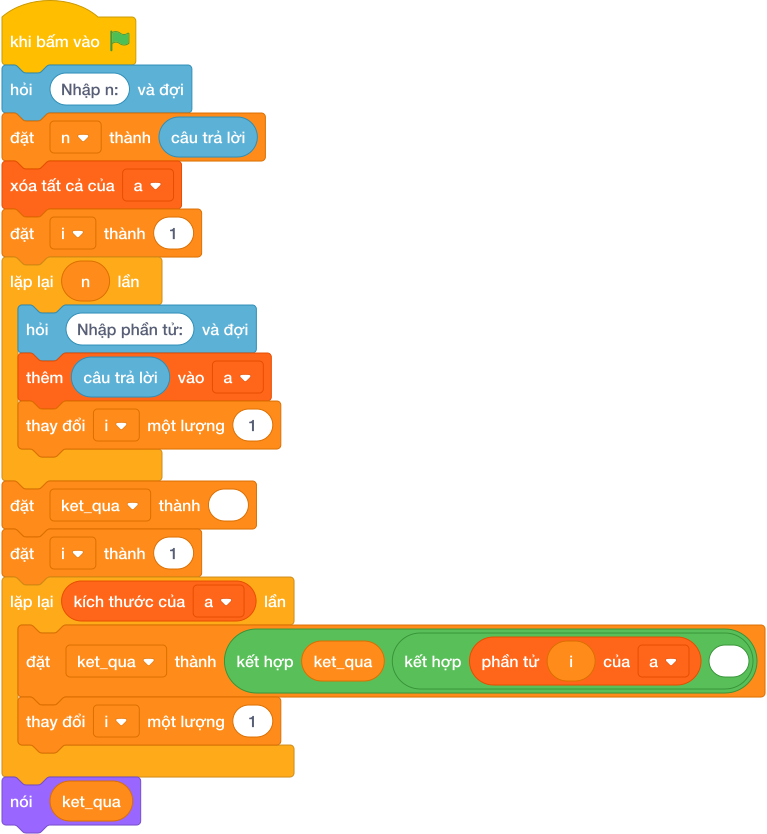

# Hướng Dẫn Giảng Dạy

## 1. Ý tưởng & Phân tích thuật toán

- Bản chất của bài này là xếp điểm từ cao xuống thấp để bạn điểm cao đứng trước trao giải.
- Với số mẫu `N = 5`, các điểm `20 80 40 100 60`: xếp lại thành `100 80 60 40 20`.
- Quy trình trong lời giải với các biến `n`, `a`:
  - Đọc `n = 5`, dãy `a = [20, 80, 40, 100, 60]`.
  - Gọi `a.sort(reverse=True)` được `[100, 80, 60, 40, 20]` rồi in ra.
- Giá trị biên cụ thể: `N = 1` thì in nguyên điểm đó; các bạn bằng điểm nhau thì đứng cạnh nhau theo thứ tự nào cũng đúng.

---

## 2. Bảng chạy tay trên số liệu mẫu (Dry Run Table - Sample 1: 5 / 20 80 40 100 60)

| Bước | Thao tác | Giá trị |
|------|----------|---------|
| 1 | Đọc `n` | `n = 5` |
| 2 | Đọc dãy `a` | `a = [20, 80, 40, 100, 60]` |
| 3 | Gọi `a.sort(reverse=True)` | `a = [100, 80, 60, 40, 20]` |
| 4 | In kết quả | màn hình hiện `100 80 60 40 20` |

Kết quả cuối cùng khớp với đáp án mẫu: `100 80 60 40 20`.

---

## 3. Lưu ý & Bẫy lỗi thường gặp

- Bẫy 1 — xếp tăng dần thay vì giảm dần:
```text
n = câu trả lời
a = list(các khối hỏi và đợi cho từng biến)
a.sort()
nói (*a)

```
Với mẫu trên in ra `20 40 60 80 100` sai. Cách sửa: thêm `reverse=True`.
- Bẫy 2 — đảo dãy nhập mà không xếp:
```text
n = câu trả lời
a = list(các khối hỏi và đợi cho từng biến)
nói (*(a[::-1]))

```
Với mẫu trên in ra `60 100 40 80 20` sai. Cách sửa: xếp giảm dần bằng `a.sort(reverse=True)`.
- Bẫy 3 — in cả ngoặc của danh sách:
```text
n = câu trả lời
a = list(các khối hỏi và đợi cho từng biến)
a.sort(reverse=True)
nói (a)

```
Với mẫu trên in ra `[100, 80, 60, 40, 20]` có ngoặc và dấu phẩy, không khớp đáp án mẫu. Cách sửa: thêm dấu sao `nói (*a)`.

---

## 4. Lời giải tham khảo & Kịch bản Khối lệnh Scratch 3.0

### 4.1. Khối lệnh đồ họa trực quan (Visual Scratch Blocks)



> 💡 **Kịch bản thực hiện từng bước:**
> - khi bấm vào cờ xanh
> - hỏi [Nhập n:] và đợi
> - đặt [n] thành (câu trả lời)
> - xóa tất cả của danh sách [a]
> - đặt [i] thành 1
> - lặp lại (n) lần:
> -   hỏi [Nhập phần tử:] và đợi
> -   thêm (câu trả lời) vào [a]
> -   thay đổi [i] một lượng 1
> - đặt [ket_qua] thành rỗng
> - đặt [i] thành 1
> - lặp lại (kích thước của [a]) lần:
> -   đặt [ket_qua] thành kết hợp ket_qua và phần tử i và dấu cách
> -   thay đổi [i] một lượng 1
> - nói (ket_qua)
