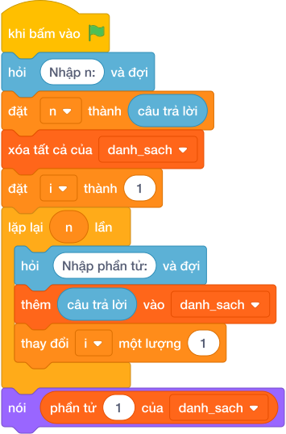

# Hướng Dẫn Giảng Dạy: Điểm olympic bỏ max bỏ min
Chuyên đề: **Lập Trình Thuật Toán & Khối Lệnh Scratch 3.0**

---

## 1. Ý tưởng & Phân tích thuật toán

- Bản chất của bài này là gạch đi một điểm cao nhất và một điểm thấp nhất rồi tính trung bình các điểm còn lại.
- Với số mẫu `N = 5`, các điểm `7.0 9.0 8.0 10.0 6.0`: bỏ thấp nhất `6.0` và cao nhất `10.0`, còn `7.0 8.0 9.0`, tổng `24.0` chia `3` được `8.0`, viết đủ 2 chữ số thành `8.00`.
- Quy trình trong lời giải với các biến `n`, `a`, `trimmed`, `tb`:
  - Đọc `n = 5`, dãy `a = [7.0, 9.0, 8.0, 10.0, 6.0]`; gọi `a.sort()` được `[6.0, 7.0, 8.0, 9.0, 10.0]`.
  - Cắt hai đầu `a[1:-1]` được `trimmed = [7.0, 8.0, 9.0]`; tính `tb = 24.0 / 3 = 8.0`.
  - In `8.00`.
- Giá trị biên cụ thể: `N = 3` thì sau khi bỏ còn đúng 1 điểm ở giữa; nhiều điểm trùng cao nhất hoặc thấp nhất thì mỗi đầu chỉ bỏ đúng một điểm.

---

## 2. Bảng chạy tay trên số liệu mẫu (Dry Run Table - Sample 1: 5 / 7.0 9.0 8.0 10.0 6.0)

| Bước | Thao tác | Giá trị |
|------|----------|---------|
| 1 | Đọc `n` | `n = 5` |
| 2 | Đọc dãy `a` | `a = [7.0, 9.0, 8.0, 10.0, 6.0]` |
| 3 | Gọi `a.sort()` | `a = [6.0, 7.0, 8.0, 9.0, 10.0]` |
| 4 | Cắt `a[1:-1]` | `trimmed = [7.0, 8.0, 9.0]` |
| 5 | Tính `tb` | `24.0 / 3 = 8.0` |
| 6 | In với 2 chữ số | màn hình hiện `8.00` |

Kết quả cuối cùng khớp với đáp án mẫu: `8.00`.

---

## 3. Lưu ý & Bẫy lỗi thường gặp

- Bẫy 1 — chia cho `N` thay vì số điểm còn lại:
```text
n = int(câu trả lời.strip())
a = list(map(float, câu trả lời.split()))
a.sort()
trimmed = a[1:-1]
tb = sum(trimmed) / n
print(f"{tb:.2f}")
```
Với mẫu trên in ra `24.0 / 5 = 4.80` sai. Cách sửa: chia cho `len(trimmed)`.
- Bẫy 2 — quên bỏ hai đầu mà tính trung bình cả dãy:
```text
n = int(câu trả lời.strip())
a = list(map(float, câu trả lời.split()))
tb = sum(a) / n
print(f"{tb:.2f}")
```
Với mẫu trên in ra `40.0 / 5 = 8.00` trùng cờ đáp án, nhưng bản chất sai: chưa bỏ `6.0` và `10.0`. Với dãy mà điểm giữa lệch khỏi trung bình chung, cách này cho kết quả sai. Cách sửa: xếp rồi cắt `a[1:-1]` trước khi tính.
- Bẫy 3 — in thiếu chữ số thập phân:
```text
n = int(câu trả lời.strip())
a = list(map(float, câu trả lời.split()))
a.sort()
trimmed = a[1:-1]
tb = sum(trimmed) / len(trimmed)
print(tb)
```
Với mẫu trên in ra `8.0`, không khớp đáp án mẫu `8.00`. Cách sửa: in bằng `nói (f"{tb:.2f}")`.

---

## 4. Lời giải tham khảo & Kịch bản Khối lệnh Scratch 3.0

### 4.1. Khối lệnh đồ họa trực quan (Visual Scratch Blocks)



> 💡 **Kịch bản thực hiện từng bước:**
> - khi bấm vào cờ xanh
> - hỏi [Nhập n:] và đợi
> - đặt [n] thành (câu trả lời)
> - xóa tất cả của [danh_sach]
> - đặt [i] thành (1)
> - lặp lại (n) lần:
> -   hỏi [Nhập phần tử:] và đợi
> -   thêm (câu trả lời) vào [danh_sach]
> -   thay đổi [i] một lượng (1)
> - nói (phần tử thứ 1 của [danh_sach])
