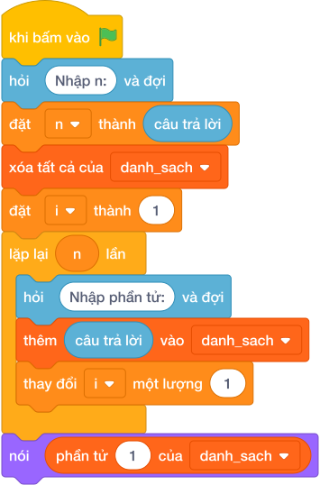

# Hướng Dẫn Giảng Dạy: Sắp xếp tên theo thứ tự bảng chữ cái
Chuyên đề: **Lập Trình Thuật Toán & Khối Lệnh Scratch 3.0**

---

## 1. Ý tưởng & Phân tích thuật toán

- Bản chất của bài này là xếp các từ theo thứ tự từ điển từ A đến Z.
- Với số mẫu `N = 4`, các từ `orange apple banana grape`: xếp lại thành `apple banana grape orange` (chữ `a` trước `b`, `b` trước `g`, `g` trước `o`).
- Quy trình trong lời giải với các biến `n`, `words`:
  - Đọc `n = 4`.
  - Đọc các từ thành `words = ["orange", "apple", "banana", "grape"]`.
  - Gọi `words.sort()` được `["apple", "banana", "grape", "orange"]` rồi in ra.
- Giá trị biên cụ thể: `N = 1` thì in nguyên từ đó; các từ đều viết thường nên so sánh từ điển trực tiếp đúng luôn.

---

## 2. Bảng chạy tay trên số liệu mẫu (Dry Run Table - Sample 1: 4 / orange apple banana grape)

| Bước | Thao tác | Giá trị |
|------|----------|---------|
| 1 | Đọc `n` | `n = 4` |
| 2 | Đọc `words` | `["orange", "apple", "banana", "grape"]` |
| 3 | Gọi `words.sort()` | `["apple", "banana", "grape", "orange"]` |
| 4 | In kết quả | màn hình hiện `apple banana grape orange` |

Kết quả cuối cùng khớp với đáp án mẫu: `apple banana grape orange`.

---

## 3. Lưu ý & Bẫy lỗi thường gặp

- Bẫy 1 — quên xếp mà in nguyên thứ tự nhập:
```text
n = int(câu trả lời.strip())
words = câu trả lời.split()
print(*words)
```
Với mẫu trên in ra `orange apple banana grape` sai. Cách sửa: gọi `words.sort()` trước khi in.
- Bẫy 2 — xếp ngược từ Z về A:
```text
n = int(câu trả lời.strip())
words = câu trả lời.split()
words.sort(reverse=True)
print(*words)
```
Với mẫu trên in ra `orange grape banana apple` sai. Cách sửa: xếp tăng dần mặc định, không dùng `reverse=True`.
- Bẫy 3 — chỉ đọc một từ đầu tiên:
```text
n = int(câu trả lời.strip())
words = [câu trả lời.strip()]
words.sort()
print(*words)
```
Với mẫu trên các từ nằm chung một dòng nên chỉ lấy được `orange`, in ra `orange` thiếu ba từ còn lại. Cách sửa: đọc cả dòng bằng `words = câu trả lời.split()`.

---

## 4. Lời giải tham khảo & Kịch bản Khối lệnh Scratch 3.0

### 4.1. Khối lệnh đồ họa trực quan (Visual Scratch Blocks)



> 💡 **Kịch bản thực hiện từng bước:**
> - khi bấm vào cờ xanh
> - hỏi [Nhập n:] và đợi
> - đặt [n] thành (câu trả lời)
> - xóa tất cả của [danh_sach]
> - đặt [i] thành (1)
> - lặp lại (n) lần:
> -   hỏi [Nhập phần tử:] và đợi
> -   thêm (câu trả lời) vào [danh_sach]
> -   thay đổi [i] một lượng (1)
> - nói (phần tử thứ 1 của [danh_sach])
