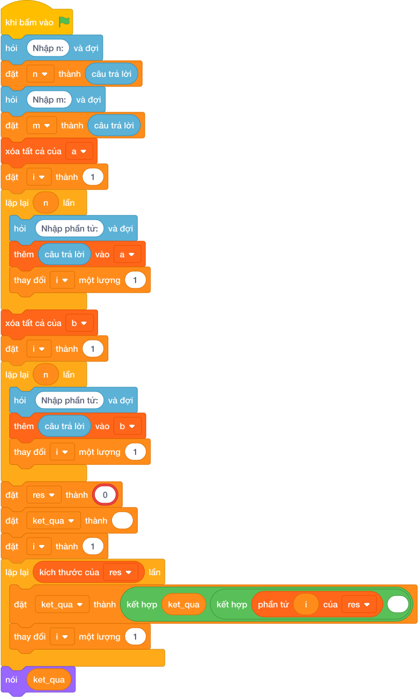

# Hướng Dẫn Giảng Dạy

## 1. Ý tưởng & Phân tích thuật toán

- Bản chất của bài này là trộn hai dãy thành một dãy chung rồi xếp từ bé đến lớn.
- Với số mẫu `N = 3`, `M = 4`, dãy `A = 1 4 7`, dãy `B = 2 3 5 8`: trộn lại được `1 4 7 2 3 5 8`, xếp lại thành `1 2 3 4 5 7 8`.
- Quy trình trong lời giải với các biến `n`, `m`, `a`, `b`, `res`:
  - Đọc `n = 3`, `m = 4`; đọc `a = [1, 4, 7]`, `b = [2, 3, 5, 8]`.
  - Nối hai dãy `a + b` rồi gọi `sorted` được `[1, 2, 3, 4, 5, 7, 8]`.
  - In ra `1 2 3 4 5 7 8`.
- Giá trị biên cụ thể: dãy hợp nhất có `N + M` phần tử; `N, M` tới `10^5` nên dãy chung tới hai trăm nghìn số, phép xếp có sẵn vẫn làm kịp.

---

## 2. Bảng chạy tay trên số liệu mẫu (Dry Run Table - Sample 1: 3 4 / 1 4 7 / 2 3 5 8)

| Bước | Thao tác | Giá trị |
|------|----------|---------|
| 1 | Đọc `n, m` | `n = 3`, `m = 4` |
| 2 | Đọc `a`, `b` | `a = [1, 4, 7]`, `b = [2, 3, 5, 8]` |
| 3 | Nối `a + b` | `[1, 4, 7, 2, 3, 5, 8]` |
| 4 | Gọi `sorted` | `[1, 2, 3, 4, 5, 7, 8]` |
| 5 | In kết quả | màn hình hiện `1 2 3 4 5 7 8` |

Kết quả cuối cùng khớp với đáp án mẫu: `1 2 3 4 5 7 8`.

---

## 3. Lưu ý & Bẫy lỗi thường gặp

- Bẫy 1 — chỉ nối mà quên xếp:
```text
n, m = các khối hỏi và đợi cho từng biến
a = list(các khối hỏi và đợi cho từng biến)
b = list(các khối hỏi và đợi cho từng biến)
nói (*(a + b))

```
Với mẫu trên in ra `1 4 7 2 3 5 8` sai. Cách sửa: xếp lại bằng `sorted(a + b)`.
- Bẫy 2 — đọc hai dãy chung một dòng:
```text
n, m = các khối hỏi và đợi cho từng biến
a = list(các khối hỏi và đợi cho từng biến)
b = list(các khối hỏi và đợi cho từng biến)
res = sorted(a + b)
nói (*res)

```
Bản thân cách này đúng với mẫu, nhưng nếu gom nhầm số của dãy `B` sang dòng dãy `A` thì kết quả lệch. Bẫy thật sự: đọc thiếu dòng thứ ba nên `b` rỗng, in ra `1 4 7` thiếu bốn số. Cách sửa: đọc đủ ba dòng theo đúng thứ tự `n m`, rồi `a`, rồi `b`.
- Bẫy 3 — in hai dãy riêng thay vì dãy chung:
```text
n, m = các khối hỏi và đợi cho từng biến
a = list(các khối hỏi và đợi cho từng biến)
b = list(các khối hỏi và đợi cho từng biến)
nói (*a)
nói (*b)

```
Với mẫu trên in ra hai dòng `1 4 7` rồi `2 3 5 8`, không khớp đáp án mẫu một dòng. Cách sửa: trộn rồi xếp thành một dãy `res` và in một dòng.

---

## 4. Lời giải tham khảo & Kịch bản Khối lệnh Scratch 3.0

### 4.1. Khối lệnh đồ họa trực quan (Visual Scratch Blocks)



> 💡 **Kịch bản thực hiện từng bước:**
> - khi bấm vào cờ xanh
> - hỏi [Nhập n:] và đợi
> - đặt [n] thành (câu trả lời)
> - hỏi [Nhập m:] và đợi
> - đặt [m] thành (câu trả lời)
> - xóa tất cả của danh sách [a]
> - đặt [i] thành 1
> - lặp lại (n) lần:
> -   hỏi [Nhập phần tử:] và đợi
> -   thêm (câu trả lời) vào [a]
> -   thay đổi [i] một lượng 1
> - xóa tất cả của danh sách [b]
> - đặt [i] thành 1
> - lặp lại (n) lần:
> -   hỏi [Nhập phần tử:] và đợi
> -   thêm (câu trả lời) vào [b]
> -   thay đổi [i] một lượng 1
> - đặt [res] thành (sorted(...))
> - đặt [ket_qua] thành rỗng
> - đặt [i] thành 1
> - lặp lại (kích thước của [res]) lần:
> -   đặt [ket_qua] thành kết hợp ket_qua và phần tử i và dấu cách
> -   thay đổi [i] một lượng 1
> - nói (ket_qua)
