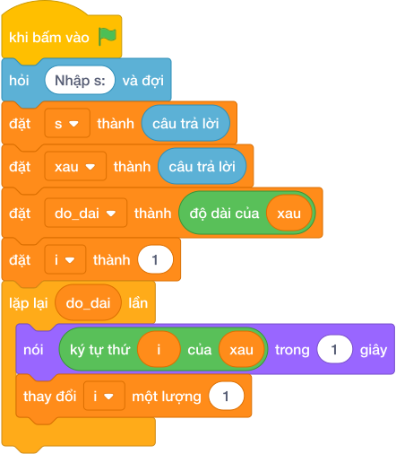

# Hướng Dẫn Giảng Dạy: Cắt ba ký tự đầu tiên
Chuyên đề: **Lập Trình Thuật Toán & Khối Lệnh Scratch 3.0**

---

## 1. Ý tưởng & Phân tích thuật toán
- Bản chất: lấy 3 chữ cái đầu tiên của chuỗi `s`.
- Quy trình:
  - Đọc chuỗi vào biến `s`. Với số liệu mẫu, `s = "VIETNAM"` (độ dài 7).
  - Cắt lát `s[:3]` nghĩa là lấy các vị trí 0, 1, 2, tức là `V`, `I`, `E`.
  - In ra `VIE` bằng `nói (s[:3])`.

---

## 2. Bảng chạy tay trên số liệu mẫu (Dry Run Table - Sample 1: VIETNAM)
| Bước | Lệnh chạy | Giá trị trong máy | Ghi chú |
|---|---|---|---|
| 1 | `s = câu trả lời` | `s = "VIETNAM"` | vị trí 0 là V, 1 là I, 2 là E |
| 2 | `s[:3]` | `"VIE"` | lấy đúng 3 ký tự đầu |
| 3 | `nói (s[:3])` | màn hình hiện `VIE` | khớp Output mẫu |

---

## 3. Lưu ý & Bẫy lỗi thường gặp
- Bẫy 1: cắt thiếu thành `s[:2]`. Đoạn sai:
```text
s = câu trả lời
print(s[:2])
```
Với mẫu `VIETNAM` chỉ in ra `VI`, thiếu chữ `E`, đáp án đúng là `VIE`. Cách sửa: dùng `s[:3]`.
- Bẫy 2: in ký tự ở vị trí 3 là `nói (s[3])`. Đoạn sai:
```text
s = câu trả lời
print(s[3])
```
Với mẫu `VIETNAM` in ra `T` (vị trí 3), đáp án đúng là `VIE`. Cách sửa: dùng lát cắt `s[:3]`.

---

## 4. Lời giải tham khảo & Kịch bản Khối lệnh Scratch 3.0

### 4.1. Khối lệnh đồ họa trực quan (Visual Scratch Blocks)



> 💡 **Kịch bản thực hiện từng bước:**
> - khi bấm vào cờ xanh
> - hỏi [Nhập s:] và đợi
> - đặt [s] thành (câu trả lời)
> - đặt [xau] thành (câu trả lời)
> - đặt [do_dai] thành (độ dài của xau)
> - đặt [i] thành (1)
> - lặp lại (do_dai) lần:
> -   nói (ký tự thứ i của xau) trong (1) giây
> -   thay đổi [i] một lượng (1)
